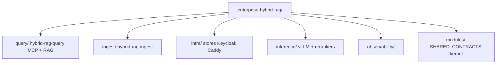

# Enterprise Hybrid RAG — Modular Specification

Greenfield product spec for a document-agnostic enterprise Hybrid RAG platform.

All runtime planes are **independent sub-projects** connected via [`modules/SHARED_CONTRACTS.md`](./modules/SHARED_CONTRACTS.md).

## Documents

### Platform

| Document | Description |
|----------|-------------|
| [ENTERPRISE_HYBRID_RAG_SPEC.md](./ENTERPRISE_HYBRID_RAG_SPEC.md) | Platform overview (**v0.22** — contracts, auth, ops depth) |
| [docs/CODING_STANDARDS.md](./docs/CODING_STANDARDS.md) | Python/TS style, Black/Ruff, LangGraph patterns, PR gate |
| [docs/DOCUMENTATION.md](./docs/DOCUMENTATION.md) | Documentation standards, Mermaid policy, code comments |
| [docs/USER_GUIDE.md](./docs/USER_GUIDE.md) | End-user guide (chat, MCP, scope, citations) |
| [docs/ADMIN_GUIDE.md](./docs/ADMIN_GUIDE.md) | Administrator guide (collections, ingest, ACL, quotas) |
| [docs/DEPLOYMENT_GUIDE.md](./docs/DEPLOYMENT_GUIDE.md) | Deployment / SRE bootstrap and operations |
| [docs/ARCHITECT_GUIDE.md](./docs/ARCHITECT_GUIDE.md) | Solution architect interfaces and topologies |
| [docs/DEVELOPER_GUIDE.md](./docs/DEVELOPER_GUIDE.md) | Developer onboarding, TDD, extending the pipeline |
| [CONTRIBUTING.md](./CONTRIBUTING.md) | PR checklist and contribution expectations |
| [docs/TESTING.md](./docs/TESTING.md) | Test-driven development playbook |
| [modules/IMPLEMENTATION.md](./modules/IMPLEMENTATION.md) | Language map stub → spec §1.3 |
| [query/benchmarks/README.md](./query/benchmarks/README.md) | Ragas, k6, Locust evaluation harness |
| [docs/PERFORMANCE.md](./docs/PERFORMANCE.md) | Latency/throughput tuning, SLOs, resilience, capacity |
| [docs/SPEC_ROADMAP.md](./docs/SPEC_ROADMAP.md) | Enhancement plan, phases, release gates, **§22 what to spec next** |
| [modules/SHARED_CONTRACTS.md](./modules/SHARED_CONTRACTS.md) | Cross-sub-project schemas and events (`mod-kernel`) |

### Query sub-project (`hybrid-rag-query`)

| Document | Description |
|----------|-------------|
| [query/README.md](./query/README.md) | Sub-project entry point |
| [query/SPEC.md](./query/SPEC.md) | MCP + RAG boundary |
| [query/docs/MCP.md](./query/docs/MCP.md) | Tools, SSE transport |
| [query/docs/PIPELINE.md](./query/docs/PIPELINE.md) | Retrieve → rerank → answer |
| [query/docs/LANGGRAPH.md](./query/docs/LANGGRAPH.md) | LangGraph orchestration + LangSmith |
| [query/docs/STREAMING.md](./query/docs/STREAMING.md) | `/research/stream` SSE |
| [query/docs/INTEGRATION.md](./query/docs/INTEGRATION.md) | Stores, inference, observability |

```bash
cd query && cp .env.example .env && make up
```

### Ingestion sub-project (`hybrid-rag-ingest`)

```bash
cd ingest && cp .env.example .env && make up
```

See [ingest/README.md](./ingest/README.md).

### Infrastructure (`hybrid-rag-infra`)

```bash
cd infra && cp .env.example .env && make up && make init-db
```

See [infra/README.md](./infra/README.md).

### Inference (`hybrid-rag-inference`)

```bash
cd inference && cp .env.example .env && make up PROFILE=gpu_24gb
```

See [inference/README.md](./inference/README.md).

### Observability (`hybrid-rag-observability`)

```bash
cd observability && cp .env.example .env && make up
```

See [observability/README.md](./observability/README.md).

## Architecture



## Bootstrap order

```bash
# From repo root (recommended)
cp infra/.env.example infra/.env    # once per sub-project, or:
make env
make bootstrap                      # INFERENCE_PROFILE=gpu_24gb by default
make health
make lint                           # Ruff + Black on application code
```

Manual per-plane bootstrap (same as spec §12.5):

```bash
cd infra && make network && make up && make init-db
cd ../inference && make up PROFILE=gpu_24gb
cd ../observability && make up
cd ../ingest && make up
cd ../query && make up
cd ../infra && make up PROFILE=edge   # optional public MCP
```

Root `Makefile` targets: `make help` for full list.

## Docker images (Packer)

Build all sub-project images with pinned tags for CI or private registry:

```bash
cp packer/versions.pkrvars.hcl.example packer/versions.pkrvars.hcl
make packer-build-all IMAGE_TAG=1.0.0
```

Per sub-project: `cd query && make packer-build IMAGE_TAG=query-v1.0.0`

See [packer/README.md](./packer/README.md).

## Status

Draft **v0.22** — catalog DDL, JSON schemas, IF-6/MCP/OTel depth; coding §23; TDD §19.
