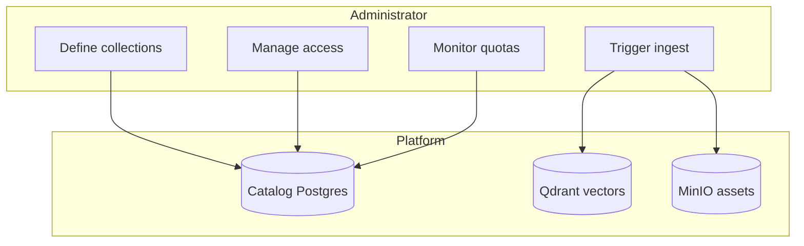
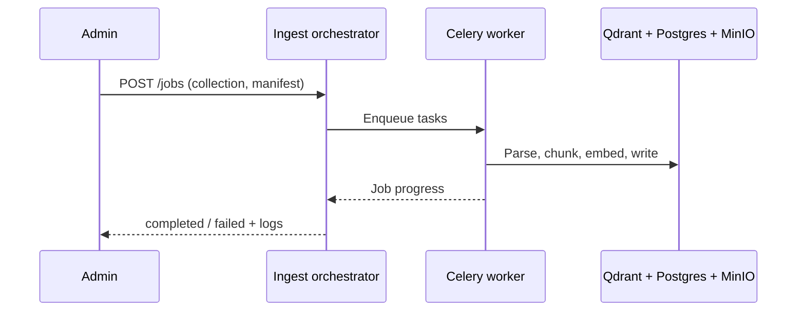
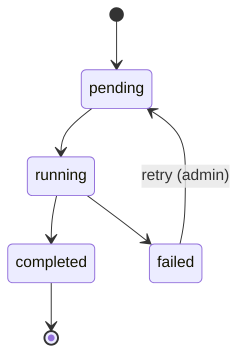
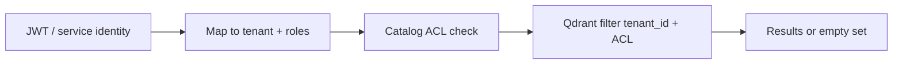

# Administrator guide

**Audience:** Tenant administrators, content owners, and platform operators managing **collections**, **ingest**, **access control**, and **quotas**  
**Prerequisites:** Access to ingest admin API (default port **8020** in dev) or automation that wraps it; OIDC roles as defined by your deployment

---

## 1. Administrator responsibilities

| Task | Outcome |
|------|---------|
| Create **collections** | Logical buckets of documents per tenant |
| Run **ingest** | Parse, chunk, embed, index content |
| Set **ACL** | Who can query which collection |
| Monitor **jobs** | Pending, running, failed ingest tasks |
| Enforce **quotas** | Prevent runaway ingest or query volume |

---

## 2. Core concepts

| Term | Meaning |
|------|---------|
| `tenant_id` | Organization or customer partition — required on all operations |
| `collection_id` | Named corpus (e.g. `product-docs`) |
| `document_id` | Stable id for one logical document |
| `version_id` | Immutable ingest generation; new version does not overwrite old vectors in place |
| `content_hash` | Detects unchanged files for idempotent re-ingest |

---

## 3. Collections and manifests

Each collection **SHOULD** have an ingest manifest describing:

- Source folders or connector URIs
- Default parser profile (`pymupdf` fast path vs `docling` quality tier)
- Metadata defaults (`product`, `language`, tags)

**Procedure — create a collection (conceptual):**

1. Choose `tenant_id` and `collection_id` (lowercase, URL-safe).
2. Register collection in catalog (admin API or migration seed).
3. Place source files or configure connector sync.
4. POST ingest job with manifest path or inline config.
5. Wait for job status `completed`; verify chunk count in admin metrics.

See [ingest/docs/PARSERS.md](../ingest/docs/PARSERS.md) and [ingest/docs/DOCLING.md](../ingest/docs/DOCLING.md) for parser choice.

---

## 4. Ingest operations

### 4.1 Ingest modes

| Mode | Use when |
|------|----------|
| **Full** | New collection or breaking schema change |
| **Incremental** | Files added/changed; uses `content_hash` dedup |
| **Version** | Publish new immutable `version_id` for a document set |

### 4.2 Job lifecycle

**Idempotency:** Re-running ingest with the same `(tenant_id, collection_id, document_id, content_hash)` does not duplicate Qdrant points (FR-01).

### 4.3 Failure handling

| Failure | Action |
|---------|--------|
| Parser error on one file | Fix file or switch parser profile; retry document |
| Embed timeout | Check inference GPU; reduce worker concurrency |
| Queue depth high | Pause enqueue (FR-29); resume after query load drops |

---

## 5. Access control (ACL)

ACL is enforced at **catalog lookup** and **Qdrant filter** (FR-03). Unauthorized users receive **empty results**, not error messages that leak document titles.

**Administrator tasks:**

- Grant collection-level roles (exact API: spec §9 — admin tools planned E-16).
- Never disable `tenant_id` enforcement in production.
- Audit grant changes (operational requirement per your compliance program).

---

## 6. Quotas and rate limits

| Limit | Default (standard tier) | Symptom when exceeded |
|-------|-------------------------|------------------------|
| Queries per tenant / minute | 120 | HTTP 429 |
| Queries per user / minute | 30 | HTTP 429 |
| Concurrent streams per user | 3 | HTTP 429 |
| Embed tokens per tenant / day | 10M | HTTP 403 |

Quotas live in catalog `tenant_quotas` (SHARED_CONTRACTS §12). Adjust per tenant contract.

Ingest surge protection: when Celery queue depth exceeds threshold, new jobs are auto-paused (FR-29) to protect query latency.

---

## 7. Object storage (MinIO)

Binary assets (images, diagrams, raw exports) land in MinIO buckets:

- `hybrid-rag` — production objects
- `hybrid-rag-staging` — pre-promotion staging

See [infra/docs/MINIO.md](../infra/docs/MINIO.md) for bucket layout and IAM users.

---

## 8. Monitoring for administrators

| Signal | Where |
|--------|-------|
| Ingest job status | Ingest admin API / future dashboard |
| Query errors | Langfuse sessions, OTel traces |
| Storage growth | Qdrant collection stats, MinIO usage |
| Quota burn | Catalog quotas + rate-limit metrics |

---

## 9. Troubleshooting

| Symptom | Check | Fix |
|---------|-------|-----|
| Users see no results | ACL + ingest completed? | Grant access; verify job |
| Duplicate chunks after re-ingest | Hash changed? | Expected if file edited |
| Ingest stuck in `running` | Worker health | Restart worker; inspect Celery |
| Query slow after large ingest | GPU contention | Throttle ingest concurrency |
| 403 quota | `tenant_quotas` | Raise quota or schedule ingest off-peak |

---

## 10. Related documentation

| Document | Purpose |
|----------|---------|
| [DEPLOYMENT_GUIDE.md](./DEPLOYMENT_GUIDE.md) | Install and upgrade stacks |
| [ingest/SPEC.md](../ingest/SPEC.md) | Normative ingest behavior |
| [infra/docs/KEYCLOAK.md](../infra/docs/KEYCLOAK.md) | Identity and OIDC |
| [ENTERPRISE_HYBRID_RAG_SPEC.md](../ENTERPRISE_HYBRID_RAG_SPEC.md) §5, §9 | Full ingest + security spec |
