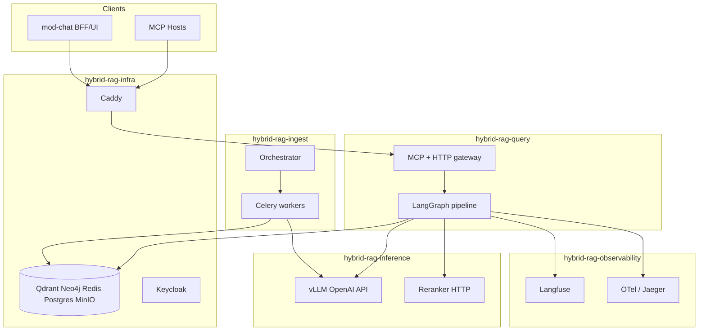
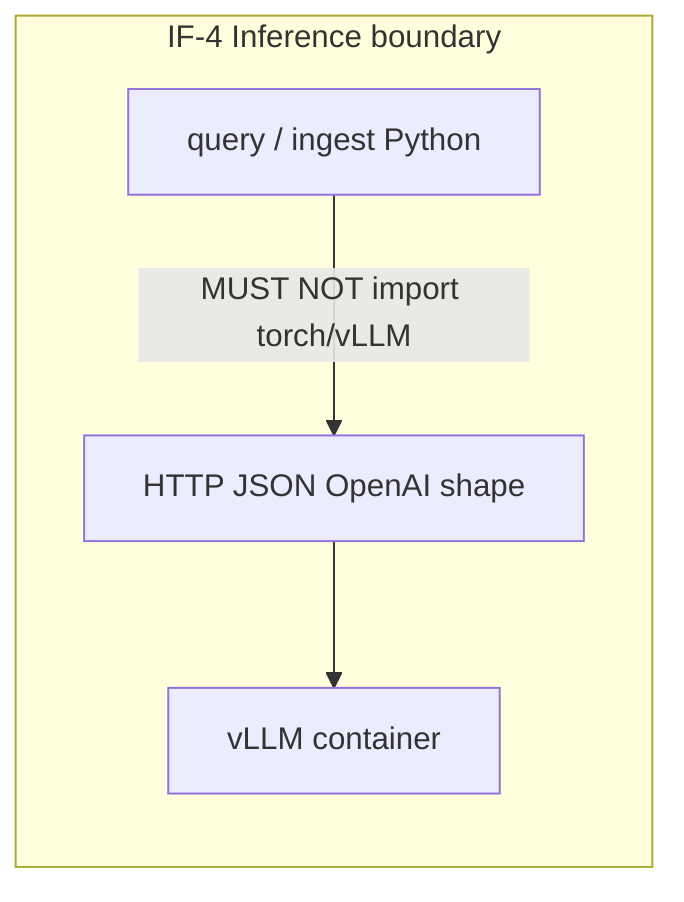
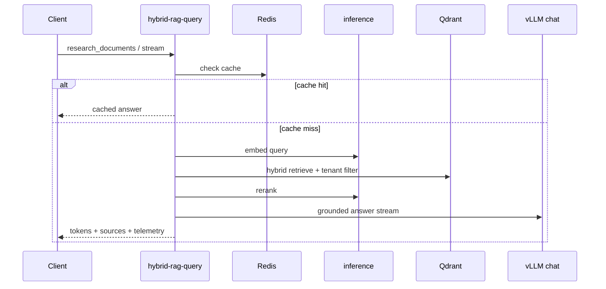
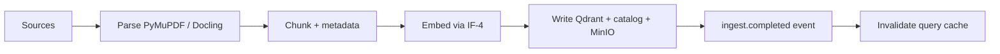
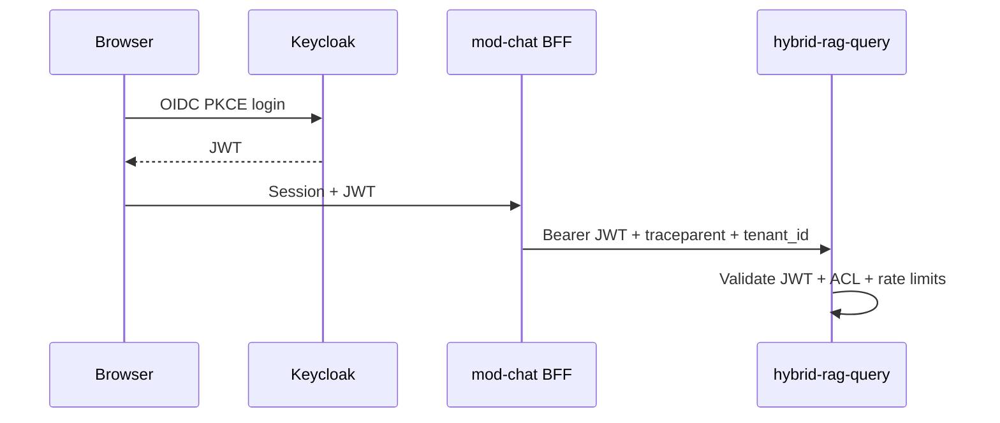

# Architect guide

**Audience:** Solution architects, security reviewers, and technical leads designing integrations and enterprise rollouts  
**Prerequisites:** Familiarity with RAG, vector search, and OIDC; read platform spec §3 and §3A first

---

## 1. Architectural intent

Enterprise Hybrid RAG is a **modular** platform: five replaceable runtime planes connected by explicit interfaces (IF-1 … IF-6). The **MCP server** is the primary integration surface; HTTP streaming complements TTFT-sensitive clients.

---

## 2. Interface catalog (IF-*)

| ID | From → To | Transport | Contract |
|----|-----------|-----------|----------|
| IF-1 | ingest → stores | gRPC/HTTP, SQL | Chunk payload, catalog DDL — [SHARED_CONTRACTS.md](../modules/SHARED_CONTRACTS.md) |
| IF-2 | query → stores | gRPC, Bolt, Redis | Read-only retrieval + cache |
| IF-3 | ingest/query → MinIO | S3 API | Presigned URLs, bucket policy — [MINIO.md](../infra/docs/MINIO.md) |
| IF-4 | query/ingest → inference | OpenAI-compatible HTTP | **No** vLLM import in app images |
| IF-5 | apps → observability | OTLP, Langfuse SDK | SDK only in app images |
| IF-6 | clients → query | MCP, SSE, OIDC JWT | Tenant binding, ACL — §9 |

---

## 3. Data architecture

### 3.1 Entity model

| Entity | Store | Purpose |
|--------|-------|---------|
| Chunk vectors + payload | Qdrant | Hybrid retrieval |
| Document graph | Neo4j | Hierarchy, cross-refs, media links |
| Catalog metadata + ACL | Postgres | Source of truth for scope and permissions |
| Query cache | Redis | Result cache, rate limits |
| Raw / image assets | MinIO | Off-vector blobs |

### 3.2 Multi-tenancy

Logical isolation by `tenant_id` on **every** Qdrant filter and catalog query (FR-02). Cross-tenant retrieval must be impossible at the API layer.

---

## 4. Query path (logical)

**Degradation ladder** (§6.3.2): under load, shed optional stages (graph enrich, rerank, supervisor) before returning 503.

---

## 5. Ingest path (logical)

**Idempotency key:** `(tenant_id, collection_id, document_id, content_hash)`.

---

## 6. Security architecture

| Layer | Control |
|-------|---------|
| Edge | TLS, optional static bearer on MCP SSE (dev/S2S only) |
| Application | OIDC JWT when `auth.required=true` |
| Data | Tenant filter + ACL empty-set semantics |
| Audit | Structured logs; Langfuse sessions |

---

## 7. Observability architecture

| Signal | Tool | Consumer |
|--------|------|----------|
| LLM cost, sessions, scores | Langfuse | Product + ops |
| Distributed traces | OTel → Jaeger (default) / SigNoz (optional §10.5) | Engineering |
| APM SLO dashboards | SigNoz when `PROFILE=signoz` — [observability/docs/SIGNOZ.md](../observability/docs/SIGNOZ.md) | SRE |
| Metrics | Prometheus (`PROFILE=metrics`) + SigNoz histograms §10.5.3 | SLO dashboards |

LangGraph nodes emit per-stage `timings_ms` (FR-09). Ragas gates quality on release; LangSmith optional in CI (TL-07).

---

## 8. Scaling patterns

| Pattern | When |
|---------|------|
| Horizontal query replicas | Read-heavy; stateless except Redis cache |
| Ingest worker pool | Corpus onboarding bursts |
| Qdrant sharding | >10M chunks per tenant (future) |
| Separate inference pool | Embed vs chat SLA conflict |

Connection pool defaults: spec §18.16. Circuit breakers: §18.15.

---

## 9. Architecture decisions (index)

Full ADR list: platform spec §17. Highlights:

| ID | Decision |
|----|----------|
| OD1 | MCP-first API |
| OD4 | LangGraph for query orchestration |
| OD5 | Static bearer config-driven — not sole prod auth |
| OD9 | User-level ACL requires OIDC JWT |

---

## 10. Extension points

| Extension | Interface |
|-----------|-----------|
| Connectors v2 | §5.8 — S3 first |
| Admin ACL API | E-16 in roadmap |
| mod-chat | Optional BFF — no direct store access (TL-03) |
| Helm / K8s | E-19 — `deploy/helm/` planned |

---

## 11. Related documentation

| Document | Purpose |
|----------|---------|
| [ENTERPRISE_HYBRID_RAG_SPEC.md](../ENTERPRISE_HYBRID_RAG_SPEC.md) §1.4 | **Implementation inventory** — stub vs shipped |
| [ENTERPRISE_HYBRID_RAG_SPEC.md](../ENTERPRISE_HYBRID_RAG_SPEC.md) | Normative platform spec |
| [SHARED_CONTRACTS.md](../modules/SHARED_CONTRACTS.md) | Cross-plane schemas |
| [DEPLOYMENT_GUIDE.md](./DEPLOYMENT_GUIDE.md) | Operational bootstrap |
| [DOCUMENTATION.md](./DOCUMENTATION.md) | Doc and diagram standards |
| [SPEC_ROADMAP.md](./SPEC_ROADMAP.md) | Planned depth |
