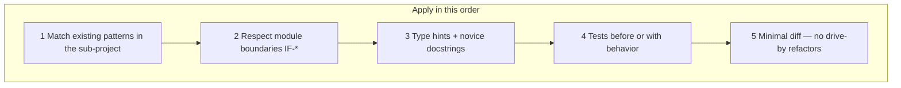

# Coding standards

**Parent:** [ENTERPRISE_HYBRID_RAG_SPEC.md](../ENTERPRISE_HYBRID_RAG_SPEC.md) §23  
**Status:** Normative for all application code in this repository  
**Audience:** Developers implementing query, ingest, inference sidecars, and (future) mod-chat

This playbook defines **how to write code** so a novice can read, review, and extend the platform safely. It complements [TESTING.md](./TESTING.md) (TDD), [DOCUMENTATION.md](./DOCUMENTATION.md) (docs + comments), and sub-project `SPEC.md` files (behavior).

---

## 1. Principles



| Principle | Rule |
|-----------|------|
| **Boundary-first** | Query and ingest **MUST NOT** import vLLM, torch, or store server SDKs beyond thin clients (TL-02, TL-04). Cross-plane coupling is **HTTP + shared contracts** only (FR-20). |
| **Novice-readable** | Public APIs explain *why* and *which spec requirement* — not what the syntax obviously does (TL-13, FR-37). |
| **Explicit over clever** | Prefer clear control flow over metaprogramming, deep inheritance, or hidden side effects. |
| **Fail closed** | Auth, tenant filter, and ACL errors **MUST NOT** leak document titles or bypass `tenant_id` (FR-02, FR-03). |
| **Observable by default** | Record `timings_ms` per pipeline stage (FR-09); use structured logs with `tenant_id` / `request_id` when available (TL-16). |
| **Stub-visible** | Stub code uses `# Stub:` or docstring **Stub:** and `"stub": true` in JSON where applicable (§1.5). |

---

## 2. Python (query, ingest, inference sidecars)

### 2.1 Runtime and style

| Rule | Requirement |
|------|-------------|
| Version | **Python 3.12+** (TL-01) |
| Formatter | **[Black](https://github.com/psf/black)** — line length **100** (TL-14) |
| Linter | **[Ruff](https://docs.astral.sh/ruff/)** — `E`, `F`, `I`, `UP`, `B` rule sets minimum (TL-14) |
| Type checking | **`mypy`** or **`pyright`** recommended on public `app/` modules; type hints required on public functions (TL-15) |
| Imports | `from __future__ import annotations` in new modules; stdlib → third-party → local; no wildcard imports |
| Async | FastAPI routes and LangGraph `ainvoke` — use `async`/`await` consistently; do not block the event loop with sync HTTP — use `httpx.AsyncClient` |

**Config:** root [`pyproject.toml`](../pyproject.toml) — `[tool.black]` and `[tool.ruff]`.

### 2.2 Module layout

```text
{sub-project}/app/
├── clients/             # thin HTTP/gRPC wrappers
├── rag_graph.py         # LangGraph (query)
├── rag_state.py         # RAGState TypedDict (query)
├── mcp_server.py        # FastAPI entry (query)
├── orchestrator.py      # FastAPI entry (ingest)
├── tasks.py             # Celery (ingest)
└── telemetry.py         # OTel bootstrap
```

### 2.3 Naming

| Kind | Convention | Example |
|------|------------|---------|
| Modules | `snake_case` | `query_cache.py` |
| Classes | `PascalCase` | `ChunkPayload` |
| Functions | `snake_case` | `node_retrieve` |
| LangGraph nodes | `node_<stage>` | `node_rerank` |
| JSON fields | `snake_case` | `tenant_id`, `timings_ms` |

### 2.4 Type hints (TL-15)

Public functions **MUST** annotate parameters and return types. Use `TypedDict` for `RAGState` — not untyped `dict`.

### 2.5 Docstrings (TL-13)

See [DOCUMENTATION.md](./DOCUMENTATION.md) §4. Every public function: summary, inputs/outputs, spec § link, **Stub:** when applicable.

### 2.6 LangGraph nodes

- Return partial dict — do not mutate state in place.
- Record `timings_ms` via `_tick()` (FR-09).
- I/O only through `clients/*` — mock in unit tests.
- Reference: `query/app/rag_graph.py`.

### 2.7 FastAPI routes

- Validate `tenant_id` and scope; FR-05 SSE events only.
- `/healthz` probes live deps unless `STUB_HEALTH=true` (FR-06).
- Structured errors per spec §7.7.

### 2.8 HTTP clients (IF-4)

- `httpx` with pools, explicit timeouts, max one LLM retry on 5xx.
- No `torch` / `vllm` in query or ingest (TL-02).

### 2.9 Celery (ingest)

- Idempotency key FR-01; JSON-serializable args; embed via HTTP.

### 2.10 Logging (TL-16)

Structured fields: `tenant_id`, `request_id`, `stage`, `job_id` as applicable. Never log JWTs or secrets.

### 2.11 Error handling

Catch specific exceptions; degrade per §6.3.2; no bare `except:`.

---

## 3. TypeScript (mod-chat, future)

Node 20+, ESLint + Prettier, strict TS, TSDoc on exports. No direct store access (TL-03).

---

## 4. Shell scripts

`set -euo pipefail`; header with purpose, env vars, idempotency.

---

## 5. Config (TOML, YAML)

Comment non-obvious keys; secrets in `.env` only; shared keys match §3.4.

---

## 6. Security checklist

- `tenant_id` on every retrieval path (FR-02)
- ACL empty-set semantics (FR-03)
- No secrets in repo or INFO logs

---

## 7. Testing with code

See [TESTING.md](./TESTING.md) — no kernel-boundary behavior without tests (FR-33/34).

---

## 8. PR checklist

- [ ] `ruff check` + `black --check` (TL-14)
- [ ] Type hints on new public APIs (TL-15)
- [ ] Docstrings (TL-13)
- [ ] No FR-20 / TL-02 violations
- [ ] Structured logs (TL-16)
- [ ] Tests + docs (§19, NFR-25)

```bash
make lint    # preferred — root Makefile
# or directly:
ruff check query/app ingest/app inference/reranker
black --check query/app ingest/app inference/reranker
```

---

## 9. Anti-patterns

| Anti-pattern | Fix |
|--------------|-----|
| God `utils.py` | Split `clients/`, domain modules |
| Sync HTTP in async route | `httpx.AsyncClient` |
| `import ingest` from `query` | HTTP / Redis events only |
| Logging full prompts at INFO | Truncate; DEBUG only |

---

## 10. Reference implementations

| Pattern | File |
|---------|------|
| LangGraph + docstrings | `query/app/rag_graph.py` |
| TypedDict state | `query/app/rag_state.py` |
| FastAPI entry | `query/app/mcp_server.py` |
| Reranker sidecar | `inference/reranker/sidecar.py` |

---

## 11. Related documents

| Document | Role |
|----------|------|
| [TESTING.md](./TESTING.md) | TDD |
| [DOCUMENTATION.md](./DOCUMENTATION.md) | Comments |
| [DEVELOPER_GUIDE.md](./DEVELOPER_GUIDE.md) | Onboarding |
| [CONTRIBUTING.md](../CONTRIBUTING.md) | PR expectations |
