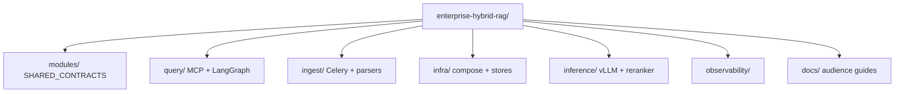
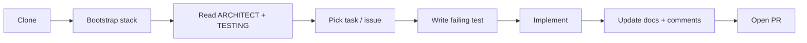
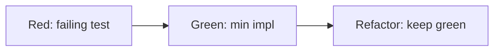
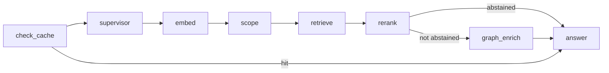

# Developer guide

**Audience:** Engineers implementing query, ingest, inference, infra scripts, and shared contracts  
**Prerequisites:** Python 3.12+, Docker, basic RAG concepts; read [TESTING.md](./TESTING.md) before your first PR

---

## 1. Repository map



| Sub-project | Entry | Normative spec |
|-------------|-------|----------------|
| Query | [query/README.md](../query/README.md) | [query/SPEC.md](../query/SPEC.md) |
| Ingest | [ingest/README.md](../ingest/README.md) | [ingest/SPEC.md](../ingest/SPEC.md) |
| Infra | [infra/README.md](../infra/README.md) | [infra/SPEC.md](../infra/SPEC.md) |
| Inference | [inference/README.md](../inference/README.md) | [inference/SPEC.md](../inference/SPEC.md) |
| Observability | [observability/README.md](../observability/README.md) | [observability/SPEC.md](../observability/SPEC.md) |
| Kernel contracts | [modules/SHARED_CONTRACTS.md](../modules/SHARED_CONTRACTS.md) | Platform spec §4 |

---

## 2. Onboarding checklist

1. Clone repo; read [ARCHITECT_GUIDE.md](./ARCHITECT_GUIDE.md) §2 (interfaces).
2. Read platform spec **§1.4** — know what is stub vs shipped before coding.
3. Bootstrap dev stack — [DEPLOYMENT_GUIDE.md](./DEPLOYMENT_GUIDE.md) §3.
3. Read [TESTING.md](./TESTING.md) — TDD is mandatory (TL-11, G13).
4. Pick a sub-project; run `make health` and `pytest` (when tests exist).
5. Read [DOCUMENTATION.md](./DOCUMENTATION.md) §4 — code comment standards apply to every PR.



---

## 3. Test-driven development (required)

**Order of work:**



| Boundary | First artifact |
|----------|----------------|
| Chunk schema | `test_chunk_payload_schema.py` |
| LangGraph node | `query/tests/unit/test_*_node.py` |
| Parser | Fixture file + expected chunks |
| MCP tool | Frozen markdown fixture |

Contract tests in [SHARED_CONTRACTS.md](../modules/SHARED_CONTRACTS.md) §14 **must pass** before `rag-v*` release.

---

## 4. Extending the query pipeline

LangGraph graph: `query/app/rag_graph.py` (spec §6.1).



**To add or change a node:**

1. Document state keys in `rag_state.py` with field-level comments.
2. Add unit test with mocked clients.
3. Implement node; record `timings_ms.<stage>`.
4. Update [query/docs/LANGGRAPH.md](../query/docs/LANGGRAPH.md) with Mermaid if graph topology changes.

**Rules:**

- One embed call per request (FR-13).
- No vLLM import in query image (TL-02) — use HTTP client to IF-4.

---

## 5. Extending ingest

| Component | Location | Doc |
|-----------|----------|-----|
| Parsers | `ingest/app/parsers/` (planned) | [PARSERS.md](../ingest/docs/PARSERS.md) |
| Celery tasks | `ingest/app/tasks.py` | [ingest/SPEC.md](../ingest/SPEC.md) |
| Orchestrator | `ingest/app/orchestrator.py` | Admin API |

Parser profiles: `pymupdf` (fast) vs `docling` (quality) — [DOCLING.md](../ingest/docs/DOCLING.md).

---

## 6. Code comment standards (TL-13)

Novice-readable docstrings on **all public** modules, classes, and functions. See [DOCUMENTATION.md](./DOCUMENTATION.md) §4 and **[CODING_STANDARDS.md](./CODING_STANDARDS.md)** (platform spec §23).

**Quick rules:**

- Module docstring: what this file does + spec § link.
- LangGraph nodes: inputs/outputs in terms of `RAGState` keys.
- Stubs: prefix with `# Stub:` and name the future module.
- Link spec FR/NFR ids when enforcing a contract.

---

## 7. Coding standards (required)

Full playbook: **[CODING_STANDARDS.md](./CODING_STANDARDS.md)** — Black, Ruff (`pyproject.toml`), type hints, LangGraph/FastAPI/Celery patterns, structured logging (TL-14–16).

```bash
make lint
make format
make bootstrap   # full dev stack from repo root
make health
```

---

## 8. Diagrams in your docs

All flow and architecture diagrams **must** use Mermaid (TL-12). Directory trees may use plain fenced blocks.

---

## 9. Local commands

```bash
# Query plane
cd query && make up && make health
pytest tests/unit tests/contract -q   # when present

# Ingest plane
cd ingest && make up && make health

# Benchmarks (GPU / live stack)
python query/benchmarks/benchmark_rag.py --limit 20 --ragas
```

---

## 9. PR expectations

See [CONTRIBUTING.md](../CONTRIBUTING.md). Summary:

- Tests before or with implementation (FR-33, FR-34).
- Docs in same PR as behavior (NFR-25).
- Mermaid for new diagrams (FR-36).
- Docstrings on public APIs (FR-37).

---

## 10. Related documentation

| Document | Purpose |
|----------|---------|
| [TESTING.md](./TESTING.md) | Pyramid, fixtures, CI |
| [DOCUMENTATION.md](./DOCUMENTATION.md) | Audience map + comment templates |
| [query/docs/LANGGRAPH.md](../query/docs/LANGGRAPH.md) | Graph details |
| [query/docs/MCP.md](../query/docs/MCP.md) | MCP tools |
| [SPEC_ROADMAP.md](./SPEC_ROADMAP.md) | What to build next |
