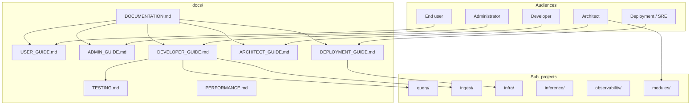

# Documentation standards

**Parent:** [ENTERPRISE_HYBRID_RAG_SPEC.md](../ENTERPRISE_HYBRID_RAG_SPEC.md) §21  
**Status:** Normative for all sub-projects  
**Audience:** Everyone who writes or reviews docs and code in this repository

This playbook defines **who reads what**, **how diagrams are drawn**, **how code is commented**, and **what must ship with every change**.

---

## 1. Documentation map (by audience)

| Audience | Primary goal | Start here | Also read |
|----------|--------------|------------|-----------|
| **End user** | Ask questions grounded in company documents; understand scope and citations | [USER_GUIDE.md](./USER_GUIDE.md) | mod-chat help (when deployed) |
| **Administrator** | Manage collections, ingest jobs, ACL, quotas, tenants | [ADMIN_GUIDE.md](./ADMIN_GUIDE.md) | `ingest/docs/`, §9 security |
| **Deployment / SRE** | Bootstrap stacks, health gates, upgrades, capacity | [DEPLOYMENT_GUIDE.md](./DEPLOYMENT_GUIDE.md) | `infra/docs/`, [PERFORMANCE.md](./PERFORMANCE.md) |
| **Solution architect** | Boundaries, interfaces, security, scaling topologies | [ARCHITECT_GUIDE.md](./ARCHITECT_GUIDE.md) | Platform spec §3, §3A, §17, [LLD.md](./LLD.md) |
| **Developer** | Implement features test-first; extend parsers and pipeline | [DEVELOPER_GUIDE.md](./DEVELOPER_GUIDE.md) | [LLD.md](./LLD.md), [TESTING.md](./TESTING.md), sub-project `SPEC.md` |



Every sub-project **MUST** maintain at minimum:

| File | Purpose |
|------|---------|
| `README.md` | Quick start, ports, `make` targets, link to `SPEC.md` |
| `SPEC.md` | Normative behavior for that plane |
| `docs/*.md` | Integration topics (stores, parsers, performance) |

---

## 2. Mermaid diagram policy (TL-12)

**Normative rule:** All **architecture**, **sequence**, **state**, **flow**, and **deployment** diagrams in specification and user-facing documentation **MUST** use [Mermaid](https://mermaid.js.org/) fenced blocks:

````markdown

````

| Diagram type | Mermaid construct | Example location |
|--------------|-------------------|------------------|
| System context | `flowchart TB` / `graph` | [ARCHITECT_GUIDE.md](./ARCHITECT_GUIDE.md) |
| Request / auth flow | `sequenceDiagram` | [USER_GUIDE.md](./USER_GUIDE.md), §7.10 |
| Pipeline stages | `flowchart LR` | `query/docs/LANGGRAPH.md` |
| TDD / eval flows | `flowchart LR` | [TESTING.md](./TESTING.md) |
| Module boundaries | `flowchart` with `subgraph` | Platform spec §3.1 |

**Allowed exceptions (not diagrams):**

- **Directory trees** and **CLI transcripts** — plain fenced blocks (`bash`, `text`, `json`)
- **Tables** — markdown tables, not Mermaid
- **Wire-format examples** — JSON/YAML/TOML snippets

**Forbidden in normative docs:** ASCII box diagrams (`┌──┐`), hand-drawn arrows in `text` blocks for flows.

**CI recommendation (future):** lint for ` ```text ` blocks containing box-drawing characters in `*.md` under `docs/` and `*/SPEC.md`.

---

## 3. Writing standards (all audiences)

### 3.1 Structure

Each guide **SHOULD** follow:

1. **Who this is for** — one sentence
2. **Prerequisites** — tools, access, profiles
3. **Concepts** — glossary links to platform spec §16
4. **Procedures** — numbered steps with expected output
5. **Troubleshooting** — symptom → cause → fix table
6. **Related docs** — links only; no duplicate normative text

### 3.2 Tone and depth

- Write for a **novice** who has never seen RAG or MCP: define acronyms on first use.
- Prefer **active voice** and **complete sentences**.
- One idea per paragraph; procedures use ordered lists.
- **Do not** assume knowledge of internal file paths unless the doc is for developers.

### 3.3 Version coupling (NFR-25)

Behavioral changes **MUST** update docs in the **same PR**:

| Change type | Required doc updates |
|-------------|---------------------|
| New MCP tool or HTTP route | `query/docs/MCP.md`, contract fixtures, [USER_GUIDE.md](./USER_GUIDE.md) if user-visible |
| Parser or ingest stage | `ingest/docs/`, [ADMIN_GUIDE.md](./ADMIN_GUIDE.md) |
| Config key | Sub-project `README.md`, `config/*.toml` comments, [DEPLOYMENT_GUIDE.md](./DEPLOYMENT_GUIDE.md) |
| Interface (IF-*) | Platform spec §3.3, [ARCHITECT_GUIDE.md](./ARCHITECT_GUIDE.md), `SHARED_CONTRACTS.md` |
| Performance SLO | [PERFORMANCE.md](./PERFORMANCE.md), `baselines.json` comment |

### 3.4 PR documentation checklist (FR-35)

Before merge, authors confirm:

- [ ] Audience guide updated if user-visible or operational behavior changed
- [ ] `SPEC.md` for affected sub-project updated
- [ ] New diagrams use Mermaid (TL-12)
- [ ] Public functions/classes have novice-readable docstrings (§4)
- [ ] README quick-start still runs (`make health` or documented equivalent)

---

## 4. Code comment standards (TL-13, FR-37)

Code comments exist so a **novice developer** can navigate the repo without oral tradition.

### 4.1 Python (query, ingest, inference)

| Element | Requirement | Style |
|---------|-------------|-------|
| Module | One-line summary + link to spec section | Module docstring at top |
| Public function / class | What it does, key args, return shape, side effects | Google-style docstring |
| LangGraph node | Inputs from `RAGState`, outputs merged into state, FR/NFR refs | Docstring + inline for non-obvious branches |
| Stub / TODO | Why stubbed and what replaces it | `# Stub:` prefix |
| Config env vars | Name, default, effect | Comment at read site or in `config/*.toml` |

**Example (LangGraph node):**

```python
def node_retrieve(state: RAGState) -> dict:
    """Hybrid dense+sparse retrieval from Qdrant.

    Reads ``tenant_id``, ``collection_id``, and embed vectors from *state*.
    Writes ``retrieved_chunks`` and ``timings_ms.retrieve``.

    Spec: ENTERPRISE_HYBRID_RAG_SPEC.md §6.3; FR-02 tenant filter required.

    Stub: returns a single fake chunk until ``clients/qdrant.py`` is wired.
    """
```

**Avoid:** Comments that restate the code (`# increment i`).  
**Prefer:** Comments that explain **why** and **which contract** applies.

### 4.2 TypeScript (mod-chat, future)

- Exported functions and React components: **TSDoc** with `@param`, `@returns`, `@example` for non-trivial props.
- BFF routes: comment which MCP tool or upstream URL is called and which JWT claims are required.

### 4.3 Shell and Compose

- `infra/scripts/*.sh`: header comment with purpose, env vars, idempotency.
- `docker-compose.yml`: comment per service group (stores vs app vs edge).

### 4.4 What not to document in code

- Secrets, tokens, or production hostnames
- Copy-paste of entire spec sections — link to `SPEC.md` instead

---

## 5. Functional requirements (summary)

| ID | Requirement |
|----|-------------|
| FR-35 | Platform MUST maintain audience guides in `docs/`; each sub-project MUST maintain `README.md` + `SPEC.md` |
| FR-36 | Architecture and flow diagrams in normative docs MUST use Mermaid (TL-12) |
| FR-37 | Public Python/TS APIs MUST have novice-readable docstrings per §4 |
| FR-38 | Application code MUST follow [CODING_STANDARDS.md](./CODING_STANDARDS.md) (§23) |
| FR-39 | Python changes MUST pass Ruff + Black when configured (TL-14) |
| NFR-25 | Doc updates MUST land in the same PR as behavioral changes |

Full normative text: platform spec §21.

---

## 6. Related documents

| Document | Role |
|----------|------|
| [USER_GUIDE.md](./USER_GUIDE.md) | End-user chat and MCP usage |
| [ADMIN_GUIDE.md](./ADMIN_GUIDE.md) | Collections, ingest, ACL, quotas |
| [DEPLOYMENT_GUIDE.md](./DEPLOYMENT_GUIDE.md) | Bootstrap, profiles, health, upgrade |
| [ARCHITECT_GUIDE.md](./ARCHITECT_GUIDE.md) | Interfaces, topologies, decisions |
| [DEVELOPER_GUIDE.md](./DEVELOPER_GUIDE.md) | Onboarding, TDD, coding standards, extending the pipeline |
| [CODING_STANDARDS.md](./CODING_STANDARDS.md) | Python/TS style, lint, LangGraph patterns |
| [TESTING.md](./TESTING.md) | Test pyramid and fixtures |
| [CONTRIBUTING.md](../CONTRIBUTING.md) | PR expectations |
