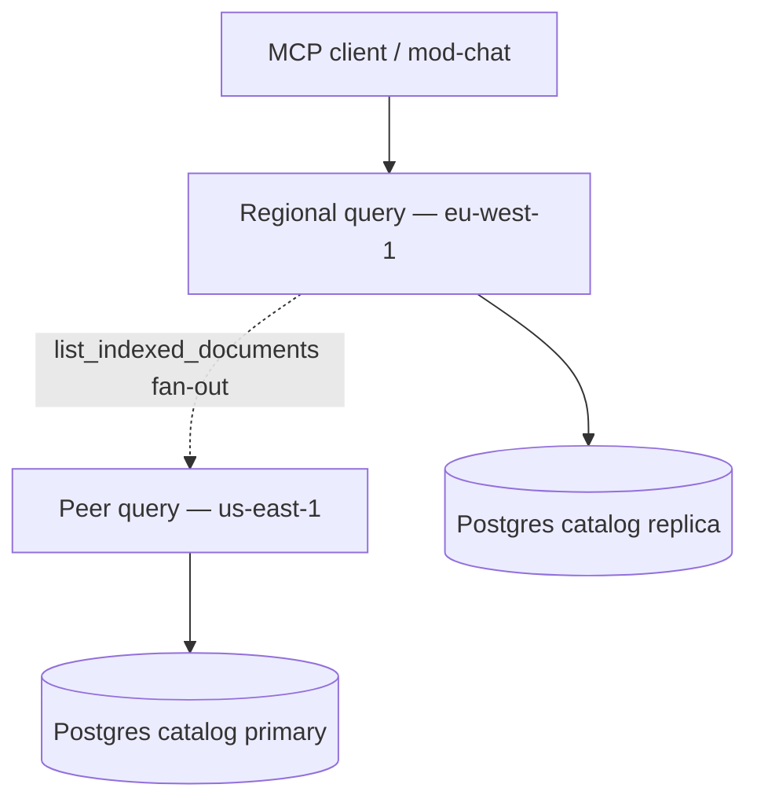

# Federated MCP — Multi-Region Catalog (E-32)

**Resolves:** OQ3 · extends E-24 multi-region read path  
**Spec:** ENTERPRISE_HYBRID_RAG_SPEC.md §17.1

Federated MCP provides a **unified catalog view** across regional `hybrid-rag-query` deployments while ingest and session writes remain on the primary region.

---

## 1. Architecture



| Concern | Primary region | Read region |
|---------|----------------|-------------|
| Ingest / writes | Yes | No |
| `CATALOG_DSN_SESSION` | Primary | Primary (until full federation) |
| `CATALOG_DSN_RO` | Optional replica | Regional replica |
| Catalog tool reads | Local + peer merge | Local + peer merge |

---

## 2. Configuration

```bash
FEDERATED_MCP_ENABLED=true
MCP_REGION=eu-west-1
MCP_PEER_ENDPOINTS_JSON='{"us-east-1":"https://query.us-east-1.example.com:8010"}'
FEDERATED_MCP_STUB=true   # dev — skip HTTP peer calls
```

Helm overlay (`deploy/helm/hybrid-rag/values-prod.yaml`):

```yaml
federatedMcp:
  enabled: true
  region: eu-west-1
  peerEndpoints:
    us-east-1: https://query.us-east-1.example.com:8010
```

ConfigMap emits `FEDERATED_MCP_ENABLED`, `MCP_REGION`, `MCP_PEER_ENDPOINTS_JSON`.

---

## 3. Runtime behavior

`query/app/federated_catalog.py` wraps the local `CatalogStore`:

- `list_indexed_documents` — merges local results with peer responses (dedupe by `document_id`)
- `get_document_metadata` — local first, then peer fallback
- Peer calls: `POST {peer}/mcp/tools/list_indexed_documents` and `get_document_metadata`

**Research / RAG** still uses regional Qdrant replica (E-24). Federation applies to **catalog MCP tools** only in E-32 v1.

---

## 4. Rollout

1. Complete E-24 regional query + catalog replica deployment
2. Enable `FEDERATED_MCP_ENABLED` on read-region query pods
3. Register peer endpoints in `MCP_PEER_ENDPOINTS_JSON`
4. Verify `list_indexed_documents` returns union across regions
5. Monitor peer latency; set timeouts (5s default in code)

---

## 5. Future

- Tenant home-region routing table in catalog
- Sticky session federation
- Cross-region `research_documents` merge (v1.1+)

See also: [`docs/MULTI_REGION.md`](./MULTI_REGION.md)
