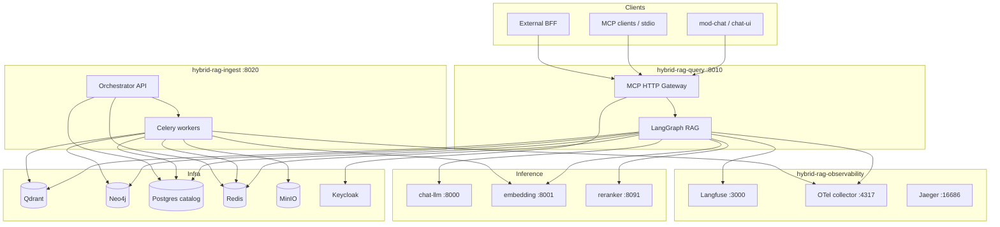
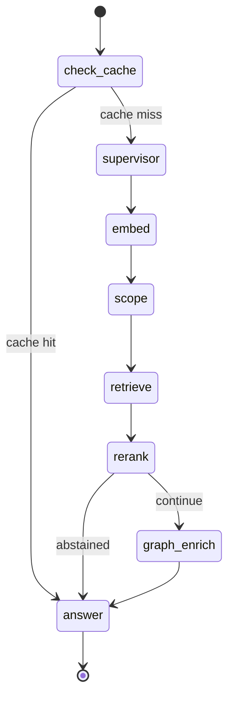
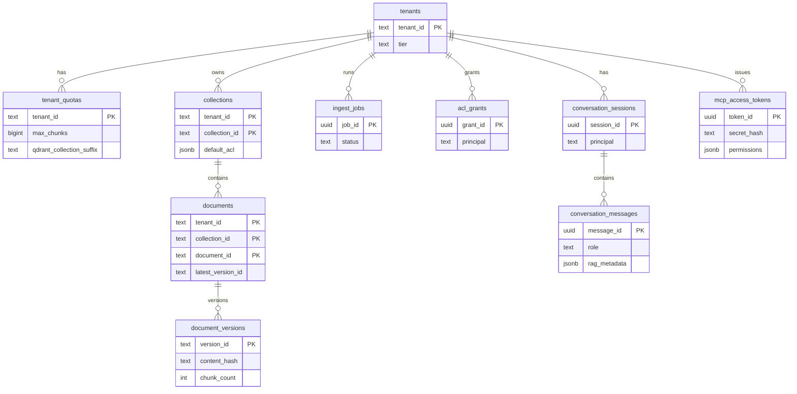
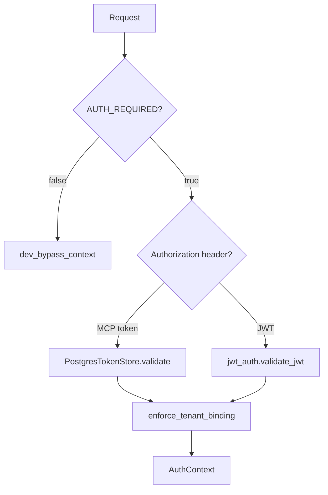
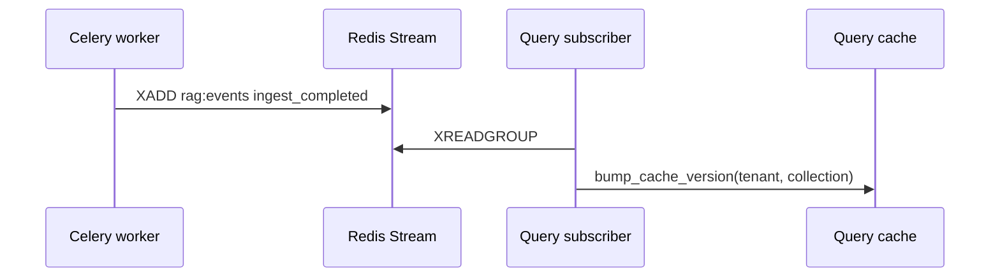
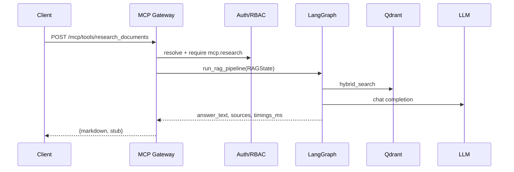
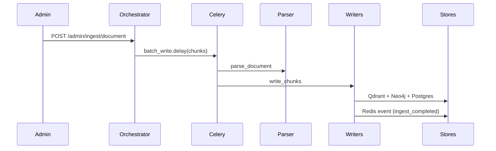
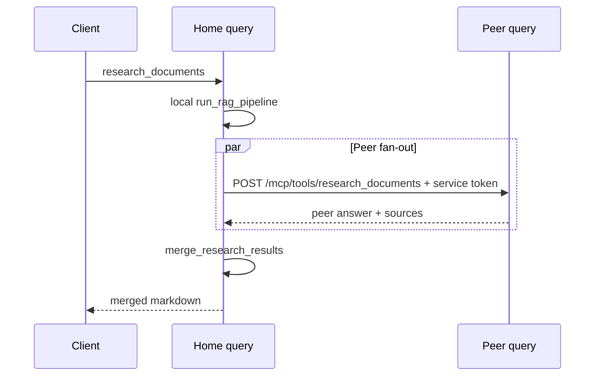

# Enterprise Hybrid RAG — Low Level Design (LLD)

**Version:** rag-v1.0  
**Status:** Normative implementation reference  
**Audience:** Developers, architects, SRE  
**Parent:** [ENTERPRISE_HYBRID_RAG_SPEC.md](../ENTERPRISE_HYBRID_RAG_SPEC.md) (platform requirements)  
**Contracts:** [modules/SHARED_CONTRACTS.md](../modules/SHARED_CONTRACTS.md)  
**Roadmap:** [SPEC_ROADMAP.md](./SPEC_ROADMAP.md)

This document is the **exhaustive low-level design** for the repository as implemented. The platform spec states *what*; sub-project `SPEC.md` files state deploy boundaries; **this LLD states *how* classes, stores, APIs, and flows connect.**

---

## Table of contents

1. [Document conventions](#1-document-conventions)
2. [System context](#2-system-context)
3. [Repository layout](#3-repository-layout)
4. [Deployment topology](#4-deployment-topology)
5. [Network and ports](#5-network-and-ports)
6. [Query plane (`hybrid-rag-query`)](#6-query-plane-hybrid-rag-query)
7. [Ingest plane (`hybrid-rag-ingest`)](#7-ingest-plane-hybrid-rag-ingest)
8. [Inference plane](#8-inference-plane)
9. [Infra plane](#9-infra-plane)
10. [Observability plane](#10-observability-plane)
11. [Data models](#11-data-models)
12. [MCP and HTTP API](#12-mcp-and-http-api)
13. [Authentication and RBAC](#13-authentication-and-rbac)
14. [Sessions and conversation history](#14-sessions-and-conversation-history)
15. [Multi-region federation](#15-multi-region-federation)
16. [Caching, rate limits, quotas](#16-caching-rate-limits-quotas)
17. [Events and cache invalidation](#17-events-and-cache-invalidation)
18. [Circuit breakers and degradation](#18-circuit-breakers-and-degradation)
19. [Security and mTLS](#19-security-and-mtls)
20. [Configuration reference](#20-configuration-reference)
21. [Kubernetes and Helm](#21-kubernetes-and-helm)
22. [Bootstrap and validation gates](#22-bootstrap-and-validation-gates)
23. [Testing architecture](#23-testing-architecture)
24. [Error codes and HTTP semantics](#24-error-codes-and-http-semantics)
25. [Sequence diagrams](#25-sequence-diagrams)
26. [File index](#26-file-index)

---

## 1. Document conventions

| Symbol | Meaning |
|--------|---------|
| **MUST** / **SHOULD** | RFC 2119 semantics aligned with platform spec |
| `monospace` | Code identifier, env var, table/column, route |
| Stub | Implementation returns synthetic data when `*_STUB=true` or stores unreachable |
| `index_schema_version` | Integer (currently `1`) governing Qdrant payload shape |

**Versioning:** Application Docker tags use `IMAGE_TAG`; release train tag is `rag-v1.0` (`docs/releases/rag_v1_gate.json`).

---

## 2. System context



**Data flow summary:**

| Path | Direction | Protocol |
|------|-----------|----------|
| Research query | Client → Query → Inference + Stores | HTTP/SSE, MCP JSON |
| Ingest | Admin → Ingest → Workers → Stores | HTTP admin, Celery |
| Catalog reads | Query → Postgres (`query_ro`) | SQL |
| Sessions / tokens | Query → Postgres (dedicated roles) | SQL |
| Traces | Query/Ingest → OTel → Jaeger | gRPC OTLP |
| LLM observability | Query → Langfuse SDK | HTTP |
| Domain events | Ingest → Redis Stream → Query subscriber | Redis Streams |

---

## 3. Repository layout

| Path | Project ID | Runtime |
|------|------------|---------|
| `query/` | `hybrid-rag-query` | FastAPI + LangGraph |
| `ingest/` | `hybrid-rag-ingest` | FastAPI orchestrator + Celery |
| `inference/` | `hybrid-rag-inference` | vLLM + reranker compose |
| `infra/` | `hybrid-rag-infra` | Docker stores + Keycloak + Caddy edge |
| `observability/` | `hybrid-rag-observability` | Langfuse, collector, Jaeger |
| `deploy/helm/hybrid-rag/` | — | Kubernetes application chart |
| `modules/` | `mod-kernel` | JSON schemas + shared contracts |
| `chat-ui/` | `mod-chat` | BFF + static web (optional) |
| `scripts/` | — | Bootstrap, validation gates |
| `docs/` | — | Audience guides, LLD, roadmap |

**Python packages:** `query/app/`, `ingest/app/` (import path `app`).

---

## 4. Deployment topology

### 4.1 Local development (Compose)

Bootstrap order (`make bootstrap`):

```text
1. infra       → stores + Keycloak
2. infra-init-db → Qdrant collection + MinIO buckets
3. migrate-catalog → Postgres DDL 001–005
4. inference   → embed/chat/reranker (PROFILE=gpu_24gb|dev)
5. observability → Langfuse + collector + Jaeger
6. observability-bootstrap-langfuse → sync keys to query/.env
7. ingest      → orchestrator + workers
8. query       → MCP gateway
9. bootstrap-mcp-token, bootstrap-prod-quotas
```

Docker network: `hybrid-rag-net` (external, created by `infra`).

### 4.2 Production (Kubernetes)

- **Helm chart** deploys query, ingest, ingress, optional mod-chat, cert-manager `Certificate` CRs.
- **Stores** are external (`values-prod.yaml` `stores.mode: managed`) or self-hosted outside the chart.
- **PKI:** `make infra-cert-manager-install` + `infra-cert-manager-issuer` → Helm mounts TLS secrets.

### 4.3 Compose profiles

| File | Profile | Effect |
|------|---------|--------|
| `infra/compose/docker-compose.yml` | `edge` | Caddy TLS reverse proxy |
| `ingest/compose/docker-compose.yml` | `beat` | Celery beat for connector sync |
| `inference/compose/docker-compose.yml` | `dev`, `gpu_24gb`, `a100_80gb` | GPU tier |
| `observability/compose/docker-compose.yml` | `metrics`, `signoz` | Prometheus / SigNoz |
| `observability/compose/docker-compose.jaeger-persist.yml` | `jaeger-persist` | Persistent trace storage |

---

## 5. Network and ports

| Service | Default port | Hostname (compose) |
|---------|--------------|-------------------|
| Query MCP HTTP | 8010 | `query` |
| Ingest orchestrator | 8020 | `orchestrator` |
| Qdrant REST / gRPC | 6333 / 6334 | `qdrant` |
| Neo4j Bolt / HTTP | 7687 / 7474 | `neo4j` |
| Postgres catalog | 5432 | `postgres` |
| Redis | 6379 | `redis` |
| MinIO API / console | 9000 / 9001 | `minio` |
| Keycloak | 8081 (host) → 8080 | `keycloak` |
| Chat LLM | 8000 | `chat-llm` |
| Embedding | 8001 | `embedding` |
| Reranker | 8091 | `reranker` |
| Langfuse | 3000 | `langfuse` |
| OTel collector gRPC | 4317 | `otel-collector` |
| Jaeger UI | 16686 | `jaeger` |
| Caddy (edge) | 8080 / 443 | `caddy` |

---

## 6. Query plane (`hybrid-rag-query`)

### 6.1 Process model

| Entrypoint | Module | Role |
|------------|--------|------|
| Docker / production | `app.server:main` | Uvicorn with optional mTLS |
| ASGI app | `app.mcp_server:app` | FastAPI application |
| MCP stdio | `app.mcp_stdio` | IDE / CLI transport |
| Operator CLI | `app.cli` | Bootstrap token mint |

**Lifespan** (`mcp_server.lifespan`):

1. Load `Settings` → `app.state`
2. Create token, session, catalog stores
3. `warmup_clients()` — embed, chat, qdrant, neo4j, reranker, catalog probes
4. `start_event_subscriber()` — Redis Stream consumer for cache invalidation
5. On shutdown: `stop_event_subscriber()`

### 6.2 Module map

| Module | Responsibility |
|--------|----------------|
| `mcp_server.py` | HTTP routes, health, admin |
| `mcp_handlers.py` | Tool business logic |
| `mcp_tools.py` | Schema load + `dispatch_tool()` |
| `mcp_format.py` | Markdown assembly (answer + sources + telemetry) |
| `catalog_handlers.py` | Catalog MCP tools |
| `rag_graph.py` | LangGraph compile + nodes |
| `rag_state.py` | `RAGState` TypedDict |
| `rag_answer.py` | Answer node helpers |
| `rag_runner.py` | Streaming preflight |
| `research_streaming.py` | SSE generator |
| `supervisor.py` | Query rewrite / scope inference |
| `graph_enrich.py` | Neo4j context blocks |
| `prompt_builder.py` | LLM prompt assembly |
| `client_factory.py` | Singleton clients + circuit breakers |
| `clients/*` | Qdrant, Neo4j, embed, chat, reranker |
| `auth.py`, `jwt_auth.py` | Auth resolution |
| `rbac.py` | Permission checks |
| `token_store.py` | MCP bearer tokens |
| `session_store.py` | Conversation persistence |
| `catalog_store.py` | Postgres catalog reads |
| `federated_catalog.py` | Multi-region catalog merge |
| `federated_research.py` | Multi-region research merge |
| `acl.py`, `acl_cache.py` | Document-level ACL |
| `query_cache.py` | Redis answer cache |
| `quota_store.py` | Tenant quota read (`CATALOG_DSN_RO`) |
| `rate_limit.py` | Admission control |
| `qdrant_collection.py` | Collection name + regulated suffix |
| `circuit_breaker.py` | FR-28 degrade ladder |
| `tls_config.py` | mTLS listener (E-34) |
| `telemetry.py`, `otel_metrics.py` | OTel spans + metrics |
| `event_subscriber.py` | Ingest event consumer |
| `settings.py` | Env → `Settings` dataclass |

### 6.3 LangGraph pipeline

**Topology** (compiled once per process in `build_rag_graph()`):



| Node | Function | Primary side effects |
|------|----------|-------------------|
| `check_cache` | `node_check_cache` | Redis `get_cached_answer`; sets `from_cache` |
| `supervisor` | `node_supervisor` | LLM rewrite; may set `collection_id` / `document_id` |
| `embed` | `node_embed` | Dense + sparse vectors; L3 on embed circuit open |
| `scope` | `node_scope` | Sets `scope_source` explicit/inferred |
| `retrieve` | `node_retrieve` | Qdrant hybrid search; ACL filter; L4 on qdrant open |
| `rerank` | `node_rerank` | Cross-encoder scores; `abstained` if below `MIN_RERANK_SCORE` |
| `graph_enrich` | `node_graph_enrich` | Neo4j parent sections; L1 skip on neo4j open |
| `answer` | `node_answer` | LLM generation or abstain message; `set_cached_answer` |

**Entry API:** `async run_rag_pipeline(initial: RAGState) -> RAGState`

**Conditional routers:**

- `_route_after_cache`: `from_cache` → `answer` else `supervisor`
- `_route_after_rerank`: `abstained` → `answer` else `graph_enrich`

### 6.4 `RAGState` field groups

See `query/app/rag_state.py` for normative docstrings.

| Group | Keys |
|-------|------|
| Request | `query`, `tenant_id`, `collection_id`, `additional_collection_ids`, `scope_strategy`, `document_id`, `version_id`, `explicit_scope`, `request_id`, `session_id`, `conversation_history` |
| Vectors | `query_dense_vector`, `query_sparse_vector` |
| Outputs | `retrieved_chunks`, `rerank_scores`, `context_blocks`, `sources`, `answer_text`, `scope_source` |
| Control | `from_cache`, `abstained`, `skip_supervisor`, `graph_enrich_enabled`, `degradation_level`, `stub` |
| Observability | `timings_ms`, `langfuse_session_id`, `langfuse_trace_id` |

### 6.5 Qdrant retrieval

**Client:** `query/app/clients/qdrant.py`

- Hybrid dense + sparse (`bm25-text`) with RRF fusion
- **Mandatory filter:** `tenant_id`
- Optional: `collection_id`, `document_id`, `version_id`
- **Cross-collection (E-30):** `scope_strategy=multi_top_k` fans out to `additional_collection_ids`
- **Collection resolution:** `resolve_qdrant_collection(tenant_id)` → base name or `{base}_{suffix}` (E-33)

### 6.6 Streaming path

`POST /research/stream` → `research_streaming.stream_research_events()`:

1. Auth + rate limit + stream slot
2. Load session history if `session_id`
3. `advance_to_answer()` or full graph for tokens
4. Yield SSE: `token` → `sources` → `telemetry` → `done`
5. Append session turn; release stream slot

---

## 7. Ingest plane (`hybrid-rag-ingest`)

### 7.1 Process model

| Process | Role |
|---------|------|
| `orchestrator.py` | FastAPI admin API on `:8020` |
| Celery worker | `ingest.batch_write`, `ingest.connector_sync` |
| Celery beat (optional) | `ingest.scheduled_connector_sync` |

### 7.2 Orchestrator API

| Method | Path | Handler | Notes |
|--------|------|---------|-------|
| GET | `/admin/healthz` | `healthz` | Liveness |
| POST | `/admin/ingest/collection` | `enqueue_collection_sync` | Full/incremental collection job |
| POST | `/admin/connectors/sync` | `enqueue_collection_sync` | Alias |
| POST | `/admin/ingest/document` | inline ingest | Parse + `batch_write.delay()` |
| GET | `/admin/ingest/jobs/{job_id}` | `get_job_status` | Job polling |
| POST | `/admin/acl/grants` | `create_acl_grant` | ACL CRUD |
| GET | `/admin/acl/grants` | `list_acl_grants` | |
| DELETE | `/admin/acl/grants/{grant_id}` | `delete_acl_grant` | Publishes ACL change event |
| PATCH | `/admin/collections/{tenant_id}/{collection_id}/default_acl` | `patch_collection_default_acl` | |
| GET | `/admin/tenants/{tenant_id}/quotas` | `get_tenant_quotas` | Usage + limits |
| PUT | `/admin/tenants/{tenant_id}/quotas` | `put_tenant_quotas` | E-27 admin API |
| POST | `/admin/tenants/{tenant_id}/purge` | `purge_tenant` | E-21 offboarding |
| POST | `/admin/versions/prune` | `prune_versions` | E-22 retention |

### 7.3 Celery tasks

| Task | Function | Flow |
|------|----------|------|
| `ingest.batch_write` | `batch_write` | Validate → dedup → embed → Qdrant + Neo4j + catalog |
| `ingest.connector_sync` | `connector_sync` | Connector list → parse → batch_write |
| `ingest.scheduled_connector_sync` | `scheduled_connector_sync` | Beat-driven multi-target sync |

**Hooks:** `task_jobs.py` updates `ingest_jobs` status in Postgres.

### 7.4 Parse pipeline

```text
fetch_bytes → parse_document (router) → chunk_builder → write_chunks
```

| Parser module | Extensions |
|---------------|------------|
| `text.py` | `.txt` |
| `markdown.py` | `.md` |
| `html.py` | `.html`, `.htm` |
| `structured.py` | `.json`, `.yaml`, `.csv` |
| `pdf.py` | `.pdf` (fast) |
| `docx.py` | `.docx` |
| `docling.py` | `.pdf`, `.docx`, `.pptx` (profile `docling`) |

**Router:** `parsers/router.py` → `resolve_parser_kind()`; `PARSER_STUB=true` uses lightweight stubs.

### 7.5 Connectors

**Factory:** `ingest/app/connectors/__init__.py` → `get_connector(type, tenant_id, collection_id, prefix)`

| Type aliases | Implementation |
|--------------|----------------|
| `filesystem`, `fs`, `local` | `FilesystemConnector` |
| `s3`, `minio` | `S3Connector` (boto3) |

**Incremental sync:** `file_registry.py` stores etag per object key in Redis.

### 7.6 Write path (`writers.py`)

`write_chunks(chunks, job_id)`:

1. Schema validate against `chunk_payload.v1.json`
2. `partition_deduped_chunks()` — Redis content-hash dedup
3. `EmbedClient.embed_batch()` + sparse tokenization
4. `QdrantWriter.upsert_chunks()` — dense + sparse vectors
5. `Neo4jWriter.merge_chunks()` — graph merge
6. `catalog_store.record_from_chunks()` — Postgres upsert
7. `publish_ingest_completed()` — Redis Stream event

### 7.7 Migrations

**Runner:** `ingest/app/migrate.py`

- Ordering: lexicographic `NNN_*.sql`
- Tracking: `schema_migrations(version, applied_at)`
- Lock: `pg_advisory_lock(742001)`
- Host bootstrap: `scripts/migrate_catalog.sh` (rewrites `postgres` → `127.0.0.1`)

---

## 8. Inference plane

| Service | Image | Port | Model role |
|---------|-------|------|------------|
| `chat-llm` | vLLM | 8000 | Answer generation |
| `embedding` | vLLM | 8001 | Dense embeddings (`EMBED_DIMENSION=768`) |
| `reranker` | custom | 8091 | Cross-encoder rerank |
| `reranker-fast` | custom | 8092 | Fast rerank tier |

**Profiles:** `dev` (CPU embed only), `gpu_24gb`, `a100_80gb`.

Query clients use OpenAI-compatible `/v1` APIs via `VLLM_URL`, `VLLM_EMBED_URL`, `RERANKER_URL`.

---

## 9. Infra plane

### 9.1 Store services

| Service | Purpose |
|---------|---------|
| Qdrant | Vector index (dense + sparse) |
| Neo4j | Document graph enrichment |
| Postgres | Catalog, sessions, tokens, Langfuse DB (separate DB in obs stack) |
| Redis | Cache, rate limits, Celery, dedup, events |
| MinIO | Object storage (raw PDFs, images) |
| Keycloak | OIDC (`hybrid-rag` realm) |

### 9.2 Postgres roles

Created by `infra/scripts/postgres-init.sh`:

| Role | Purpose |
|------|---------|
| `ingest_rw` | Migrations + catalog writes |
| `query_ro` | Catalog SELECT |
| `query_session_rw` | `conversation_*` tables |
| `query_token_rw` | `mcp_access_tokens` |
| `keycloak` | Keycloak DB |

### 9.3 Edge and PKI

- **Caddy** (`PROFILE=edge`): MCP SSE reverse proxy; mTLS upstream via `render_caddyfile.py`
- **Dev certs:** `make -C infra mtls-dev-certs`
- **K8s PKI:** `infra/k8s/cert-manager/` — see [infra/docs/CERT_MANAGER.md](../infra/docs/CERT_MANAGER.md)

---

## 10. Observability plane

### 10.1 Components

| Service | Role |
|---------|------|
| Langfuse | LLM traces, token cost, sessions |
| OTel collector | OTLP ingress, fan-out to Jaeger + metrics |
| Jaeger | Distributed trace UI |
| Prometheus (optional) | Scrape collector `:8889` |

### 10.2 Langfuse bootstrap

1. `LANGFUSE_INIT_*` env vars in `observability/.env` (headless init)
2. `make bootstrap-langfuse-keys` → `query/.env` `LANGFUSE_PUBLIC_KEY`, `LANGFUSE_SECRET_KEY`

### 10.3 OTel span catalog (query)

| Span name | Trigger |
|-----------|---------|
| `rag_pipeline` | Full graph execution |
| `rag.node.*` | Per LangGraph node |
| `mcp.research_documents` | Sync research tool |
| `http.research_stream` | SSE endpoint |
| `mcp.authz.check` | RBAC |
| `session.load_history` / `session.append_turn` | Sessions |
| `store.qdrant.retrieve` | Retrieval |
| `store.neo4j.read` | Graph enrich |
| `inference.embed` / `inference.chat` | Model calls |

### 10.4 Metrics

- `record_rag_stage_ms(stage, ms, tenant_id)` — histogram per stage
- `record_rag_ttft_ms(ms)` — time to first token (streaming)

---

## 11. Data models

### 11.1 Postgres ER (catalog)



**Migrations:**

| # | File | Adds |
|---|------|------|
| 001 | `001_catalog_v1.sql` | Core catalog tables |
| 002 | `002_conversation_sessions_v1.sql` | Sessions + messages + trigger |
| 003 | `003_mcp_access_tokens_v1.sql` | MCP tokens |
| 004 | `004_grant_query_roles_v1.sql` | Role GRANTs |
| 005 | `005_tenant_qdrant_suffix_v1.sql` | `tenant_quotas.qdrant_collection_suffix` |

### 11.2 Qdrant chunk payload

**Schema:** `modules/schemas/chunk_payload.v1.json`

**Required:** `uuid`, `tenant_id`, `collection_id`, `document_id`, `version_id`, `title`, `text`, `type`, `ingested_at`

**Vectors:**

| Name | Type |
|------|------|
| `""` (default) | Dense `float[]` dim=`EMBED_DIMENSION` |
| `bm25-text` | Sparse indices/values |

**Collection naming:**

- Default: `enterprise_hybrid_rag` (`QDRANT_COLLECTION`)
- Regulated: `{base}_{qdrant_collection_suffix}` from `tenant_quotas` (ingest write + query read)

### 11.3 Neo4j graph

**Write labels:** `Tenant`, `Collection`, `Document`, `Version`, `Section`, `Chunk`

**Relationships:** `OWNS`, `CONTAINS`, `HAS_VERSION`, `HAS_SECTION`, `HAS_CHUNK`, `REFERENCES`

**Read (query):** Parent section text, cross-references, `image_url` for visual chunks; Mermaid export for `visualize_document_graph` tool.

### 11.4 Redis keyspace

| Key pattern | DB | TTL | Purpose |
|-------------|-----|-----|---------|
| `qcache:ver:{tenant}:{collection}` | 0 | — | Cache generation counter |
| `qcache:v{ver}:{sha256}` | 0 | configurable | Cached answer JSON |
| `rlimit:{tenant}:queries` | 0 | 60s | Tenant QPM |
| `rlimit:{tenant}:{principal}:queries` | 0 | 60s | User QPM |
| `rlimit:{tenant}:streams` | 0 | — | Concurrent streams (tenant) |
| `rlimit:{tenant}:{principal}:streams` | 0 | — | Concurrent streams (user) |
| `dedup:{tenant}:{content_hash}` | 0 | — | Ingest chunk dedup |
| `file:{tenant}:{collection}:{key}` | 0 | — | Connector etag registry |
| Celery broker | 1 | — | Task queue |
| Celery results | 2 | — | Task results |
| Stream `rag:events` | 0 | — | Domain events |

### 11.5 Domain events

**Schema:** `modules/schemas/events.ingest_completed.v1.json`

Published on ingest completion; query `event_subscriber` invalidates query cache version on matching tenant/collection.

---

## 12. MCP and HTTP API

### 12.1 MCP tools

| Tool | Permission | Schema |
|------|------------|--------|
| `research_documents` | `mcp.research` | `mcp_research_documents.input.v1.json` |
| `create_conversation_session` | `mcp.session.write` | `mcp_create_conversation_session.input.v1.json` |
| `list_conversation_sessions` | `mcp.session.read` | `mcp_list_conversation_sessions.input.v1.json` |
| `get_conversation_history` | `mcp.session.read` | `mcp_get_conversation_history.input.v1.json` |
| `list_indexed_documents` | `mcp.catalog.read` | `mcp_list_indexed_documents.input.v1.json` |
| `get_document_metadata` | `mcp.catalog.read` | `mcp_get_document_metadata.input.v1.json` |
| `visualize_document_graph` | `mcp.graph.read` | `mcp_visualize_document_graph.input.v1.json` |

**Dispatch:** `POST /mcp/tools/{tool_name}` → `mcp_tools.dispatch_tool()` → handler.

**Stdio:** `python -m app.mcp_stdio` — same tool definitions via MCP SDK.

### 12.2 HTTP routes (query)

| Method | Path | Permission |
|--------|------|------------|
| GET | `/` | Public index |
| GET | `/healthz` | Public — store + breaker snapshot |
| GET | `/sse` | MCP SSE discovery |
| POST | `/research/stream` | `mcp.research` |
| POST | `/mcp/tools/*` | Per tool |
| POST | `/sessions` | `mcp.session.write` |
| GET | `/sessions` | `mcp.session.read` |
| GET | `/sessions/{id}/messages` | `mcp.session.read` |
| POST | `/admin/mcp/tokens` | `mcp.admin.tokens` |
| GET | `/admin/mcp/tokens` | `mcp.admin.tokens` |
| POST | `/admin/mcp/tokens/{id}/revoke` | `mcp.admin.tokens` |
| POST | `/admin/sessions/prune` | `mcp.admin.tokens` |
| GET | `/admin/metrics` | Admin metrics snapshot |

### 12.3 `research_documents` contract

**Input (key fields):**

```json
{
  "query": "string (required)",
  "tenant_id": "string",
  "collection_id": "string",
  "additional_collection_ids": ["string"],
  "scope_strategy": "single | multi_top_k",
  "document_id": "string?",
  "version_id": "string?",
  "session_id": "uuid?",
  "create_session_if_missing": false,
  "langfuse_session_id": "string?",
  "langfuse_trace_id": "string?",
  "langfuse_user_id": "string?"
}
```

**Output:**

```json
{
  "markdown": "string — answer + sources + telemetry footer",
  "stub": false
}
```

Federated internal responses add `answer_text`, `sources`, `federated_regions`.

### 12.4 SSE event types

| `type` | Payload fields |
|--------|----------------|
| `token` | `text` |
| `sources` | `markdown` |
| `telemetry` | `markdown`, `timings_ms`, `abstained`, `stub` |
| `done` | — |

Format: `data: {json}\n\n` (FR SSE compatibility).

### 12.5 Markdown layout (`mcp_format.py`)

1. Answer body  
2. `**Sources:**` numbered list  
3. `---`  
4. Telemetry footer (timings, abstain, stub flag)

---

## 13. Authentication and RBAC

### 13.1 Auth resolution order (`deps.get_auth_context`)



**MCP token format:** `{MCP_TOKEN_PREFIX}{uuid}.{secret}` (default prefix `rag_mcp_`)

- Secret stored as SHA-256 hash in `mcp_access_tokens.secret_hash`
- Mint via `POST /admin/mcp/tokens` or `ALLOW_TOKEN_BOOTSTRAP=true` CLI

**JWT bridge:** `JWT_BRIDGE=true` → RS256/ES256 via `JWKS_URI`; roles mapped to permissions via `role_templates` in settings.

### 13.2 Permissions

| Permission | Scope |
|------------|-------|
| `mcp.research` | Research tools + stream |
| `mcp.catalog.read` | List/metadata catalog |
| `mcp.graph.read` | Graph visualization |
| `mcp.session.read` | List sessions, history |
| `mcp.session.write` | Create session |
| `mcp.admin.tokens` | Token admin, session prune |
| `mcp.*` | Wildcard — all MCP permissions |

**Role templates (default):** `viewer`, `user`, `collection-admin`, `admin` — configured in `settings.py` / env.

**Wildcard rules:** `mcp.session.*`, `mcp.admin.*`, parent segment grants (`rbac.has_permission`).

### 13.3 Tenant binding

`enforce_tenant_binding(auth, body_tenant_id)` — if request specifies `tenant_id`, it MUST match auth context or **403** `tenant_mismatch`.

---

## 14. Sessions and conversation history

**Tables:** `conversation_sessions`, `conversation_messages` (migration 002)

**Store implementations:**

- `PostgresSessionStore` — production (`CATALOG_DSN_SESSION`)
- `InMemorySessionStore` — dev/tests

**Flow:**

1. Optional `session_id` on research request
2. `load_history(max_turns)` → `conversation_history` in `RAGState`
3. Supervisor + answer use history for multi-turn context
4. `append_turn(user, assistant, rag_metadata)` after completion

**Prune:** `POST /admin/sessions/prune` → `session_prune.prune_sessions(max_age_days)`; Helm CronJob optional.

---

## 15. Multi-region federation

### 15.1 Catalog federation (E-32)

**Module:** `query/app/federated_catalog.py`

- Home region from `MCP_TENANT_HOME_REGION_JSON` / `tenant_home_region()`
- Peer endpoints from `MCP_PEER_ENDPOINTS_JSON`
- Fan-out `list_indexed_documents` / `get_document_metadata` to peers
- Merge with dedupe + `peer_region` attribution

### 15.2 Research federation

**Module:** `query/app/federated_research.py`

- When `FEDERATED_RESEARCH_ENABLED=true` and not internal call:
  - POST peers `/mcp/tools/research_documents` with `X-Federated-Service-Token`
  - `merge_research_results()` — dedupe sources, merge answers
- Internal peer responses include structured fields for merge (`federated_internal` role)

**Env:**

| Variable | Purpose |
|----------|---------|
| `FEDERATED_MCP_ENABLED` | Master switch |
| `FEDERATED_RESEARCH_ENABLED` | Research fan-out |
| `FEDERATED_RESEARCH_APPEND` | Append vs replace local answer |
| `MCP_REGION` | Local region id |
| `MCP_PEER_ENDPOINTS_JSON` | `{"us-east-1": "https://..."}` |
| `FEDERATED_MCP_SERVICE_TOKEN` | Shared secret for peer calls |

---

## 16. Caching, rate limits, quotas

### 16.1 Query result cache

- Key: `qcache:v{version}:{hash(tenant,collection,query,scope,...)}`
- Version bumped on ingest events for tenant/collection
- Disabled when `QUERY_CACHE_ENABLED=false`

### 16.2 Rate limits (`rate_limit.py`)

| Limit | Env defaults |
|-------|--------------|
| Tenant QPM | `TENANT_QUERIES_PER_MINUTE=120` |
| User QPM | `USER_QUERIES_PER_MINUTE=30` |
| Tenant concurrent streams | `MAX_CONCURRENT_STREAMS_PER_TENANT=50` |
| User concurrent streams | `MAX_CONCURRENT_STREAMS_PER_USER=3` |

Exceeded → **429** `rate_limited`.

### 16.3 Quotas

| Plane | Store | Enforcement |
|-------|-------|-------------|
| Ingest | `tenant_quotas` via `ingest_rw` | `assert_quota_for_enqueue` before job |
| Query | `tenant_quotas` via `query_ro` | Admission + suffix lookup |

**Admin:** `PUT /admin/tenants/{id}/quotas` — bootstrap via `make bootstrap-prod-quotas`.

---

## 17. Events and cache invalidation



**Subscriber:** `event_subscriber.py` — background asyncio task started in FastAPI lifespan.

---

## 18. Circuit breakers and degradation

**Module:** `circuit_breaker.py` — per-client breakers in `client_factory.py`

| Level | Trigger | Behavior |
|-------|---------|----------|
| L1 | Neo4j open | Skip graph enrich |
| L2 | Reranker open | Use retrieval order |
| L3 | Embed open | Abstain with message |
| L4 | Qdrant open | Abstain with message |

**Config:** `CIRCUIT_BREAKERS_ENABLED=true`, thresholds in `client_factory` (default 5 failures, 30s reset).

**Health:** `/healthz` includes `breaker_snapshots` per dependency.

---

## 19. Security and mTLS

### 19.1 Transport layers

| Path | Mechanism |
|------|-----------|
| Internet → edge | Caddy TLS or ingress cert-manager |
| Caddy → query | Upstream mTLS (optional) |
| Query listener | `MCP_MTLS_ENABLED` + `uvicorn_ssl_kwargs()` |
| Query → peers | `peer_ssl_context()` for federation |
| Stores | TLS in managed mode (`bolt+s://`, `rediss://`) |

### 19.2 Query mTLS env

| Variable | Purpose |
|----------|---------|
| `MCP_MTLS_ENABLED` | Enable TLS on :8010 |
| `MCP_TLS_CERT`, `MCP_TLS_KEY` | Server certificate |
| `MCP_TLS_CLIENT_CA` | Require client cert from edge |
| `MCP_TLS_CLIENT_CERT`, `MCP_TLS_CLIENT_KEY` | Outbound mTLS to peers |

### 19.3 Helm TLS

- `certificate-query-mtls.yaml` → Secret `hybrid-rag-query-mtls`
- `certificate-ingress-tls.yaml` → public ingress
- `certificate-ingress-client.yaml` → nginx upstream client cert
- Projected volume: server cert + CA as `ca.crt`

---

## 20. Configuration reference

### 20.1 Query (essential env)

| Variable | Default (dev) | Purpose |
|----------|---------------|---------|
| `QUERY_PORT` | 8010 | Listen port |
| `AUTH_REQUIRED` | false | Dev bypass |
| `JWT_BRIDGE` | true | OIDC JWT path |
| `SESSIONS_ENABLED` | true | Session store |
| `QUERY_CACHE_ENABLED` | false | Redis answer cache |
| `QUERY_RATE_LIMIT_ENABLED` | true | Rate limits |
| `CIRCUIT_BREAKERS_ENABLED` | true | FR-28 |
| `QDRANT_STUB` | true | Stub Qdrant |
| `EMBED_STUB` / `CHAT_STUB` / `RERANKER_STUB` | true | Stub inference |
| `CATALOG_DSN_RO` | — | Catalog + quotas |
| `CATALOG_DSN_SESSION` | — | Sessions |
| `CATALOG_DSN_TOKEN` | — | MCP tokens |
| `LANGFUSE_*` | — | Langfuse SDK |
| `OTEL_EXPORTER_OTLP_ENDPOINT` | collector | Traces |
| `FEDERATED_*` | off | Federation |
| `MCP_MTLS_*` | off | mTLS |

**TOML reference:** `query/config/query.toml.example`

### 20.2 Ingest (essential env)

| Variable | Purpose |
|----------|---------|
| `ORCHESTRATOR_PORT` | 8020 |
| `CATALOG_DSN` | `ingest_rw` migrations + writes |
| `CELERY_BROKER_URL` / `CELERY_RESULT_BACKEND` | Redis DB 1/2 |
| `INGEST_WRITE_STUB` | Skip store writes |
| `PARSER_STUB` | Lightweight parsers |
| `DEDUP_ENABLED` | Content-hash dedup |
| `DOCUMENTS_SOURCE_DIR` | Filesystem connector root |
| `CONNECTOR_BEAT_ENABLED` | Scheduled sync |

**TOML reference:** `ingest/config/ingest.toml.example`

### 20.3 Observability (essential env)

| Variable | Purpose |
|----------|---------|
| `LANGFUSE_INIT_*` | Headless org/project/key bootstrap |
| `LANGFUSE_POSTGRES_PASSWORD` | Langfuse DB |
| `OTLP_GRPC_PORT` | 4317 |

---

## 21. Kubernetes and Helm

**Chart path:** `deploy/helm/hybrid-rag/`

| Template | Workload |
|----------|----------|
| `query.yaml`, `query-hpa.yaml` | MCP gateway Deployment + HPA |
| `ingest.yaml` | Orchestrator + workers |
| `ingress.yaml` | nginx SSE-friendly ingress |
| `configmap-env.yaml` | Shared store URLs |
| `cronjobs.yaml` | Version + session prune |
| `certificate-*.yaml` | cert-manager Certificates |
| `mod-chat.yaml` | Optional BFF |

**Values overlays:** `values.yaml` (dev defaults), `values-prod.yaml` (managed stores, mTLS, federation).

**Not in chart:** Qdrant, Postgres, Redis, Neo4j, MinIO — provision separately or use managed endpoints.

---

## 22. Bootstrap and validation gates

| Gate | Command | Scope |
|------|---------|-------|
| CI | `make validate-rag-v1` | Config + P1/P2/P3 + unit/contract |
| Pre-release | `make validate-pre-release` | Live health, migrate, integration, optional Ragas/load |
| P1 | `make validate-p1` | Migrations, ACL, connectors v1 |
| P2 | `make validate-p2` | mTLS, multi-region, embed migration |
| P3 | `make validate-p3` | E-30, E-32, E-33 |

**Bootstrap scripts:**

| Script | Purpose |
|--------|---------|
| `scripts/migrate_catalog.sh` | Host-side catalog migrate |
| `scripts/bootstrap_mcp_token.sh` | MCP admin token |
| `scripts/bootstrap_langfuse_keys.sh` | Langfuse → query/.env |
| `scripts/bootstrap_prod_quotas.sh` | Default tenant quotas |
| `observability/scripts/ensure_langfuse_init.sh` | Generate LANGFUSE_INIT_* |

---

## 23. Testing architecture

| Tier | Location | Gate |
|------|----------|------|
| Unit | `query/tests/unit`, `ingest/tests/unit` | Every PR |
| Contract | `*/tests/contract` | Every PR |
| Integration | `*/tests/integration` | `LIVE_STACK=1` |
| Benchmarks | `query/benchmarks/` | Nightly / pre-release |

**Live fixture:** `ingest/tests/fixtures/chunks/e2e-api-keys.json` seeded via `query/tests/integration/seed_ingest_fixture.py`.

**Env profile:** `query/.env.live.example` — stubs off, real store URLs.

---

## 24. Error codes and HTTP semantics

| Code | `detail.code` | When |
|------|---------------|------|
| 401 | `unauthorized` | Missing/invalid auth |
| 403 | `forbidden` | RBAC deny / tenant mismatch |
| 404 | `not_found` | Unknown tool, session, document |
| 429 | `rate_limited` | QPM or stream slot exceeded |
| 503 | — | `/healthz` when `research_ready=false` |

**Abstention (FR-08):** HTTP 200 with answer text explaining low confidence; `abstained: true` in telemetry — not an HTTP error.

---

## 25. Sequence diagrams

### 25.1 Synchronous research



### 25.2 Ingest document



### 25.3 Federated research



---

## 26. File index

### 26.1 Query critical path

```text
query/app/mcp_server.py          # HTTP surface
query/app/mcp_handlers.py        # Tool handlers
query/app/rag_graph.py           # LangGraph pipeline
query/app/research_streaming.py  # SSE
query/app/client_factory.py      # Clients + breakers
query/app/federated_research.py  # Multi-region research
query/app/token_store.py         # MCP tokens
query/app/session_store.py       # Sessions
```

### 26.2 Ingest critical path

```text
ingest/app/orchestrator.py       # Admin API
ingest/app/tasks.py              # Celery tasks
ingest/app/writers.py            # Store writes
ingest/app/pipeline.py           # Parse orchestration
ingest/app/connectors/__init__.py
ingest/app/migrate.py            # DDL runner
ingest/migrations/001-005_*.sql
```

### 26.3 Schemas

```text
modules/schemas/chunk_payload.v1.json
modules/schemas/mcp_research_documents.input.v1.json
modules/schemas/mcp_access_token_mint.*.json
modules/schemas/events.ingest_completed.v1.json
```

### 26.4 Related documentation

| Doc | Topic |
|-----|-------|
| [query/docs/LANGGRAPH.md](../query/docs/LANGGRAPH.md) | Graph node detail |
| [query/docs/MCP.md](../query/docs/MCP.md) | Tool catalog |
| [query/docs/RBAC.md](../query/docs/RBAC.md) | Permissions |
| [ingest/docs/MIGRATIONS.md](../ingest/docs/MIGRATIONS.md) | DDL procedures |
| [docs/FEDERATED_MCP.md](./FEDERATED_MCP.md) | Federation ops |
| [infra/docs/CERT_MANAGER.md](../infra/docs/CERT_MANAGER.md) | Production PKI |
| [docs/TESTING.md](./TESTING.md) | TDD playbook |

---

*This LLD is maintained alongside code changes. When adding a new store, API route, or graph node, update the corresponding section and run `make validate-rag-v1`.*
