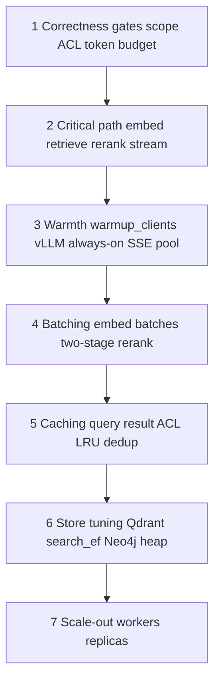
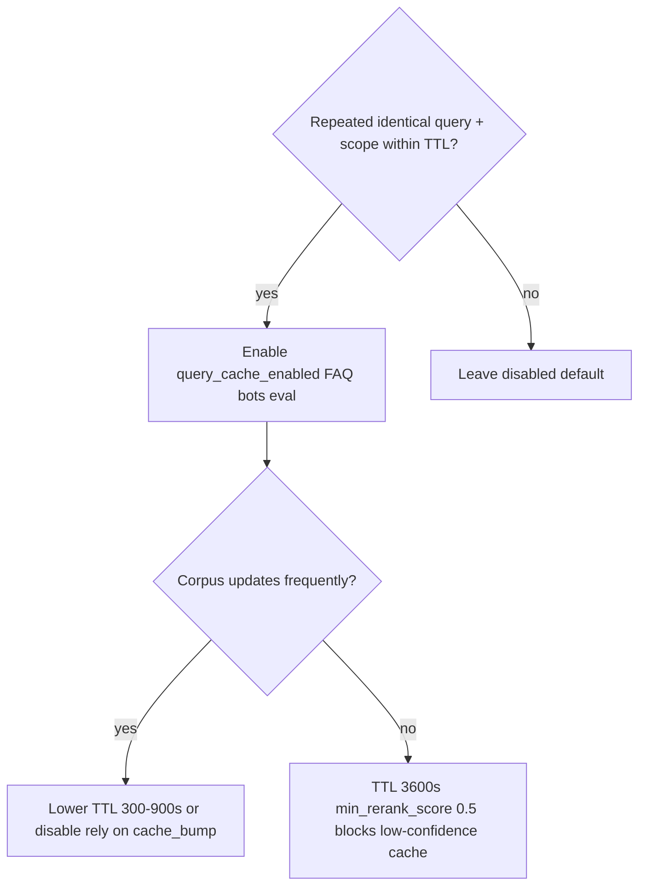

# Performance Optimization Guide

**Parent:** [ENTERPRISE_HYBRID_RAG_SPEC.md](../ENTERPRISE_HYBRID_RAG_SPEC.md) §18  
**Audience:** Platform engineers tuning query latency, ingest throughput, and GPU utilization

---

## 1. Optimization hierarchy

Apply optimizations in this order — later steps depend on earlier foundations:



**Rule:** Never raise concurrency before measuring GPU utilization and queue depth. Oversubscription causes TTFT regressions and OOM.

---

## 2. Query path — latency playbook

### 2.1 Stage skip matrix

| User action | Enable | Disable / skip |
|-------------|--------|----------------|
| Pins collection + document in UI | `skip_supervisor_when_explicit` | supervisor LLM call |
| FAQ / repeat questions | `query_cache_enabled` | embed, retrieve, rerank, answer |
| Narrow corpus (< 50k chunks) | default `search_ef=128` | quantization (optional) |
| Acronym-heavy domain | `neo4j_fulltext_enabled` | only if recall lift > 50ms cost |
| Tables + cross-refs needed | `graph_enrich_enabled` | disable for pure FAQ |

### 2.2 Two-stage rerank (highest ROI on GPU)

```toml
[query]
final_recall_limit = 25
rerank_stage1_top_n = 12    # fast model narrows pool
rerank_top_k = 4            # full model on top 12 only

[services]
reranker_fast_url = "http://reranker-fast:8092"
reranker_url = "http://reranker:8091"
```

**Expected gain:** rerank stage P95 600ms → 250ms when full model runs on 12 pairs not 25.

### 2.3 Scope optimization

| Mode | When | Latency |
|------|------|---------|
| `dense` (default) | Most deployments | Uses Qdrant fusion scores — no extra cross-encoder |
| `cross_encoder` | Scope accuracy < 90% on golden set | +200–400ms per unscoped query |
| Explicit pins | UI scope bar / MCP args | Skips scope inference entirely (< 20ms) |

**Prod default:** train users to pin scope; set `scope_mode = require_explicit` for regulated collections.

### 2.4 Connection pooling

| Client | Setting | Recommendation |
|--------|---------|----------------|
| Qdrant | gRPC preferred over REST | Single client per worker; reuse across requests |
| Neo4j | `max_connection_pool_size` | 50 for query; 10 for ingest writers |
| Postgres catalog | SQLAlchemy pool | `pool_size=5`, `max_overflow=10` |
| Redis | connection pool | One async/sync pool per process |
| HTTP reranker | `httpx` keep-alive | `timeout=30`, reuse client in `client_factory` |

### 2.5 Streaming and TTFT

- Use `POST /research/stream` — do not wait for full answer in MCP tool path when UI supports SSE
- Emit `sources` event before first `token` so UI shows citations while LLM generates
- **TTFT budget:** retrieve + rerank + graph MUST complete before first token (target P50 < 800ms GPU)

### 2.6 Query cache decision tree



---

## 3. Ingest path — throughput playbook

### 3.1 Bottleneck identification

| Symptom | Bottleneck | First knob |
|---------|------------|------------|
| GPU < 40% util, queue growing | Embed batch size too small | Raise `batch_size` in Celery task |
| GPU 100%, queue growing | Inference saturated | Lower `celery_concurrency` or add embed GPU |
| CPU 100%, GPU idle | Parse bound | Raise `parse_workers` |
| Qdrant latency spikes during ingest | Write contention | Schedule bulk jobs off-peak; `wait=false` upserts |
| Redis timeouts | MGET batch too large | Lower `dedup_mget_batch` to 50 |

### 3.2 Concurrency formula

```
safe_celery_concurrency = floor(embed_tokens_per_sec / (avg_chunks_per_task × embed_parallelism))
```

Start with `celery_concurrency=2`, `embed_parallelism=2` on `gpu_24gb`. Increase one variable at a time; watch `celery_queue_depth` and `ingest_chunks_per_second`.

### 3.3 Batch size tuning

| Parameter | Start | Scale up when |
|-----------|-------|---------------|
| `batch_size` (chunks/task) | 32 | GPU util < 60% and queue depth > 50 |
| `qdrant_upsert_batch` | 100 | gRPC overhead dominates worker profile |
| `neo4j_unwind_batch` | 50 | Neo4j CPU < 50% during ingest |
| `dedup_mget_batch` | 100 | Redis RTT > 5ms per batch |

### 3.4 Incremental ingest

- File registry skips unchanged files by hash — target NFR-12 (≥ 30% skip on re-ingest)
- Publish `ingest.completed` with `cache_bump: true` only when chunk content changed
- Defer VLM (`defer_vlm=true`) — never block parse on vision model

### 3.5 Off-peak scheduling

| Job type | Window | Rate limit |
|----------|--------|------------|
| Full collection reindex | Off-peak (nights/weekends) | `ingest_max_chunks_per_minute` |
| Incremental connector sync | Business hours | Default Celery rate limits |
| Version prune | After reindex completes | Single worker |

---

## 4. Store tuning

### 4.1 Qdrant (hybrid search)

| Corpus size | `search_ef` | `hnsw_m` | `on_disk_payload` | Quantization |
|-------------|-------------|----------|-------------------|--------------|
| < 100k | 128 | 16 | optional | no |
| 100k–500k | 128–192 | 16 | **true** | optional INT8 |
| 500k–2M | 192–256 | 24 | **true** | INT8 recommended |
| > 2M | 256+ | 32 | **true** | INT8 + shard plan |

**Payload indexes (required):** `tenant_id`, `collection_id`, `document_id`, `version_id`, `type`, `acl_principal`.

**Query filter rule:** always include `tenant_id` + `collection_id` — reduces HNSW search space before fusion.

### 4.2 Neo4j (graph enrich)

- Query path: read-only sessions; limit graph enrich to `rerank_top_k` chunk ids
- Ingest: UNWIND batches; avoid per-node MERGE in loops
- Fulltext index: create only when `neo4j_fulltext_enabled=true` — index build is ingest-time cost

### 4.3 Redis

| DB | Use | Eviction |
|----|-----|----------|
| 0 | Query cache + events | `allkeys-lru` if memory-bound |
| 1 | Celery broker | no eviction |
| 2 | Dedup + file registry | no eviction |

Set `maxmemory` on cache DB; never evict broker keys.

### 4.4 Postgres catalog

- Query: read-only DSN; index `(tenant_id, collection_id)` on `documents`, `acl_grants`
- Avoid N+1 catalog lookups — batch document metadata fetch for rerank context assembly

---

## 5. Inference plane

### 5.1 Port isolation (vLLM)

| Port | Model | Sharing |
|------|-------|---------|
| 8000 | Chat LLM | query only |
| 8001 | Embed | query + ingest (highest contention) |
| 8002 | Vision | ingest only (defer) |
| 8091/8092 | Reranker sidecars | query only |

**Contention fix:** dedicated embed GPU or throttle ingest `celery_concurrency` during peak query hours (spec §18.4).

### 5.2 vLLM flags (prod)

```bash
--gpu-memory-utilization 0.90
--max-num-seqs 16          # lower if KV OOM
--max-model-len 16384      # match ollama_num_ctx / query config
--enable-prefix-caching    # when available — speeds repeated system prompts
```

### 5.3 KV cache and concurrency

```
KV_VRAM ≈ 2 × layers × hidden × num_ctx × concurrent_seqs × dtype_bytes
```

If OOM during answer stage: lower `max-num-seqs`, reduce `max_context_tokens`, or limit BFF concurrent streams (default 2/user).

---

## 6. Profile-specific presets

Apply atomically via `[models].profile` — see spec §12.1.

### `gpu_24gb` (recommended prod single-GPU)

```toml
[query]
skip_supervisor_when_explicit = true
scope_rerank_mode = "dense"
final_recall_limit = 25
rerank_stage1_top_n = 12
rerank_top_k = 4
graph_enrich_enabled = true
query_cache_enabled = false   # enable for FAQ-heavy workloads

[ingest]
celery_concurrency = 4
embed_parallelism = 4
defer_vlm = true
```

**Schedule:** run large ingest jobs 22:00–06:00 local; query peak 09:00–18:00.

### `lima_12gb` (CPU dev)

```toml
[query]
final_recall_limit = 12
rerank_top_k = 3
graph_enrich_enabled = false
neo4j_fulltext_enabled = false

[ingest]
celery_concurrency = 2
embed_parallelism = 1
```

Expect P95 full answer < 45s (NFR-03). Use for contract tests, not load tests.

### `a100_80gb`

```toml
[query]
max_context_tokens = 24000
final_recall_limit = 25
multi_scope_parallelism = 8

[models]
ollama_num_ctx = 32768
```

Enable query cache for eval reruns; SGLang multi-model on same host.

---

## 7. Observability for performance

### 7.1 Required telemetry

Every query MUST log:

```
rag_stage_ms supervisor=N embed=N scope=N retrieve=N rerank=N graph=N answer=N
  from_cache=false context_tokens=N prompt_tokens=N completion_tokens=N
```

### 7.2 Jaeger / OTel spans

| Span | Attribute |
|------|-----------|
| `rag_pipeline` | `timings_ms` JSON |
| `store/qdrant/retrieve` | `recall_count`, `search_ef` |
| `store/redis/cache_lookup` | `cache_hit` |

### 7.3 Alert thresholds

| Metric | Alert |
|--------|-------|
| `rag_ttft_ms` p95 | > 2s for 5 min |
| `rag_stage_ms.retrieve` p95 | > 200ms |
| `ingest_chunks_per_second` | < 50% baseline 10 min |
| `inference_cold_start_total` | > 0 in prod |

---

## 8. Benchmark workflow

```bash
# 1. Baseline (after tuning)
cd query && python benchmarks/benchmark_rag.py --limit 20 --write-baseline

# 2. Compare on PR / nightly
python benchmarks/compare_benchmark_run.py benchmarks/last_run.json benchmarks/baselines.json

# 3. Ingest mock (every PR)
cd ../ingest && python benchmarks/benchmark_ingest.py --mock --fail-chunks-per-min 1000
```

See `query/benchmarks/baselines.json.example` for schema.

**Release gate:** spec §18.7 checklist — all items must pass before `rag-v*` tag.

---

## 9. Anti-patterns

| Anti-pattern | Why it hurts | Fix |
|--------------|--------------|-----|
| Cross-encoder scope on every query | +300ms minimum | Use `dense` mode; pin scope in UI |
| `final_recall_limit=50` without two-stage rerank | Rerank dominates | Enable fast reranker or lower limit |
| Multiple Ollama models on 8 GB Mac | Swap thrashing | One model; sidecar reranker on CPU |
| Ingest + query peak on same embed GPU | TTFT spikes | Off-peak ingest or dedicated embed port |
| `on_disk_payload=false` at 500k+ chunks | RAM exhaustion | Enable in infra.toml |
| Caching without `cache_bump` on ingest | Stale answers | Subscribe to `ingest.completed` |
| Raising `num_ctx` without lowering `max_context_tokens` | KV OOM | Keep margin ≥ 512 tokens |
| Per-request Qdrant client create | Connection overhead | `warmup_clients()` + pool reuse |
| Full graph traversal per query | Neo4j latency | Limit to top-k chunk ids post-rerank |

---

## 10. Quick wins checklist

- [ ] `warmup_on_startup = true` + `warmup_clients()` in query
- [ ] `skip_supervisor_when_explicit = true`
- [ ] Reranker HTTP sidecar (not in-process per worker)
- [ ] `defer_vlm = true` on ingest
- [ ] Qdrant `on_disk_payload = true`
- [ ] Payload indexes on filter fields
- [ ] Explicit scope pins in chat UI
- [ ] Two-stage rerank configured
- [ ] Ingest off-peak for full reindex
- [ ] Benchmark baselines committed per hardware profile

---

## 11. Infrastructure sub-project (`hybrid-rag-infra`)

Store tuning, Redis DB separation, Caddy SSE, Postgres indexes — **no custom app code**.

| Focus | Doc |
|-------|-----|
| Qdrant HNSW, gRPC, quantization | [infra/docs/PERFORMANCE.md](../infra/docs/PERFORMANCE.md) §2 |
| Neo4j heap, UNWIND batches | §3 |
| Redis broker vs cache isolation | §4 |
| Caddy `flush_interval -1` for MCP SSE | §8 |

**Planned:** INF-P1…P6 in infra performance roadmap.

---

## 12. Observability sub-project (`hybrid-rag-observability`)

Telemetry overhead budget: **< 5% p95 regression** on query path.

| Focus | Doc |
|-------|-----|
| OTel BatchSpanProcessor + collector batch | [observability/docs/PERFORMANCE.md](../observability/docs/PERFORMANCE.md) §2–3 |
| Langfuse async flush after SSE `done` | §4 |
| Probabilistic sampling at scale | §3 (planned OBS-P1) |
| Anti-patterns (span per chunk) | §9 |

**Planned:** OBS-P1…P6 in observability performance roadmap.

---

*Update when `benchmarks/baselines.json` or hardware profiles change.*

---

## 13. Enterprise resilience

Platform normative: spec §6.3.2, §18.14–18.16.

| Concern | Mechanism | Owner |
|---------|-----------|-------|
| Graceful degradation | L0–L5 ladder | query |
| Circuit breakers | inference + store clients | query |
| Rate limits | Redis `rlimit:` per tenant/user | query |
| Tenant quotas | catalog `tenant_quotas` | ingest + query |
| Backpressure | auto-pause at queue depth 1000 | ingest |
| SLO / error budget | 99.9% availability, burn alerts | observability |

Sub-project playbooks:

| Plane | Doc |
|-------|-----|
| Query | [query/docs/PERFORMANCE.md](../query/docs/PERFORMANCE.md) |
| Ingest | [ingest/docs/PERFORMANCE.md](../ingest/docs/PERFORMANCE.md) |
| Inference | [inference/docs/PERFORMANCE.md](../inference/docs/PERFORMANCE.md) |
| Stores | [infra/docs/PERFORMANCE.md](../infra/docs/PERFORMANCE.md) |
| Telemetry | [observability/docs/PERFORMANCE.md](../observability/docs/PERFORMANCE.md) |

---

## 14. Load and soak testing

Per spec §13.1 — normative tools: **k6** (primary), **Locust** (alternative).

```bash
# k6 (install: https://k6.io/docs/get-started/installation/)
k6 run -e QUERY_URL=http://localhost:8010 query/benchmarks/k6/research_stream.js

# Locust
locust -f query/benchmarks/locust/locustfile.py --headless -u 50 -r 5 -t 30m \
  --host http://localhost:8010

# Wrapper
python query/benchmarks/load_test.py --backend k6 --concurrency 50 --duration 30m
```

Detail: [query/benchmarks/README.md](../query/benchmarks/README.md).

---

## 15. RAG quality evaluation (Ragas)

Per spec §13.2, **TL-08**:

```bash
pip install -r query/benchmarks/requirements.txt
python query/benchmarks/benchmark_rag.py --golden-set query/benchmarks/golden_set.json --ragas
```

Gates: faithfulness ≥ 0.85, answer relevancy ≥ 0.80, context recall ≥ 0.75.

---

## 16. Capacity planning

Use platform §12.8 worksheet before production cutover. Key inputs:

- Peak QPS → query replica count + inference `max-num-seqs`
- Chunk count → Qdrant RAM + INT8 threshold
- Ingest cps → Celery workers × embed batch throughput
- **30% headroom** on GPU and Qdrant at peak (NFR-17)
