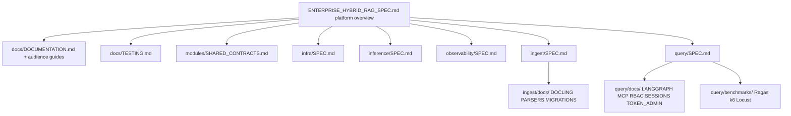

# Specification Roadmap — Enterprise Hybrid RAG

**Parent:** [ENTERPRISE_HYBRID_RAG_SPEC.md](../ENTERPRISE_HYBRID_RAG_SPEC.md)  
**Current platform spec:** v0.28  
**Last updated:** 2026-07-10

This document is the **living plan** for spec depth, implementation phases, and cross-sub-project alignment. Normative behavior remains in the platform spec and sub-project `SPEC.md` files.

---

## 1. Current state (v0.28)

| Area | Status | Location |
|------|--------|----------|
| Modular sub-projects (5 planes + kernel) | **Specified + stub compose** | `query/`, `ingest/`, `infra/`, `inference/`, `observability/` |
| **Catalog DDL + migrations** | **001–004 on disk** | `ingest/migrations/`, §4.4, `ingest/docs/MIGRATIONS.md` |
| **JSON schemas (MCP + kernel)** | **11 contracts on disk** | `modules/schemas/`, §4.7 |
| **MCP token RBAC** | **Implemented** | `auth.py`, `token_store.py`, `rbac.py`, `/admin/mcp/tokens` |
| **JWT bridge (JWKS)** | **Implemented** | `jwt_auth.py`, `JWT_STUB` dev mode, FR-24 contract test |
| **MCP conversation sessions** | **Implemented** | `session_store.py`, session MCP + HTTP routes |
| **MCP stdio transport** | **Implemented** | `mcp_stdio.py`, `MCP_ACCESS_TOKEN` |
| **LangGraph clients LG-1–LG-3** | **Done v0.28** | Qdrant, embed, chat, reranker, query cache |
| **Catalog MCP tools** | **Done v0.30** | `catalog_store.py`, ACL filtering |
| **benchmark_rag.py (LG-4)** | **Implemented** | `query/benchmarks/` |
| **migrate.py (E-14)** | **Implemented** | `ingest/app/migrate.py` |
| **Contract tests** | **71 tests passing** | `query/tests/contract/`, `query/tests/unit/` |
| **GitHub Actions CI** | **Implemented** | `.github/workflows/ci.yml`, `nightly.yml`, `scripts/ci-*.sh` |
| **Integration tests** | **Implemented** | `query/tests/integration/` (`LIVE_STACK=1`, `.env.live.example`) |
| **SigNoz APM profile** | **Partial on disk** | §10.5, `observability/docs/SIGNOZ.md` |
| **Postgres query roles** | **Init script + grants** | `postgres-init.sh`, `004_*`, `infra/docs/POSTGRES.md` |
| **Root `.gitignore`** | **Done** | secrets, local configs, token files |
| LangGraph RAG orchestration + LangSmith | **Partial** — real retrieve/answer; graph stub | `query/app/rag_graph.py`, TL-06/07 |
| Test-driven development | **Normative** | §13.4, §19, `docs/TESTING.md` |
| Implementation inventory | **Normative** | spec §1.4–1.5, §12.8 |
| **Ingest parsers / admin API** | **Done v0.49** — full plane + benchmark + Celery poll + backpressure + quotas | Query admission pending |

---

## 2. Enhancement themes (priority order)

### P0 — Contract completeness

| ID | Enhancement | Spec section | Status |
|----|-------------|--------------|--------|
| E-01 | IF-6 Identity + MCP token auth | §3.3, §7.13, §9.2 | **Done v0.28** — `auth.py`, `jwt_auth.py`, `token_store.py` |
| E-02 | Canonical bootstrap runbook + health gates | §12.5 | **Done** |
| E-03 | Sub-project release tag + compatibility matrix | §12.6 | Partial |
| E-04 | Packer / image naming convention | §12.7 | Partial |
| E-05 | Auth layering: token-first + optional JWT bridge | §7.10, §7.13 | **Done** v0.26 |
| E-06 | OTel span catalog aligned with Langfuse hierarchy | §10.4 | **Done** — wire in code pending |
| E-07 | Performance guide + baselines | **Done v0.13** | `docs/PERFORMANCE.md` |
| E-08 | Implementation language stack | **Done v0.14** | spec §1.3 |
| E-09 | Infra + observability performance plans | **Done v0.14** | sub-project `docs/PERFORMANCE.md` |
| E-10 | LangGraph + LangSmith for Python query plane | **Done v0.15** | query |
| E-11 | Enterprise performance program | **Done v0.16** | platform |
| E-12 | Docling parser tier + Ragas/k6/Locust harness | **Done v0.17** | ingest + query |
| E-13 | Test-driven development program | **Done v0.18** | platform |
| E-20 | Exhaustive documentation (audiences, Mermaid) | **Done v0.19** | platform |
| E-35 | Implementation inventory + spec/repo alignment | **Done v0.20** | platform |
| E-36 | Coding standards (Black, Ruff, patterns) | **Done v0.21** | platform |
| E-37 | Catalog DDL + JSON schemas + IF-6/MCP/OTel/Makefile | **Done v0.22** | platform |
| E-38 | MCP conversation sessions | **Done v0.24** | §7.11, `002_*` |
| E-39 | Token-based MCP RBAC | **Done v0.26** | §7.13, `003_*` |
| E-40 | Token admin OpenAPI | **Done v0.27** | `query/docs/TOKEN_ADMIN.md` |
| E-41 | Token mint JSON schemas | **Done v0.27** | `mcp_access_token_mint.*.v1.json` |
| E-42 | Postgres query roles + table grants | **Done v0.27** | `postgres-init.sh`, `004_*` |
| E-43 | Migration runner spec | **Done v0.27** | `ingest/docs/MIGRATIONS.md`, §4.4.4 |

### P1 — Implementation-ready depth

| ID | Enhancement | Deliverable | Status |
|----|-------------|-------------|--------|
| E-14 | Catalog migrations + runner | `migrate.py`, `make migrate` | **Done v0.28** |
| E-15 | Contract test suite | `query/tests/contract/` | **Partial** — query 34+; ingest chunk schema + parsers (v0.32) |
| E-16 | ACL grant API + admin tools | `ingest/app/acl_store.py`, `acl_handlers.py` | **Done v0.34** |
| E-17 | Connector interface v2 (S3 first) | `ingest/app/connectors/`, `connector_sync.py` | **Done v0.35** |
| E-18 | mod-chat scaffold (BFF + Keycloak login) | `chat-ui/` | Not started |
| E-19 | Helm chart sketch | `deploy/helm/` | Not started |

### P1.5 — LangGraph implementation (stub → production)

| ID | Item | Sub-project | Deliverable |
|----|------|-------------|-------------|
| LG-1 | Real Qdrant hybrid retrieve node | query | **Done v0.28** — `clients/qdrant.py` |
| LG-2 | vLLM embed + chat streaming in answer node | query | **Done v0.28** — `clients/chat.py`, streaming |
| LG-3 | Redis query cache node | query | **Done v0.28** — `query_cache.py` |
| LG-4 | LangSmith + **Ragas** eval from golden set | query | **Done v0.43** — `benchmark_rag.py --ragas` + nightly CI gate |
| LG-5 | Celery task spans in LangSmith (optional) | ingest | `@traceable` on `batch_write` |
| LG-6 | MCP conversation session store | query | **Done v0.28** — `session_store.py` + tools |

### P1.6 — Infra & observability performance

| ID | Item | Sub-project | Deliverable |
|----|------|-------------|-------------|
| INF-P1 | Qdrant INT8 quantization init | infra | `scripts/init-db.sh` extension |
| INF-P2 | Postgres catalog indexes | infra | `scripts/postgres-catalog-indexes.sql` |
| INF-P3 | Redis `maxmemory` in compose | infra | `compose/docker-compose.yml` |
| INF-P4 | Qdrant gRPC 6334 documented in compose | infra | port mapping + consumer docs |
| OBS-P1 | Probabilistic trace sampler | observability | **Done** — `collector/otel-collector-config.prod.yaml` |
| OBS-P2 | Query attribute truncation processor | observability | collector config |
| OBS-P3 | `benchmark_rag.py --compare-otel` | query | **Done v0.47** — CI gate < 5% p95 overhead |
| OBS-P4 | Jaeger persistent storage profile | observability | compose profile `jaeger-persist` |

### P2 — Enterprise hardening

| ID | Enhancement | Notes |
|----|-------------|-------|
| E-34 | mTLS between tiers | infra Caddy + service mesh option |
| E-21 | Tenant offboarding automation | spec §9.1 purge API |
| E-22 | Version retention job | nightly Qdrant + Neo4j prune |
| E-23 | SigNoz dashboards as code | **Done** — `scripts/import_signoz.py`, dashboard stubs, `signoz-rules.yaml` |
| E-44 | Session retention prune job | **Done** — `session_prune.py`, `POST /admin/sessions/prune`, `make prune-sessions` |
| E-24 | Multi-region read replica story | spec §12.4 expansion |
| E-25 | Embedding dimension migration playbook | resolves OQ2 |
| E-26 | Chaos test suite automation | spec §13.1 monthly staging |
| E-27 | Tenant quota admin API | `PUT /admin/tenants/{id}/quotas` | **Done v0.49** (ingest) |
| E-28 | Circuit breaker implementation | query `client_factory.py` | **Done v0.31** |
| E-29 | Load test harness (`load_test.py`) | k6/locust wrapper | **Done v0.48** |

### P3 — Advanced product

| ID | Enhancement | Phase |
|----|-------------|-------|
| E-30 | Cross-collection queries | P5 |
| E-31 | Confluence / SharePoint connectors | P5 |
| E-32 | Federated MCP (multi-region catalog) | OQ3 |
| E-33 | Per-tenant Qdrant collections (regulated tier) | OD1 variant |

---

## 3. Spec document map (where to add detail)

**Rule:** Platform spec summarizes; sub-project `SPEC.md` is normative for deploy boundaries. Deep how-tos live in `docs/` under each sub-project.

---

## 4. Interface checklist (release gate)

Before tagging `rag-v1.x`, verify:

- [ ] `index_schema_version` matches across infra, ingest, query configs
- [ ] `embed_dimension` matches inference embed model output
- [ ] IF-1 init-db completed (`make init-db`)
- [ ] Catalog migrations applied (`cd ingest && make migrate`)
- [ ] IF-4 inference health passes for required models
- [ ] IF-5 OTLP + Langfuse keys configured (query)
- [ ] IF-6 Keycloak realm imported; MCP admin token minted (`POST /admin/mcp/tokens`)
- [ ] Unit + contract tests pass on every PR (`pytest tests/unit tests/contract`) — TL-11
- [ ] Audience guides and sub-project READMEs current for shipped behavior — FR-35, NFR-25
- [ ] MCP contract tests pass (`research_documents`, session tools, `/research/stream`)
- [ ] Golden-set p95 within baseline × 1.1 (spec §18.7)
- [ ] Ragas gates pass on golden set (`benchmark_rag.py --ragas`)
- [ ] k6 or Locust soak passes NFR-23 (`load_test.py`)
- [ ] Rate limits + quotas configured for prod tenants
- [x] Circuit breakers enabled on query inference clients (E-28)
- [x] OTel SDK overhead < 5% p95 vs disabled (`OBS-P3`, `--compare-otel`)
- [ ] Infra store SLOs pass (`make health` in infra)

---

## 5. Version history (platform spec)

| Version | Focus |
|---------|-------|
| v0.7 | Observability sub-project extraction |
| v0.8 | Inference sub-project |
| v0.9 | Infra sub-project |
| v0.10 | Ingest sub-project |
| v0.11 | Query / MCP sub-project |
| **v0.12** | IF-6 identity, bootstrap runbook, release matrix, auth depth, OTel/Jaeger alignment |
| **v0.13** | Performance optimization guide, FR-25/26, NFR-18/19, benchmark baselines |
| **v0.14** | Implementation stack (§1.3); infra + observability performance plans |
| **v0.15** | LangGraph RAG orchestration + LangSmith tracing (TL-06/07) |
| **v0.16** | Enterprise performance program |
| **v0.17** | Docling, Ragas, k6/Locust |
| **v0.18** | Test-driven development (§19, `docs/TESTING.md`, FR-33/34) |
| **v0.19** | Documentation engineering (§21, audience guides, Mermaid, TL-12/13) |
| **v0.20** | Implementation inventory (§1.4–1.5), §12.8 artifacts, layout `modules/`, TL-12 integration diagrams |
| **v0.21** | Coding standards (§23, `docs/CODING_STANDARDS.md`, `pyproject.toml`) |
| **v0.22** | Catalog DDL §4.4.1, JSON schemas §4.7, IF-6 §9.2, MCP I/O §7.3.1, OTel §10.4, Makefile §12.9 |
| **v0.23** | SigNoz §10.5, collector fan-out, dashboard/alert stubs |
| **v0.24** | MCP conversation sessions §7.11, §6.13.7, `002_*`, FR-41–43 |
| **v0.25** | MCP RBAC permission matrix §7.13, §9.4, FR-44–46 |
| **v0.26** | Token-based MCP RBAC — `rag_mcp_*`, `003_*`, FR-23/45/47–48 |
| **v0.27** | §22 sync, token admin API, migration runner spec, `004_*` grants, MCP schemas, `.gitignore` |
| **v0.28** (next) | Implement auth, token_store, session_store, MCP handlers, contract tests — §22.7 |
| **rag-v1.0** (target) | First implementable release train with contract tests green |

---

## 6. Open questions tracker

See also platform spec **§22** (what to spec next).

| ID | Question | Target resolution |
|----|----------|-------------------|
| OQ1 | Managed vs self-hosted stores | v0.13 — deployment appendix |
| OQ2 | Embed model swap without full reindex | v0.13 — migration playbook |
| OQ3 | Federated multi-region MCP | v1.1+ |
| OQ4 | Keycloak vs external IdP (Azure AD) | Document federation in `infra/docs/KEYCLOAK.md` |
| OQ5 | MCP auth: token vs JWT | **Closed v0.26** — token-first; JWT bridge optional |

---

*Update this roadmap when platform spec version bumps or a sub-project reaches implementable milestone.*
