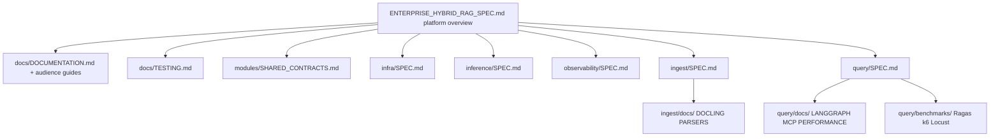

# Specification Roadmap — Enterprise Hybrid RAG

**Parent:** [ENTERPRISE_HYBRID_RAG_SPEC.md](../ENTERPRISE_HYBRID_RAG_SPEC.md)  
**Current platform spec:** v0.22  
**Last updated:** 2026-07-09

This document is the **living plan** for spec depth, implementation phases, and cross-sub-project alignment. Normative behavior remains in the platform spec and sub-project `SPEC.md` files.

---

## 1. Current state (v0.20)

| Area | Status | Location |
|------|--------|----------|
| Modular sub-projects (5 planes + kernel) | **Specified + stub compose** | `query/`, `ingest/`, `infra/`, `inference/`, `observability/` |
| **Coding standards** | **Normative** | §23, `docs/CODING_STANDARDS.md`, `pyproject.toml`, TL-14/15/16 |
| **Catalog DDL + JSON schemas** | **Partial on disk** | §4.4.1, §4.7, `ingest/migrations/`, `modules/schemas/` |
| **Root Makefile** | **Done** | `make bootstrap`, `make health`, `make lint` |
| **Implementation inventory** | **Normative** | spec §1.4–1.5, §12.8, stub-phase conventions |
| **Multi-audience documentation** | **Normative** | §21, `docs/DOCUMENTATION.md`, audience guides, TL-12/13 |
| **TL-12 integration diagrams** | **Done v0.20** | `*/docs/INTEGRATION.md`, `STACK.md`, `OTEL.md`, `docs/PERFORMANCE.md` |
| **Test-driven development** | **Normative** | §13.4, §19, `docs/TESTING.md`, TL-11, FR-33/34 |
| **Docling** parser tier + PyMuPDF fast path | **Normative** | §5.1.1, `ingest/docs/DOCLING.md`, TL-10 |
| **Ragas** + **k6** / **Locust** eval harness | **Normative + scaffold** | §13, `query/benchmarks/`, TL-08/09 |
| LangGraph RAG orchestration + LangSmith | **Specified + stub graph** | `query/app/rag_graph.py`, TL-06/07 |
| Enterprise performance program | **Normative** | spec §6.3.2, §18.14–18.17 |
| MinIO object store | **Specified + init** | `infra/docs/MINIO.md` |
| Shared contracts (quotas) | **Normative** | `modules/SHARED_CONTRACTS.md` §12 |

---

## 2. Enhancement themes (priority order)

### P0 — Contract completeness (now → next sprint)

| ID | Enhancement | Spec section | Owner sub-project |
|----|-------------|--------------|-------------------|
| E-01 | IF-6 Identity (Keycloak OIDC, JWT claims) | §3.3, §9.2 | infra + query |
| E-02 | Canonical bootstrap runbook + health gates | §12.5 | platform |
| E-03 | Sub-project release tag + compatibility matrix | §12.6 | platform |
| E-04 | Packer / image naming convention | §12.7 | platform |
| E-05 | Auth layering: Caddy bearer vs OIDC JWT | §7.10, §9 | infra + query |
| E-06 | OTel span catalog aligned with Langfuse hierarchy | §10, `observability/docs/` | observability |
| E-07 | Performance guide + baselines | **Done v0.13** — `docs/PERFORMANCE.md` | platform |
| E-08 | Implementation language stack | **Done v0.14** — spec §1.3 | platform |
| E-09 | Infra + observability performance plans | **Done v0.14** — sub-project `docs/PERFORMANCE.md` | infra, observability |
| E-10 | LangGraph + LangSmith for Python query plane | **Done v0.15** | query |
| E-11 | Enterprise performance program (SLO, degrade, quotas, scale) | **Done v0.16** | platform |
| E-12 | Docling parser tier + Ragas/k6/Locust harness | **Done v0.17** | ingest + query |
| E-13 | Test-driven development program | **Done v0.18** | platform |
| E-20 | Exhaustive documentation (audiences, Mermaid, code comments) | **Done v0.19** | platform |
| E-35 | Implementation inventory + spec/repo alignment | **Done v0.20** | platform |
| E-36 | Coding standards (Black, Ruff, patterns, logging) | **Done v0.21** | platform |
| E-37 | Catalog DDL + JSON schemas + IF-6/MCP/OTel/Makefile depth | **Done v0.22** | platform |

### P1 — Implementation-ready depth

| ID | Enhancement | Deliverable |
|----|-------------|-------------|
| E-14 | Catalog DDL migrations (normative SQL) | `ingest/migrations/` + spec §4.4 |
| E-15 | Golden-set + `tests/` scaffold (TDD) | `query/tests/`, `ingest/tests/`, `modules/schemas/` |
| E-16 | ACL grant API + admin tools | spec §9 + `ingest/docs/ADMIN_API.md` |
| E-17 | Connector interface v2 (S3 first) | spec §5.8 + `ingest/docs/CONNECTORS.md` |
| E-18 | mod-chat scaffold (BFF + Keycloak login) | `chat-ui/` optional repo |
| E-19 | Helm chart sketch (values per sub-project) | `deploy/helm/` |

### P1.5 — LangGraph implementation (stub → production)

| ID | Item | Sub-project | Deliverable |
|----|------|-------------|-------------|
| LG-1 | Real Qdrant hybrid retrieve node | query | `rag_graph.py` + `clients/qdrant.py` |
| LG-2 | vLLM embed + chat streaming in answer node | query | inference HTTP clients |
| LG-3 | Redis query cache node | query | `query_cache.py` wired to `check_cache` |
| LG-4 | LangSmith + **Ragas** eval from golden set | query | `benchmarks/benchmark_rag.py --ragas` |
| LG-5 | Celery task spans in LangSmith (optional) | ingest | `@traceable` on `batch_write` |
| LG-6 | MCP conversation session store | query | `session_store.py` + §7.11 tools + §6.13.7 history |

### P1.6 — Infra & observability performance (implement next)

| ID | Item | Sub-project | Deliverable |
|----|------|-------------|-------------|
| INF-P1 | Qdrant INT8 quantization init | infra | `scripts/init-db.sh` extension |
| INF-P2 | Postgres catalog indexes | infra | `scripts/postgres-catalog-indexes.sql` |
| INF-P3 | Redis `maxmemory` in compose | infra | `compose/docker-compose.yml` |
| INF-P4 | Qdrant gRPC 6334 documented in compose | infra | port mapping + consumer docs |
| OBS-P1 | Probabilistic trace sampler | observability | `collector/otel-collector-config.prod.yaml` |
| OBS-P2 | Query attribute truncation processor | observability | collector config |
| OBS-P3 | `benchmark_rag.py --compare-otel` | query | CI gate < 5% overhead |
| OBS-P4 | Jaeger persistent storage profile | observability | compose profile `jaeger-persist` |

### P2 — Enterprise hardening

| ID | Enhancement | Notes |
|----|-------------|-------|
| E-34 | mTLS between tiers | infra Caddy + service mesh option |
| E-21 | Tenant offboarding automation | spec §9.1 purge API |
| E-22 | Version retention job | nightly Qdrant + Neo4j prune |
| E-23 | SigNoz dashboards as code | **Partial** — §10.5.5 stubs in `observability/dashboards/`; API import automation pending |
| E-35 | MCP conversation sessions | **Done** — §7.11, §4.4.2, `002_conversation_sessions_v1.sql` (v0.24); implement LG-6 |
| E-36 | Session retention prune job | `sessions.max_age_days` nightly job |
| E-24 | Multi-region read replica story | spec §12.4 expansion |
| E-25 | Embedding dimension migration playbook | resolves OQ2 |
| E-26 | Chaos test suite automation | spec §13.1 monthly staging |
| E-27 | Tenant quota admin API | `PUT /admin/tenants/{id}/quotas` |
| E-28 | Circuit breaker implementation | query `client_factory.py` |
| E-29 | Load test harness (`load_test.py`) | k6/locust wrapper |

### P3 — Advanced product

| ID | Enhancement | Phase |
|----|-------------|-------|
| E-30 | Cross-collection queries | P5 |
| E-31 | Confluence / SharePoint connectors | P5 |
| E-32 | Federated MCP (multi-region catalog) | OQ3 |
| E-33 | Per-tenant Qdrant collections (regulated tier) | OD1 variant |

---

## 3. Spec document map (where to add detail)

**Rule:** Platform spec summarizes; sub-project `SPEC.md` is normative for deploy boundaries. Deep how-tos live in `docs/` under each sub-project.

---

## 4. Interface checklist (release gate)

Before tagging `rag-v1.x`, verify:

- [ ] `index_schema_version` matches across infra, ingest, query configs
- [ ] `embed_dimension` matches inference embed model output
- [ ] IF-1 init-db completed (`make init-db`)
- [ ] IF-4 inference health passes for required models
- [ ] IF-5 OTLP + Langfuse keys configured (query)
- [ ] IF-6 Keycloak realm imported; test user can obtain JWT (prod)
- [ ] Unit + contract tests pass on every PR (`pytest tests/unit tests/contract`) — TL-11
- [ ] Audience guides and sub-project READMEs current for shipped behavior — FR-35, NFR-25
- [ ] MCP contract tests pass (`research_documents`, `/research/stream`)
- [ ] Golden-set p95 within baseline × 1.1 (spec §18.7)
- [ ] Ragas gates pass on golden set (`benchmark_rag.py --ragas`)
- [ ] k6 or Locust soak passes NFR-23 (`load_test.py`)
- [ ] Rate limits + quotas configured for prod tenants
- [ ] Circuit breakers enabled on query inference clients
- [ ] OTel SDK overhead < 5% p95 vs disabled (`OBS-P3`)
- [ ] Infra store SLOs pass (`make health` in infra)

---

## 5. Version history (platform spec)

| Version | Focus |
|---------|-------|
| v0.7 | Observability sub-project extraction |
| v0.8 | Inference sub-project |
| v0.9 | Infra sub-project |
| v0.10 | Ingest sub-project |
| v0.11 | Query / MCP sub-project |
| **v0.12** | IF-6 identity, bootstrap runbook, release matrix, auth depth, OTel/Jaeger alignment |
| **v0.13** | Performance optimization guide, FR-25/26, NFR-18/19, benchmark baselines |
| **v0.14** | Implementation stack (§1.3); infra + observability performance plans |
| **v0.15** | LangGraph RAG orchestration + LangSmith tracing (TL-06/07) |
| **v0.16** | Enterprise performance program |
| **v0.17** | Docling, Ragas, k6/Locust |
| **v0.18** | Test-driven development (§19, `docs/TESTING.md`, FR-33/34) |
| **v0.19** | Documentation engineering (§21, audience guides, Mermaid, TL-12/13) |
| **v0.20** | Implementation inventory (§1.4–1.5), §12.8 artifacts, layout `modules/`, TL-12 integration diagrams |
| **v0.21** | Coding standards (§23, `docs/CODING_STANDARDS.md`, `pyproject.toml`) |
| **v0.22** | Catalog DDL §4.4.1, JSON schemas §4.7, IF-6 §9.2, MCP I/O §7.3.1, OTel §10.4, Makefile §12.9, benchmark CLI §13.2.1 |
| v0.23 (planned) | Implement LG-1/LG-4, auth.py, MCP tools, contract tests — §22 |
| v1.0 (target) | First implementable release train with contract tests green |

---

## 6. Open questions tracker

See also platform spec **§22** (what to spec next).

| ID | Question | Target resolution |
|----|----------|-------------------|
| OQ1 | Managed vs self-hosted stores | v0.13 — deployment appendix |
| OQ2 | Embed model swap without full reindex | v0.13 — migration playbook |
| OQ3 | Federated multi-region MCP | v1.1+ |
| OQ4 | Keycloak vs external IdP (Azure AD) | Document federation in `infra/docs/KEYCLOAK.md` |
| OQ5 | Query JWT validation: inline vs sidecar | OD9 — recommend inline JWKS in query |

---

*Update this roadmap when platform spec version bumps or a sub-project reaches implementable milestone.*
