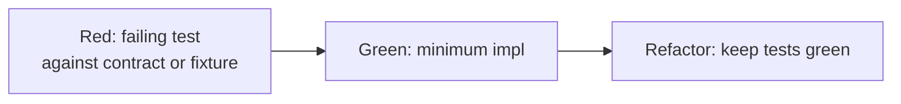
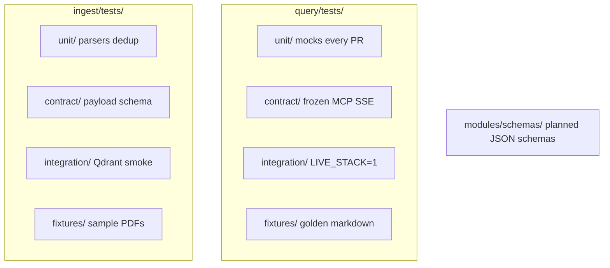

# Testing & test-driven development

**Parent:** [ENTERPRISE_HYBRID_RAG_SPEC.md](../ENTERPRISE_HYBRID_RAG_SPEC.md) §13.4, §19  
**Audience:** Engineers implementing query, ingest, and kernel contracts

---

## 1. Principle

Development on this platform follows **test-driven development (TDD)**:



**Rule (TL-11):** For kernel boundaries, MCP surfaces, and pipeline stages, the **test or fixture lands before** (or in the same PR as) the production implementation — never after.

Benchmarks (Ragas, k6) and contract tests are **not optional polish**; they are part of the specification.

---

## 2. Test pyramid

| Layer | Scope | Runner | When | Blocks merge |
|-------|-------|--------|------|--------------|
| **Unit** | Pure functions, parsers, scope logic, cache keys | `pytest` | Every PR | Yes |
| **Contract** | Chunk JSON schema, MCP markdown, SSE events, catalog RO role | `pytest` + frozen fixtures | Every PR | Yes |
| **Integration** | Ingest write → query read on live stack | `pytest` + `LIVE_STACK=1` | Nightly | Yes (nightly) |
| **Quality eval** | Ragas on golden set | `benchmark_rag.py --ragas` | Nightly | Yes (release) |
| **Performance** | p95 vs `baselines.json` | `benchmark_rag.py`, `compare_benchmark_run.py` | Nightly | Yes (release) |
| **Load / soak** | k6 / Locust | `load_test.py` | Pre-release | Yes (release) |

**Anti-pattern:** Skipping unit/contract tests and relying only on manual chat testing.

---

## 3. What to test first (by area)

### mod-kernel (`modules/SHARED_CONTRACTS.md`)

1. Add or update JSON schema / field list in spec  
2. Add failing `test_chunk_payload_schema.py` (or event test)  
3. Implement ingest writer or query reader  
4. Integration: `test_query_reads_ingest_fixture.py`

### Ingest parsers

1. Frozen input file in `ingest/tests/fixtures/` (PDF, DOCX, …)  
2. Expected chunk list snapshot (or schema assertions)  
3. Implement `app/parsers/*.py` until green  
4. No live embed in parser unit tests — mock embed client

### Query LangGraph nodes

1. Mock store/inference clients in `query/tests/unit/`  
2. Test each node: input `RAGState` → expected state delta + `timings_ms` key  
3. Test conditional edges (cache hit, abstain, degrade L1–L5)  
4. Wire real clients only in integration tier

### MCP / HTTP

1. Frozen expected markdown in `query/tests/fixtures/mcp/`  
2. `test_research_documents_markdown_order.py` — answer, Sources, telemetry footer  
3. `test_sse_event_types.py` — only `token`, `sources`, `telemetry`, `done`, `error`  
4. Implement `mcp_server.py` / tool handlers

### Admin API (ingest)

1. OpenAPI or fixture-based request/response tests  
2. Implement route handler

---

## 4. Repository layout (normative)



Platform contract tests listed in [SHARED_CONTRACTS.md](../modules/SHARED_CONTRACTS.md) §14.

---

## 5. Frozen fixtures

| Fixture | Purpose |
|---------|---------|
| `query/tests/fixtures/mcp/research_success.md` | MCP markdown contract |
| `query/tests/fixtures/sse/done_event.jsonl` | SSE shape |
| `query/benchmarks/golden_set.json` | Ragas + scope accuracy |
| `ingest/tests/fixtures/chunks/pay-001.json` | Parser output snapshot |
| `modules/schemas/chunk_payload.v1.json` | Kernel validation |

**Rule:** Intentional contract changes require **fixture update + BFF/query changelog note** in the same PR.

---

## 6. CI commands

```bash
# Every PR — unit + contract (no GPU)
cd query && pytest tests/unit tests/contract -q
cd ingest && pytest tests/unit tests/contract -q

# Nightly — integration + eval
LIVE_STACK=1 pytest tests/integration -q
python query/benchmarks/benchmark_rag.py --limit 20 --ragas
python query/benchmarks/compare_benchmark_run.py benchmarks/last_run.json benchmarks/baselines.json

# Pre-release
python query/benchmarks/load_test.py --backend k6 --concurrency 50 --duration 2h
```

---

## 7. TDD and performance

Performance regressions are **tests**:

- `baselines.json` is the committed expected performance contract per hardware profile  
- Nightly CI compares actuals — failing ratio = red build (FR-16)

Do not tune production configs without updating baselines when the change is intentional.

---

## 8. TDD and modular boundaries

| Boundary | Test enforces |
|----------|----------------|
| query ↔ ingest | No cross-imports; shared kernel only |
| query ↔ stores | `query_ro` cannot INSERT |
| ingest ↔ query routes | ingest has no `/research/stream` |
| IF-3 events | `test_event_cache_bump.py` |

---

## 9. Release gate (TDD summary)

Before `rag-v1.x`:

- [ ] All unit + contract tests green on every PR for 2 weeks  
- [ ] Integration suite green on nightly  
- [ ] Golden set + Ragas gates pass  
- [ ] Baseline performance ratios pass  
- [ ] No `@pytest.mark.skip` on contract tests without linked issue + expiry

---

## 10. Related docs

| Doc | Topic |
|-----|--------|
| [SPEC_ROADMAP.md](./SPEC_ROADMAP.md) §4 | Full release checklist |
| [query/benchmarks/README.md](../query/benchmarks/README.md) | Ragas, k6, Locust |
| [SHARED_CONTRACTS.md](../modules/SHARED_CONTRACTS.md) §14 | Cross-module contract tests |
