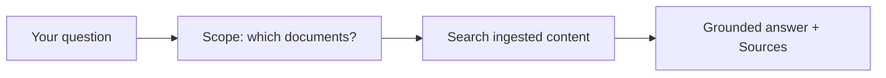
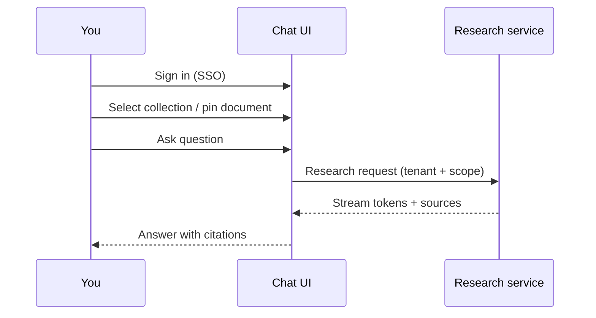
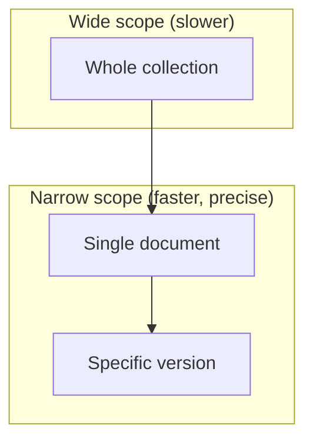

# End-user guide

**Audience:** People who ask questions against ingested company documents — via chat UI (mod-chat) or an MCP-enabled assistant  
**You do not need:** Access to servers, Docker, or the codebase

---

## 1. What this product does

Enterprise Hybrid RAG answers **natural-language questions** using **only documents your organization has ingested**. Answers include **citations** (sources) so you can verify claims in the original material.

**It does not:** Browse the public internet, invent policy, or read files on your laptop unless they were ingested by an administrator.

---

## 2. How to ask questions

### 2.1 Chat UI (mod-chat)

When your organization deploys the optional chat application:

1. Sign in with your company account (OIDC / SSO).
2. Choose a **collection** (for example “Product manuals” or “HR policies”).
3. Optionally **pin** a specific document or version in the scope bar.
4. Type your question in plain language.
5. Read the streamed answer; scroll to **Sources** for links or document references.

### 2.2 MCP assistant (Cursor, Claude Desktop, etc.)

Your IT team may expose an MCP server with a tool such as `research_documents`. You ask your assistant to “research our docs” with:

- **Collection** or **document** scope when you know it
- A clear question (not just keywords)

The assistant returns markdown: answer body, **Sources** section, and a small telemetry footer (timing — safe to ignore).

---

## 3. Scope: why it matters

**Scope** limits which ingested documents are searched. Narrow scope = faster, more precise answers.

| Scope level | When to use |
|-------------|-------------|
| **Collection** | General questions within a product line or department |
| **Document** | Questions about one manual, spec, or policy |
| **Version** | When multiple versions exist and you need a specific release |

**Tip:** If answers feel vague, pin a document. If the system says it could not find enough relevant content, try rephrasing or widening scope slightly.

---

## 4. Understanding answers and citations

### 4.1 Grounded answers

Good answers:

- State facts supported by retrieved passages
- Point to **Sources** with document title, section, and chunk reference

### 4.2 Abstention

Sometimes the system responds that it **cannot answer confidently**. This is intentional when retrieved content is weak or off-topic. **Do not treat abstention as an error** — rephrase, check scope, or ask an administrator if the right documents were ingested.

### 4.3 Citations

Use **Sources** to open or locate the original text. For diagrams and figures, ask explicitly (“show the architecture diagram in section X”) when your deployment supports visual intent (§6.10 in the platform spec).

---

## 5. Privacy and acceptable use

- Questions and answers may be logged for quality and security per your organization’s policy.
- Only ask about material you are allowed to access; ACL is enforced server-side.
- Do not paste secrets (passwords, API keys) into chat.

---

## 6. Troubleshooting

| Symptom | Likely cause | What to do |
|---------|--------------|------------|
| “Cannot answer confidently” | No relevant chunks in scope | Widen scope or rephrase; confirm document was ingested |
| Empty or generic answer | Wrong collection | Select correct collection in scope bar |
| Slow first response | Cold start or large scope | Pin document; try again (second question is often faster) |
| Access denied / empty results | ACL | Contact administrator for collection access |
| Assistant cannot find MCP tool | Client not configured | Contact IT for MCP server URL and auth |

---

## 7. Related documentation

| Document | Purpose |
|----------|---------|
| [ADMIN_GUIDE.md](./ADMIN_GUIDE.md) | How collections and ingest work (for power users) |
| [query/docs/MCP.md](../query/docs/MCP.md) | MCP tool details (technical) |
| [ENTERPRISE_HYBRID_RAG_SPEC.md](../ENTERPRISE_HYBRID_RAG_SPEC.md) §6–7 | Full query behavior (architects) |
