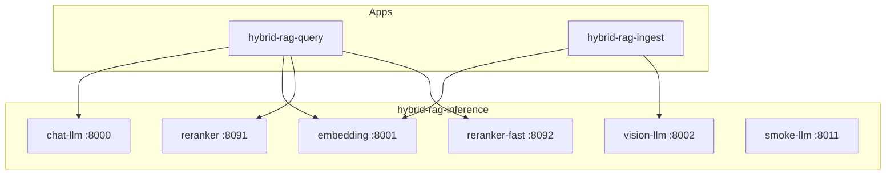

# Inference Sub-Project Specification

**Project ID:** `hybrid-rag-inference`  
**Replaces:** `modules/VLLM.md` as hosting spec  
**Platform parent:** [ENTERPRISE_HYBRID_RAG_SPEC.md](../ENTERPRISE_HYBRID_RAG_SPEC.md) §6.11, IF-4

---

## 1. Purpose

Deploy and operate the **inference plane** for Enterprise Hybrid RAG:

| Service | Role | Consumers |
|---------|------|-----------|
| Chat LLM | Supervisor, answer generation | hybrid-rag-query |
| Embedding | Dense vectors (768-dim default) | hybrid-rag-query, hybrid-rag-ingest |
| Vision LLM | Image/diagram captions | hybrid-rag-ingest |
| Reranker (full) | Cross-encoder rerank | hybrid-rag-query |
| Reranker (fast) | Two-stage rerank stage A | hybrid-rag-query |
| Smoke LLM | CI golden-set, health probes | CI, optional dev |

**Not in scope:** RAG pipeline, MCP, parsing, index stores, Langfuse server.

---

## 2. Boundary

| Owns | Does NOT own |
|------|--------------|
| vLLM processes (chat, embed, vision, smoke) | `rag_pipeline.py` |
| Reranker HTTP sidecars | Qdrant collection schema (kernel) |
| GPU allocation, systemd/compose | Caddy + stores (`hybrid-rag-infra`) |
| Model download/cache volumes | Application config except URL endpoints |

Applications use **OpenAI-compatible HTTP clients** only — no vLLM Python import in query/ingest images.

---

## 3. Port matrix

| Service | Port | Path prefix | GPU |
|---------|------|-------------|-----|
| `chat-llm` | 8000 | `/v1/chat/completions` | yes |
| `embedding` | 8001 | `/v1/embeddings` | yes (or CPU) |
| `vision-llm` | 8002 | `/v1/chat/completions` (multimodal) | yes |
| `reranker` | 8091 | `/predict`, `/healthz` | CPU/GPU |
| `reranker-fast` | 8092 | `/predict`, `/healthz` | CPU |
| `smoke-llm` | 8011 | `/v1/*` | optional CPU |

All services bind `0.0.0.0` inside Docker network `hybrid-rag-net`; **not** published to public internet.

---

## 4. Architecture



---

## 5. Configuration

**Env:** `INFERENCE_CONFIG` → `config/inference.toml`  
**Secrets:** `inference/.env` (HF token if needed)

See [config/inference.toml.example](./config/inference.toml.example).

### Cross-project invariants

| Key | Must match in |
|-----|----------------|
| `embed_dimension` | kernel, query, ingest, infra Qdrant |
| `models.llm` | query `config/query.toml` = `--served-model-name` |
| `models.embed` | query + ingest configs |
| `models.vision` | ingest config |
| `models.reranker` | query config + sidecar env |

---

## 6. Hardware profiles

| Profile | Chat | Embed | Vision | Reranker | Smoke |
|---------|------|-------|--------|----------|-------|
| `dev` | smoke only :8011 | CPU embed :8001 | disabled | CPU :8091 | Llama-3.2-1B |
| `gpu_24gb` | 3B–32B Q4 :8000 | e5-base :8001 | Qwen2-VL-7B :8002 | sidecars | optional |
| `a100_80gb` | 70B :8000 | e5-base :8001 | Qwen2-VL-7B :8002 | GPU sidecars | optional |

Apply: `make up PROFILE=gpu_24gb`

---

## 7. Interface IF-4 (platform)

Application modules receive **URLs only**:

```toml
# hybrid-rag-query — consumer config (not in this repo)
[services]
inference_provider = "vllm"
vllm_url = "http://chat-llm:8000/v1"
vllm_embed_url = "http://embedding:8001/v1"
reranker_url = "http://reranker:8091"
reranker_fast_url = "http://reranker-fast:8092"

# hybrid-rag-ingest
vllm_embed_url = "http://embedding:8001/v1"
vllm_vision_url = "http://vision-llm:8002/v1"
```

---

## 8. Health

```bash
make health
```

| Check | Pass criteria |
|-------|----------------|
| chat-llm | `GET /v1/models` 200 |
| embedding | `POST /v1/embeddings` returns dim=768 |
| vision-llm | `GET /v1/models` 200 |
| reranker | `GET /healthz` → `model_loaded: true` |
| smoke-llm | `POST /v1/chat/completions` max_tokens=1 |

hybrid-rag-query `/healthz` probes chat + embed URLs from its config.

---

## 11. Performance

Normative: [docs/PERFORMANCE.md](./docs/PERFORMANCE.md) · Platform §18.3, IF-4

| Concern | Mechanism |
|---------|-----------|
| GPU isolation | Chat :8000 ≠ vision :8002; embed :8001 shared with throttle |
| Concurrency | `--max-num-seqs` caps KV; aligns with query stream limits |
| Rerankers | HTTP sidecars :8091/:8092 — shared across query replicas |
| Prefix cache | `--enable-prefix-caching` on vLLM chat |
| Queue metrics | `vllm_queue_depth` — triggers query circuit breakers |

Config: `[performance]` in `inference.toml`; profile via `PROFILE=gpu_24gb`.

---

## 9. CI

| Job | Profile |
|-----|---------|
| `compose config` | all profiles |
| `make health PROFILE=dev` | smoke + embed CPU |
| `make smoke-test` | chat completion on :8011 |
| Live RAG gates | `gpu_24gb` chat + embed before benchmark |

---

## 10. Release

| Artifact | Tag |
|----------|-----|
| RAG apps | `rag-v1.x` |
| Inference stack | `inf-v1.x` |

Compatibility: [docs/INTEGRATION.md](./docs/INTEGRATION.md)
