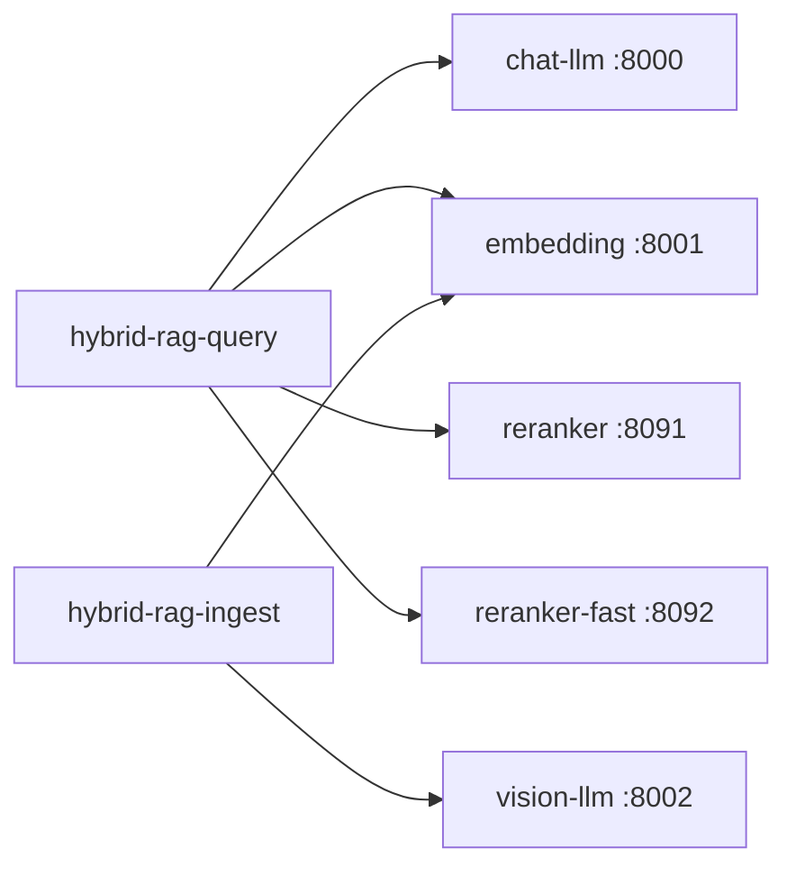

# Integration — RAG Apps ↔ Inference Sub-Project

## 1. Topology



Join Docker network `hybrid-rag-net` or use host ports from `make up`.

**Performance:** Embed port `:8001` is shared by query and ingest — throttle ingest concurrency during peak query or schedule bulk jobs off-peak. See [PERFORMANCE.md](../../docs/PERFORMANCE.md) §5.

---

## 2. hybrid-rag-query configuration

```toml
[models]
llm = "meta-llama/Llama-3.2-3B-Instruct"
embed = "intfloat/e5-base-v2"
reranker = "BAAI/bge-reranker-large"
reranker_fast = "cross-encoder/ms-marco-MiniLM-L-6-v2"
embed_dimension = 768
inference_provider = "vllm"

[services]
vllm_url = "http://127.0.0.1:8000/v1"
vllm_embed_url = "http://127.0.0.1:8001/v1"
vllm_api_key = "EMPTY"
reranker_url = "http://127.0.0.1:8091"
reranker_fast_url = "http://127.0.0.1:8092"
```

**Do not** load CrossEncoder weights in query image when `reranker_url` is set.

---

## 3. hybrid-rag-ingest configuration

```toml
[models]
embed = "intfloat/e5-base-v2"
vision = "Qwen/Qwen2-VL-7B-Instruct"

[services]
vllm_embed_url = "http://127.0.0.1:8001/v1"
vllm_vision_url = "http://127.0.0.1:8002/v1"
```

Ingest never calls chat LLM or reranker.

---

## 4. Smoke / test LLM (CI)

```toml
# config/ci.toml in query repo
[services]
vllm_url = "http://127.0.0.1:8011/v1"

[models]
llm = "meta-llama/Llama-3.2-1B-Instruct"
```

Start with `make up PROFILE=dev` — only smoke-llm + CPU embed + reranker.

---

## 5. Ollama fallback (laptop without inference sub-project)

```toml
inference_provider = "ollama"
ollama_url = "http://127.0.0.1:11434"
```

No `hybrid-rag-inference` stack required; not for production.

---

## 6. warmup_clients() (hybrid-rag-query)

Probes at startup:

- `GET {vllm_url}/models`
- `POST {vllm_embed_url}/embeddings`
- `GET {reranker_url}/healthz` if configured

---

## 7. Compatibility matrix

| inf stack | min query | min ingest | Notes |
|-----------|-----------|------------|-------|
| inf-v1.0 | rag-v1.0 | rag-v1.0 | Ports 8000–8002, 8091–8092 |
| inf-v1.1 | rag-v1.0+ | rag-v1.0+ | Added smoke-llm :8011 |

`embed_dimension` change requires kernel bump + Qdrant reindex.
