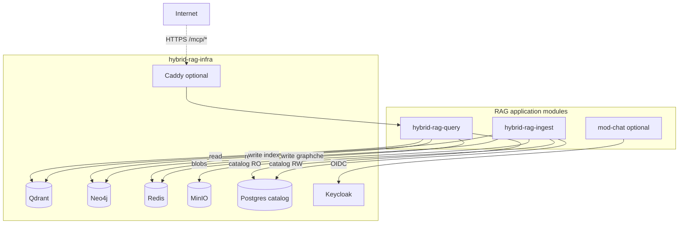

# Infrastructure Sub-Project Specification

**Project ID:** `hybrid-rag-infra`  
**Replaces:** `modules/MOD_INFRA.md` as hosting spec  
**Platform parent:** [ENTERPRISE_HYBRID_RAG_SPEC.md](../ENTERPRISE_HYBRID_RAG_SPEC.md) §12, IF-1, IF-2

---

## 1. Purpose

Deploy and operate the **data plane**, **identity**, and **public edge** for Enterprise Hybrid RAG:

- **Qdrant** — hybrid dense + sparse vectors, payload indexes
- **Neo4j** — document hierarchy, cross-references, optional fulltext
- **Redis** — Celery broker, ingest dedup, query result cache, domain events
- **MinIO** — raw documents, images, presigned URLs in retrieval payloads
- **Postgres** — catalog, ACL, ingest job state, chat threads (optional)
- **Keycloak** — OIDC issuer for `mod-chat` and optional MCP JWT validation
- **Caddy** — TLS termination and MCP SSE reverse proxy to `hybrid-rag-query`

**Not in scope:** RAG pipeline code, MCP handlers, model weights, Langfuse/SigNoz servers.

---

## 2. Boundary

| Owns | Does NOT own |
|------|--------------|
| Store provisioning, backups, init scripts | `rag_pipeline.py`, MCP server |
| Qdrant collection + payload indexes | Embedding / LLM inference |
| Neo4j constraints + JVM tuning | Ingest parsing logic |
| Postgres roles (`ingest_rw`, `query_ro`) | Application business logic |
| Keycloak realm + OIDC clients | BFF session logic in mod-chat |
| Caddy TLS + MCP proxy | Bearer JWT validation in app (defense in depth) |
| `hybrid-rag-net` Docker network | vLLM, Langfuse processes |

### Consumers (client libraries only, separate repos/images)

| Consumer | Qdrant | Neo4j | Redis | MinIO | Postgres | Keycloak |
|----------|--------|-------|-------|-------|----------|----------|
| `hybrid-rag-query` | read | read | read/write cache | read URLs | read-only DSN | JWT validate (optional) |
| `hybrid-rag-ingest` | write | write | broker + dedup | write | read-write DSN | — |
| `mod-chat` | — | — | — | — | threads (optional) | OIDC login |

---

## 3. Architecture



---

## 4. Ports

| Service | Port | Protocol |
|---------|------|----------|
| Qdrant REST/gRPC | 6333 / 6334 | HTTP / gRPC |
| Neo4j Bolt | 7687 | Bolt |
| Neo4j Browser | 7474 | HTTP |
| Redis | 6379 | Redis |
| MinIO API / console | 9000 / 9001 | HTTP |
| Postgres catalog | 5432 | PostgreSQL |
| Keycloak OIDC / admin | 8081 | HTTP |
| Caddy HTTP / HTTPS | 8080 / 443 | HTTP |

**Not exposed publicly:** Qdrant, Neo4j, Redis, MinIO, Postgres catalog DB (internal network only). Keycloak admin should be restricted in production.

---

## 5. Configuration

**Env:** `INFRA_CONFIG` → `config/infra.toml`  
**Secrets:** `infra/.env` (gitignored)

See [config/infra.toml.example](./config/infra.toml.example).

**Cross-module invariants** (must match query/ingest configs):

| Key | Value |
|-----|-------|
| `embed_dimension` | e.g. `768` |
| `qdrant_collection` | e.g. `enterprise_hybrid_rag` |
| `index_schema_version` | bumped on breaking payload change |

---

## 6. Inter-module interfaces (IF-1, IF-2)

### IF-1: Index stores

- **Writer:** `hybrid-rag-ingest` only
- **Reader:** `hybrid-rag-query` only
- Schema: parent spec §4.2 (Qdrant payload), §4.3 (Neo4j graph)
- Init: `make init-db` after first `make up`

### IF-2: Catalog (Postgres)

- `ingest_rw` — full DML on catalog tables
- `query_ro` — `SELECT` only
- Provisioned by `scripts/postgres-init.sh` (via Postgres entrypoint)

### IF-3: Object store (MinIO)

- **Writer:** `hybrid-rag-ingest` — `hybrid-rag-ingest` IAM user (`hybrid-rag-ingest-rw` policy)
- **Reader:** `hybrid-rag-query` — presigned GET via `hybrid-rag-query` IAM user (`hybrid-rag-query-ro` policy)
- **Init:** `make init-minio` (also run from `make init-db`) after first `make up`
- **Layout:** [docs/MINIO.md](./docs/MINIO.md) · kernel [SHARED_CONTRACTS.md](../modules/SHARED_CONTRACTS.md) §9

Detail: [docs/INTEGRATION.md](./docs/INTEGRATION.md).

---

## 7. Performance

Normative tuning: [docs/PERFORMANCE.md](./docs/PERFORMANCE.md) · Platform [PERFORMANCE.md](../docs/PERFORMANCE.md) §11

| Store | Primary knob | Query impact | Ingest impact |
|-------|--------------|--------------|---------------|
| Qdrant | `search_ef`, payload indexes, gRPC | retrieve p95 | upsert throughput |
| Neo4j | heap, pagecache, UNWIND batch | graph enrich | write throughput |
| Redis | DB separation, `maxmemory` | cache hit rate | broker stability |
| Postgres | indexes on tenant/collection | catalog lookup | job metadata |
| Caddy | `flush_interval -1` SSE | public MCP TTFT | — |

**SLO:** Qdrant search p95 < 200ms; Redis PING < 1ms at target corpus.

**Roadmap:** INF-P1…P6 in [docs/PERFORMANCE.md](./docs/PERFORMANCE.md) §11.

Config: `[performance]` in `config/infra.toml`.

---

## 8. Profiles

| Profile | Services | Use case |
|---------|----------|----------|
| `default` | All stores, no Caddy | Dev / internal network |
| `edge` | + Caddy MCP proxy | Prod TLS termination |

```bash
make up PROFILE=edge
```

---

## 9. Backup & DR

| Store | Method | Schedule |
|-------|--------|----------|
| Qdrant | Snapshot API | Daily (`scripts/backup.sh`) |
| Neo4j | `neo4j-admin dump` | Daily |
| Postgres | `pg_dump` + WAL | Daily |
| MinIO | Bucket replication (optional) | Per policy |

Target RPO 24h / RTO 4h for single-node (parent §9.1).

---

## 10. CI (this sub-project)

| Job | Validates |
|-----|-----------|
| `compose config` | Valid docker-compose |
| `make health` | All store health endpoints |
| `init-db` dry-run | Qdrant collection + MinIO buckets |
| `render_caddyfile` | Caddyfile snapshot from fixture config |

Application repos run integration tests against a running `hybrid-rag-infra` stack.

---

## 11. Release independence

| Artifact | Tag example |
|----------|-------------|
| RAG query/ingest | `rag-v1.2.0` |
| Infrastructure stack | `infra-v1.0.0` |
| Inference stack | `inf-v1.0.0` |
| Observability stack | `obs-v1.0.0` |

Compatibility matrix in [docs/INTEGRATION.md](./docs/INTEGRATION.md) § compatibility.
