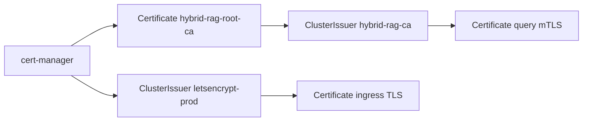

# Production PKI with cert-manager (E-34)
#
# **Owner:** hybrid-rag-infra  
# **Spec:** ENTERPRISE_HYBRID_RAG_SPEC.md §18.15 · E-34 mTLS  
# **Local dev (compose):** `make mtls-dev-certs` — OpenSSL, not cert-manager  
# **Kubernetes:** cert-manager ClusterIssuers + Helm `Certificate` CRs

---

## 1. Architecture

| Tier | cert-manager resource | Secret | Consumer |
|------|----------------------|--------|----------|
| Public ingress TLS | `Certificate` → `letsencrypt-prod` | `hybrid-rag-tls` | nginx Ingress |
| Internal root CA | `Certificate` `hybrid-rag-root-ca` | `hybrid-rag-root-ca` | ClusterIssuer `hybrid-rag-ca` |
| Query MCP listener | `Certificate` (app chart) | `hybrid-rag-query-mtls` | query Deployment |
| Ingress → query client | `Certificate` (app chart) | `hybrid-rag-ingress-mtls-client` | nginx upstream mTLS |



---

## 2. Install cert-manager (platform)

From repo root:

```bash
make -C infra cert-manager-install    # helm install jetstack/cert-manager
make -C infra cert-manager-health
```

Or directly:

```bash
./infra/k8s/cert-manager/install.sh
./infra/k8s/cert-manager/healthcheck.sh
```

Variables: `CERT_MANAGER_NS` (default `cert-manager`), `CERT_MANAGER_CHART_VERSION` (default `v1.16.2`).

---

## 3. Bootstrap internal CA

**Dev / staging** (self-signed root):

```bash
make -C infra cert-manager-issuer
```

Applies:

1. `ClusterIssuer/hybrid-rag-selfsigned`
2. `Certificate/hybrid-rag-root-ca` (namespace `cert-manager`)
3. `ClusterIssuer/hybrid-rag-ca` (signs leaf certs)

**Production public TLS** (optional, requires DNS or HTTP-01):

```bash
# Edit email + solver in cluster-issuer-letsencrypt-prod.yaml first
kubectl apply -f infra/k8s/cert-manager/cluster-issuer-letsencrypt-prod.yaml
```

---

## 4. Application namespace — sync CA

Before enabling query mTLS, copy the root CA public cert into the app namespace:

```bash
./infra/k8s/cert-manager/sync-root-ca.sh hybrid-rag
```

Helm mounts `hybrid-rag-root-ca` secret key `tls.crt` as `ca.crt` for `MCP_TLS_CLIENT_CA`.

---

## 5. Helm integration

Enable in `values-prod.yaml`:

```yaml
certManager:
  certificates:
    enabled: true
    ingress:
      issuerRef:
        name: letsencrypt-prod   # or hybrid-rag-ca for internal-only
    queryMtls:
      enabled: true
      issuerRef:
        name: hybrid-rag-ca
    ingressClient:
      enabled: true

query:
  mtls:
    enabled: true
    caSecret: hybrid-rag-root-ca
```

Install:

```bash
helm upgrade --install hybrid-rag ./deploy/helm/hybrid-rag \
  -f deploy/helm/hybrid-rag/values-prod.yaml \
  --namespace hybrid-rag --create-namespace
```

cert-manager creates/renews Secrets; the chart mounts them into query and ingress.

---

## 6. Rotation

| Certificate | renewBefore | Action |
|-------------|-------------|--------|
| `hybrid-rag-root-ca` | 30d | cert-manager auto-renews; restart query on CA rotation |
| Ingress TLS | 30d | cert-manager auto-renews; nginx reloads secret |
| Query server | 30d | cert-manager auto-renews; rolling restart query pods |

Monitor: `kubectl get certificate -A` · alerts on `Ready=False`.

---

## 7. Validation

```bash
make -C infra cert-manager-health
kubectl get clusterissuer
kubectl get certificate -n hybrid-rag
make -C deploy/helm lint
helm template hybrid-rag ./deploy/helm/hybrid-rag \
  -f deploy/helm/hybrid-rag/values-prod.yaml \
  --set certManager.certificates.enabled=true \
  --set query.mtls.enabled=true | grep -A2 'kind: Certificate'
```

Contract tests: `ingest/tests/contract/test_p2_mtls.py`, `test_cert_manager.py`.

---

## 8. Compose dev parity

Laptop dev without Kubernetes continues to use:

```bash
make -C infra mtls-dev-certs
```

See [`MTLS.md`](./MTLS.md) for Caddy + query env vars.
