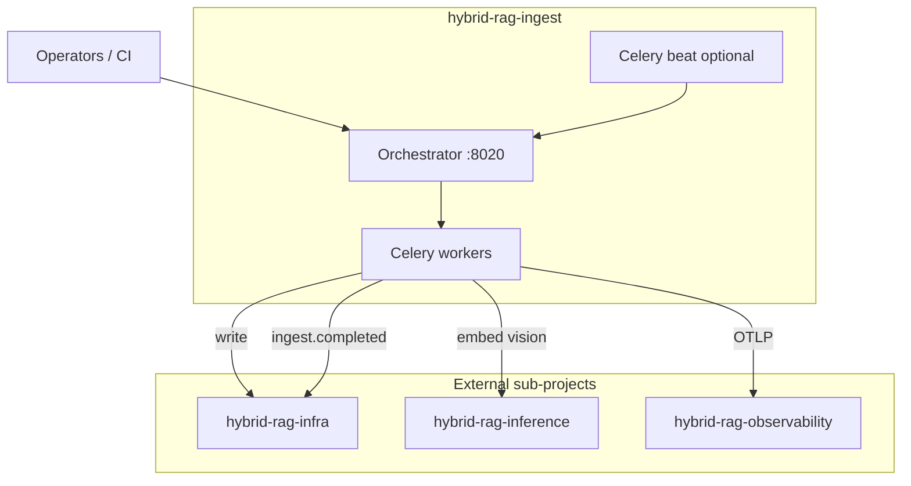

# Ingestion Sub-Project Specification

**Project ID:** `hybrid-rag-ingest`  
**Replaces:** `modules/MOD_INGEST.md` as deploy spec  
**Platform parent:** [ENTERPRISE_HYBRID_RAG_SPEC.md](../ENTERPRISE_HYBRID_RAG_SPEC.md) §5, IF-1–IF-3

---

## 1. Purpose

Deploy and operate the **ingestion plane** for Enterprise Hybrid RAG:

- Source connectors (filesystem, S3, …)
- Parse, chunk, enrich (deferred VLM)
- Batch embed (dense + sparse) via inference sub-project
- Parsers: **PyMuPDF** fast path + **Docling** quality tier (TL-10)
- Qdrant upsert, Neo4j MERGE/UNWIND, MinIO uploads
- Catalog writes (`documents`, `versions`, `ingest_jobs`, ACL)
- Redis dedup + file registry
- Admin HTTP API for operators
- Publish `ingest.*` domain events

**Not in scope:** MCP server, query pipeline, answer generation, Langfuse/SigNoz servers, store provisioning.

---

## 2. Boundary

| Owns | Does NOT own |
|------|--------------|
| `orchestrator`, `pipeline`, `parsers/`, `tasks.py` | `rag_pipeline.py`, MCP tools |
| Celery workers + optional beat | Qdrant/Neo4j/Postgres server processes |
| Admin API (`/admin/ingest/*`) | `/research/stream`, `/healthz` (query) |
| Connector credentials + sync | Chat LLM, reranker inference |
| Catalog DDL migrations | Index schema definitions (kernel) |

### Forbidden imports

`mcp_server`, `rag_pipeline`, `research_streaming`, `query_scope` — enforced by package boundary lint.

### Dependencies (URLs / clients only)

| Dependency | Interface |
|------------|-----------|
| Qdrant | IF-1 write |
| Neo4j | IF-1 write |
| Postgres | IF-2 `CATALOG_DSN` (ingest_rw) |
| Redis | Celery broker, dedup, file registry, events |
| MinIO | Object layout per kernel |
| hybrid-rag-inference | `vllm_embed_url`, `vllm_vision_url` |
| hybrid-rag-observability | OTLP exporter only |

---

## 3. Architecture



---

## 4. Ports

| Service | Port | Protocol |
|---------|------|----------|
| Orchestrator (admin API) | 8020 | HTTP |
| Celery workers | — | Redis broker |
| Celery beat | — | Redis broker |

**Not exposed publicly** in default profile — admin API on internal network only.

---

## 5. Deploy units

| Image | Role |
|-------|------|
| `hybrid-rag-ingest-orchestrator` | FastAPI admin + job enqueue |
| `hybrid-rag-ingest-worker` | Celery `batch_write` consumer |
| `hybrid-rag-ingest-beat` | Scheduled connector sync (profile `beat`) |

---

## 6. Configuration

**Env:** `INGEST_CONFIG` → `config/ingest.toml`  
**Secrets:** `ingest/.env` (gitignored)

See [config/ingest.toml.example](./config/ingest.toml.example).

**Cross-module invariants** (must match infra + kernel):

| Key | Modules |
|-----|---------|
| `embed_dimension` | infra, ingest, query |
| `qdrant_collection` | infra, ingest, query |
| `index_schema_version` | kernel, ingest, query |

---

## 7. Inter-module interfaces

### IF-1 / IF-2 (writer)

Only `hybrid-rag-ingest` writes Qdrant, Neo4j, and catalog tables. See [docs/INTEGRATION.md](./docs/INTEGRATION.md).

### IF-3 (events)

On job completion:

```json
{
  "event": "ingest.completed",
  "tenant_id": "acme-corp",
  "collection_id": "payments-api",
  "version_id": "2026-03-01",
  "chunk_count": 12400,
  "cache_bump": true
}
```

Published to Redis Stream `rag:events` (configurable). `hybrid-rag-query` subscribes for cache invalidation.

---

## 8. Scaling

| Pattern | When |
|---------|------|
| Add Celery workers | Queue depth grows during onboarding |
| Raise `celery_concurrency` | Embed GPU underutilized |
| Off-peak full reindex | Avoid embed contention with query |
| Beat replicas = 1 | Connector schedules must not duplicate |

**Rule:** `celery_concurrency × embed_parallelism` ≤ inference embed sustained throughput.

---

## 11. Performance

Normative: [docs/PERFORMANCE.md](./docs/PERFORMANCE.md) · Platform §5.4.1, §18.4, FR-29/30

| Concern | Mechanism |
|---------|-----------|
| Throughput | Batch embed, Qdrant upsert, Neo4j UNWIND |
| Backpressure | Auto-pause enqueue at queue depth 1000 |
| Isolation | Off-peak full reindex; `ingest_max_chunks_per_minute` |
| Quotas | `tenant_quotas` check before enqueue |
| Dedup | Redis `dedup:` + file registry (NFR-12) |
| MinIO | Multipart staging; storage quota |
| Parsers | `fast` (PyMuPDF) vs `docling` (Docling) — see [DOCLING.md](./docs/DOCLING.md) |

Config: `[ingest]`, `[parsers]`, `[performance]` in `ingest.toml`.

---

## 9. CI (this sub-project)

**TDD (TL-11):** parser/contract tests before `app/parsers/` implementation. See [docs/TESTING.md](../docs/TESTING.md).

| Job | Validates |
|-----|-----------|
| `pytest tests/unit tests/contract` | **Every PR** — parsers, chunk schema, dedup |
| `compose config` | Valid docker-compose |
| `make health` | Orchestrator `/admin/healthz` |
| `pytest tests/integration` | Live embed + Qdrant write (nightly) |
| `benchmarks/benchmark_ingest.py --mock` | Throughput floor (PR warn) |

---

## 10. Release independence

| Artifact | Tag example |
|----------|-------------|
| RAG query | `rag-v1.2.0` |
| Ingestion stack | `ingest-v1.0.0` |
| Infrastructure | `infra-v1.0.0` |

Compatibility matrix in [docs/INTEGRATION.md](./docs/INTEGRATION.md).
