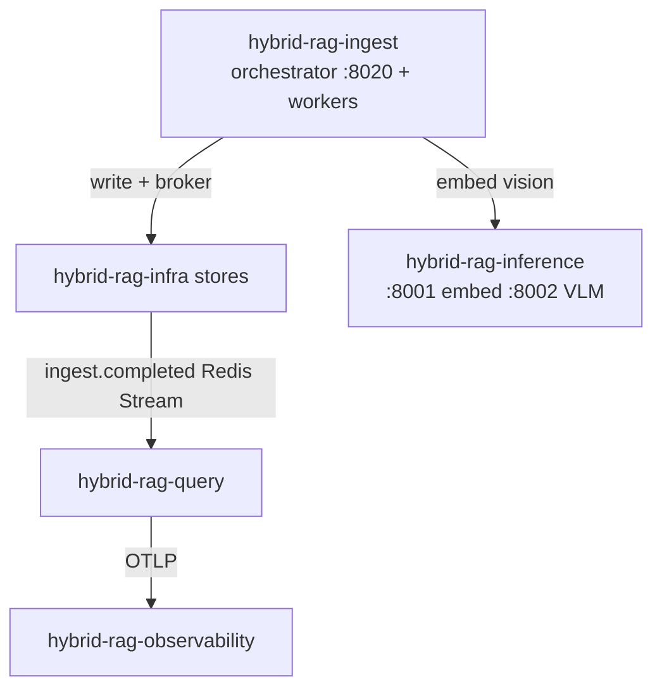

# Integration Guide — Ingestion ↔ Platform Sub-Projects

How **`hybrid-rag-ingest`** connects to infra, inference, observability, and `hybrid-rag-query` without cross-imports.

---

## 1. Network topology



---

## 2. Bootstrap order

```bash
cd infra && make up && make init-db
cd ../inference && make up PROFILE=gpu_24gb
cd ../observability && make up
cd ../ingest && make up
# then hybrid-rag-query
```

---

## 3. Environment variables

See [`.env.example`](../.env.example). Key groups:

| Group | Examples |
|-------|----------|
| Stores | `QDRANT_URL`, `NEO4J_URI`, `CATALOG_DSN`, `MINIO_*` |
| Broker | `CELERY_BROKER_URL`, `REDIS_URL` |
| Inference | `VLLM_EMBED_URL`, `VLLM_VISION_URL`, `EMBED_MODEL` |
| Observability | `OTEL_EXPORTER_OTLP_ENDPOINT` (no Langfuse keys) |
| Events | `redis_stream` in `ingest.toml` → `rag:events` |

Store URLs: [infra/docs/INTEGRATION.md](../../infra/docs/INTEGRATION.md)  
Inference URLs: [inference/docs/INTEGRATION.md](../../inference/docs/INTEGRATION.md)

---

## 4. Writer / reader contract

| Store | Ingest | Query |
|-------|--------|-------|
| Qdrant | write | read |
| Neo4j | write | read |
| Postgres catalog | `ingest_rw` | `query_ro` |
| MinIO | write | presigned read |
| Redis events | publish | subscribe (cache bump) |

Schema: [SHARED_CONTRACTS.md](../../modules/SHARED_CONTRACTS.md)

---

## 5. Domain events (IF-3)

```json
{
  "event": "ingest.completed",
  "tenant_id": "acme-corp",
  "collection_id": "payments-api",
  "version_id": "2026-03-01",
  "chunk_count": 12400,
  "cache_bump": true
}
```

`hybrid-rag-query` calls `bump_cache_version()` on receive.

---

## 6. Observability

- **OTLP only** — no Langfuse generation spans (no chat LLM in ingest)
- Span names: `ingest.job`, `store/qdrant/upsert`, `ingest.batch_write`
- Structured log: `ingest_batch_write chunks=32 module_id=hybrid-rag-ingest job_id=...`

---

## 7. Compatibility matrix

| ingest tag | index_schema_version | Requires |
|------------|---------------------|----------|
| ingest-v1.0.0 | 1 | infra-v1.0.0, inf-v1.0.0 |
| ingest-v1.1.0 | 2 | kernel bump + query ingest-v1.1.0 |

---

## 8. Security

- Admin API not on public internet by default
- Service account auth on `/admin/ingest/*`
- No MCP bearer token reuse — separate ingest operator credentials
