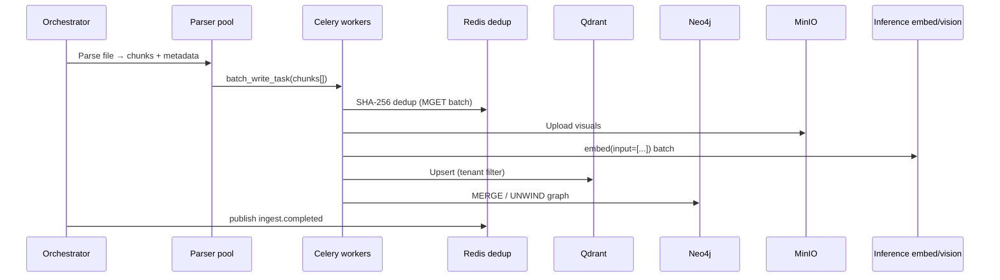

# Ingestion pipeline (hybrid-rag-ingest)

Parent: [SPEC.md](../SPEC.md) · Platform §5 · **[Performance guide](../../docs/PERFORMANCE.md)**

## Stages



## Throughput targets

| Profile | Target | Bottleneck |
|---------|--------|------------|
| `gpu_24gb` | ≥ 50 chunks/s (NFR-04) | Embed GPU :8001 |
| `lima_12gb` | ≥ 10 chunks/s | CPU embed |
| Mock (CI) | ≥ 1000 chunks/min | No inference |

## High-impact optimizations

| Priority | Technique | Config |
|----------|-----------|--------|
| 1 | Batch embed | `batch_size`, `embed_parallelism`, FR-26 |
| 2 | Defer VLM | `defer_vlm = true` |
| 3 | Redis MGET dedup | `dedup_mget_batch = 100` |
| 4 | Qdrant batch upsert | `qdrant_upsert_batch = 100` |
| 5 | Neo4j UNWIND | `neo4j_unwind_batch = 50` |
| 6 | Off-peak bulk jobs | cron / `off_peak_cron` — protects query TTFT (NFR-18) |
| 7 | Incremental hash skip | file registry — target NFR-12 ≥ 30% skip |

## Concurrency tuning

```
safe_concurrency ≈ embed_throughput / (chunks_per_task × embed_parallelism)
```

Start `celery_concurrency=2`, `embed_parallelism=2`. Raise one knob at a time; watch `celery_queue_depth` and GPU util.

**Never** exceed inference embed capacity during peak query hours when sharing GPU :8001.

## Chunking defaults

| Key | Default |
|-----|---------|
| `max_chunk_tokens` | 512 |
| `chunk_overlap_tokens` | 64 |
| `batch_size` | 32 |
| `qdrant_upsert_batch` | 100 |
| `neo4j_unwind_batch` | 50 |
| `dedup_mget_batch` | 100 |

## Idempotency

| Event | Behavior |
|-------|----------|
| Duplicate chunk hash | Skip Qdrant upsert; reuse `uuid` |
| Worker crash | Celery retry (max 3, exponential backoff) |
| Parse failure | Per-file error; job `completed_with_errors` |
| Full reindex | New `version_id`; old points until retention |

## Benchmarks

```bash
python benchmarks/benchmark_ingest.py --mock --fail-chunks-per-min 1000
python benchmarks/benchmark_ingest.py --chunks 100  # live embed
```

## Package layout

```text
ingest/
├── app/
│   ├── orchestrator.py
│   ├── pipeline.py
│   ├── tasks.py
│   ├── parsers/
│   └── connectors/
├── config/ingest.toml
└── benchmarks/
```

**Forbidden imports:** `mcp_server`, `rag_pipeline`, `research_streaming`, `query_scope`.
