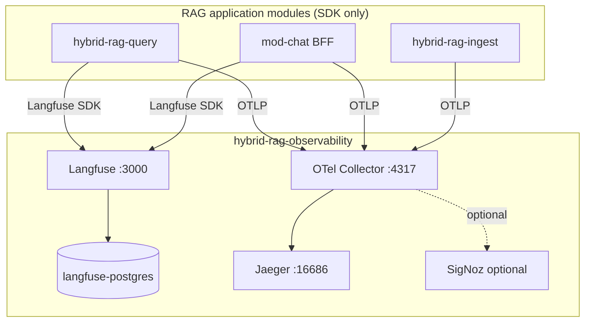

# Observability Sub-Project Specification

**Project ID:** `hybrid-rag-observability`  
**Replaces:** `modules/MOD_OBSERVABILITY.md` (platform module doc)  
**Platform parent:** [ENTERPRISE_HYBRID_RAG_SPEC.md](../ENTERPRISE_HYBRID_RAG_SPEC.md) §10, IF-5

---

## 1. Purpose

Deploy and operate the **telemetry plane** for Enterprise Hybrid RAG — one sub-project, one compose:

- **Langfuse** (+ Postgres) — LLM generations, token cost, RAG stage spans, sessions
- **OpenTelemetry collector** — single OTLP ingress (`:4317` gRPC, `:4318` HTTP)
- **Jaeger** — default trace backend and UI (`:16686`)
- **SigNoz** (optional profile) — HTTP/APM, infrastructure metrics
- **Prometheus** (optional profile) — scrape collector metrics

See [docs/STACK.md](./docs/STACK.md) for the unified architecture.

**Not in scope:** RAG pipeline code, MCP handlers, ingest workers, index stores.

---

## 2. Boundary

| Owns | Does NOT own |
|------|--------------|
| Langfuse + Postgres (Langfuse DB) | `rag_pipeline.py`, MCP server |
| Jaeger (trace UI) | vLLM, Qdrant, Neo4j |
| OTel collector config + routing | Application business logic |
| Optional SigNoz / Prometheus | Chunk text in span payloads |
| Dashboards, alert rules | Tenant auth (uses SSO at UI layer) |
| Log/trace retention policies | Langfuse SDK in app images (SDK only) |

### Consumers (SDK only, separate repos/images)

| Consumer | Langfuse SDK | OTLP |
|----------|--------------|------|
| `hybrid-rag-query` | yes | yes |
| `hybrid-rag-ingest` | no | yes |
| `mod-chat` BFF | yes | yes |

---

## 3. Architecture

---

## 4. Ports

| Service | Port | Protocol |
|---------|------|----------|
| Langfuse UI/API | 3000 | HTTP |
| Jaeger UI | 16686 | HTTP |
| OTLP gRPC | 4317 | gRPC |
| OTLP HTTP | 4318 | HTTP |
| Collector health | 13133 | HTTP |
| Collector Prometheus | 8889 | HTTP |
| SigNoz UI (optional) | 8080 | HTTP |
| Prometheus UI (optional) | 9090 | HTTP |

**Not exposed:** Langfuse Postgres, SigNoz ClickHouse (when used).

---

## 5. Configuration

**Env:** `OBS_CONFIG` → `config/observability.toml`  
**Secrets:** `observability/.env` (gitignored)

See [config/observability.toml.example](./config/observability.toml.example).

---

## 6. Telemetry contract (IF-5)

All application spans MUST include:

| Attribute | Required |
|-----------|----------|
| `module_id` | yes (`hybrid-rag-query`, `hybrid-rag-ingest`, `mod-chat`) |
| `service.name` | yes (OTel resource) |
| `tenant_id` | when known |

Canonical trace names: see [docs/INTEGRATION.md](./docs/INTEGRATION.md).

---

## 7. Langfuse vs Jaeger vs SigNoz

> **Platform normative:** [ENTERPRISE_HYBRID_RAG_SPEC.md §10.5](../ENTERPRISE_HYBRID_RAG_SPEC.md#105-signoz-optional-apm-profile) · Detail: [docs/SIGNOZ.md](./docs/SIGNOZ.md)

| Signal | Langfuse (in-stack) | Jaeger (via OTel) | SigNoz (optional) |
|--------|---------------------|-------------------|-------------------|
| LLM generations + tokens | primary | — | — |
| RAG `timings_ms` stages | child spans | span attributes | OTLP histograms (`rag_stage_ms`) |
| MCP/BFF HTTP | trace metadata | full traces | full APM + alerts |
| Ingest throughput | scores (optional) | spans | metrics (`ingest_chunks_per_second`) |
| GPU / host metrics | — | — | node exporter → SigNoz |
| SLO alerting | Langfuse scores | limited | **primary** (`signoz-rules.yaml`) |

**Enable:** `make up PROFILE=signoz` + `otel-collector-config.signoz.yaml` with `SIGNOZ_OTLP_ENDPOINT`.

Langfuse is **deployed in this sub-project** — not a separate stack. Detail: [docs/STACK.md](./docs/STACK.md), [docs/LANGFUSE.md](./docs/LANGFUSE.md), [docs/OTEL.md](./docs/OTEL.md).

---

## 8. Performance

Normative tuning: [docs/PERFORMANCE.md](./docs/PERFORMANCE.md) · Platform [PERFORMANCE.md](../docs/PERFORMANCE.md) §12

| Concern | Target | Primary knob |
|---------|--------|--------------|
| SDK overhead on query | < 5% p95 regression | BatchSpanProcessor, async Langfuse |
| Collector under load | no OOM | `memory_limiter`, `batch`, sampling |
| Trace cardinality | bounded | one span per stage, not per chunk |
| Langfuse flush | off hot path | flush after SSE `done` |

**Roadmap:** OBS-P1…P6 in [docs/PERFORMANCE.md](./docs/PERFORMANCE.md) §11.

Config: `[performance]` in `config/observability.toml`.

---

## 9. Deployment modes

| Mode | Description |
|------|-------------|
| **Local compose** | `compose/docker-compose.yml` — dev laptop |
| **Prod compose** | Same + TLS reverse proxy in front of UIs |
| **Langfuse Cloud** | Disable local Langfuse service; apps point to cloud host |
| **Managed SigNoz** | Collector exports to SaaS endpoint |

Swap backend without redeploying RAG apps — change env URLs only.

---

## 10. CI (this sub-project)

| Job | Validates |
|-----|-----------|
| `compose config` | Valid docker-compose |
| `collector lint` | OTel config schema |
| `dashboard validate` | JSON dashboard files |
| `synthetic trace` | `otel-cli` → collector → Langfuse/SigNoz reachable |

Application repos run **contract tests** (mock exporter) separately.

---

## 11. Alerts

| Alert | Condition |
|-------|-----------|
| `TraceExportFailure` | Collector export error rate > 1% for 5m |
| `QueryP95High` | `rag_ttft_ms` p95 > 2s (SigNoz) |
| `IngestStalled` | `celery_queue_depth` > 500 |
| `LangfuseDown` | Health check fails |

Rules live in `observability/alerts/`.

---

## 12. Privacy

- No raw retrieved chunk text in spans
- Query string truncated to 120 chars in structured logs
- Optional PII scrubber in collector pipeline
- Langfuse project per **environment** (dev/staging/prod), not per tenant (v1)

---

## 13. Release independence

| Artifact | Tag example |
|----------|-------------|
| RAG query/ingest | `rag-v1.2.0` |
| Observability stack | `obs-v1.0.0` |

Compatibility matrix in [docs/INTEGRATION.md](./docs/INTEGRATION.md) § compatibility.
