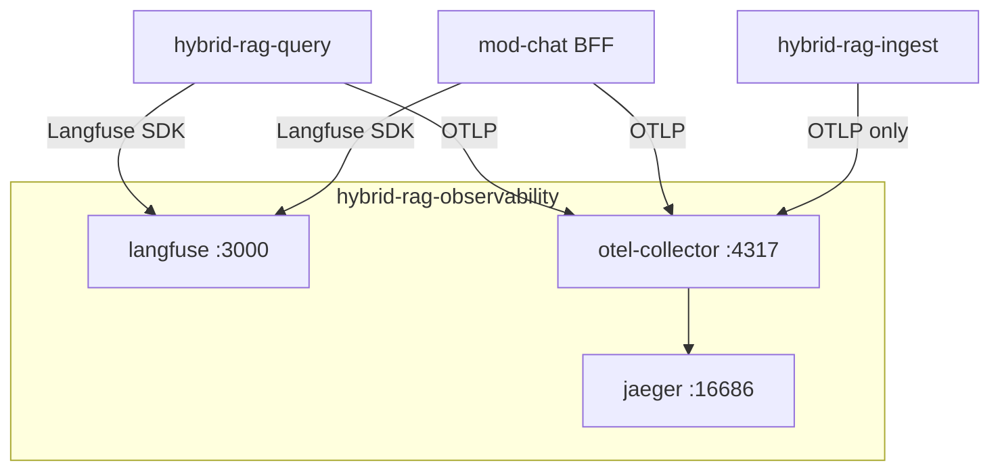

# Integration Guide — RAG Platform ↔ Observability Sub-Project

How **hybrid-rag-query**, **hybrid-rag-ingest**, and **mod-chat** connect to `hybrid-rag-observability` without embedding server code.

---

## 1. Network topology



Observability stack runs on shared Docker network `hybrid-rag-net` (or reachable host URLs). **Langfuse server is not deployed in query/ingest** — only in `observability/`.

---

## 2. Environment variables (applications)

### hybrid-rag-query

```bash
LANGFUSE_PUBLIC_KEY=pk-lf-...
LANGFUSE_SECRET_KEY=sk-lf-...
LANGFUSE_HOST=http://langfuse:3000
OTEL_EXPORTER_OTLP_ENDPOINT=http://otel-collector:4317
OTEL_EXPORTER_OTLP_INSECURE=true
OTEL_SERVICE_NAME=hybrid-rag-query
OTEL_TRACES_EXPORTER=otlp
DEPLOY_ENV=dev
```

### hybrid-rag-ingest

```bash
OTEL_EXPORTER_OTLP_ENDPOINT=http://otel-collector:4317
OTEL_SERVICE_NAME=hybrid-rag-ingest
# No Langfuse keys — no chat LLM
```

### mod-chat BFF

```bash
LANGFUSE_PUBLIC_KEY=pk-lf-...
LANGFUSE_SECRET_KEY=sk-lf-...
LANGFUSE_HOST=http://langfuse:3000
OTEL_EXPORTER_OTLP_ENDPOINT=http://otel-collector:4317
OTEL_SERVICE_NAME=hybrid-rag-chat-bff
```

Forward to MCP on each message:

```json
{
  "langfuse_session_id": "<thread_id>",
  "langfuse_user_id": "<sub>",
  "langfuse_trace_id": "<32-hex>"
}
```

---

## 3. Structured logs (stdout)

Applications emit; collector scrapes or receives via OTLP logs (optional).

```
rag_stage_ms supervisor=120 embed=45 module_id=hybrid-rag-query request_id=abc
ingest_batch_write chunks=32 module_id=hybrid-rag-ingest job_id=...
```

---

## 4. Canonical trace names

| Name | Module |
|------|--------|
| `bff.chat.message` | mod-chat |
| `mcp.research_stream` | hybrid-rag-query |
| `mcp.tool.research_documents` | hybrid-rag-query |
| `rag_pipeline` | hybrid-rag-query |
| `store/qdrant/retrieve` | hybrid-rag-query |
| `store/qdrant/upsert` | hybrid-rag-ingest |
| `ingest.job` | hybrid-rag-ingest |

---

## 5. Platform interface IF-5

Defined in [ENTERPRISE_HYBRID_RAG_SPEC.md](../../ENTERPRISE_HYBRID_RAG_SPEC.md) §3.3:

- Applications **export** via SDK; **all servers** (Langfuse, collector, Jaeger) live in `hybrid-rag-observability`
- No import of observability Python/JS packages beyond official SDKs (`langfuse`, OpenTelemetry)
- No shared database between RAG catalog and Langfuse DB

---

## 6. Compatibility

| obs stack | min query | min ingest | Notes |
|-----------|-----------|------------|-------|
| obs-v1.0 | rag-v1.0 | rag-v1.0 | Initial trace name contract |
| obs-v1.1 | rag-v1.0+ | rag-v1.0+ | Added ingest OTLP spans |

Breaking trace name changes require **both** obs and app contract test updates.

---

## 7. Local dev without observability

Applications run with:

```toml
[langfuse]
enabled = false
```

and no `OTEL_EXPORTER_OTLP_ENDPOINT` — stdout logs only. Research path unaffected.

---

## 8. Production checklist

- [ ] Observability compose healthy (`make obs-health`)
- [ ] Langfuse keys created per environment
- [ ] Apps use collector URL, not public Langfuse port from internet
- [ ] SigNoz SSO enabled
- [ ] Alert rules imported
- [ ] Contract tests pass in query repo CI
