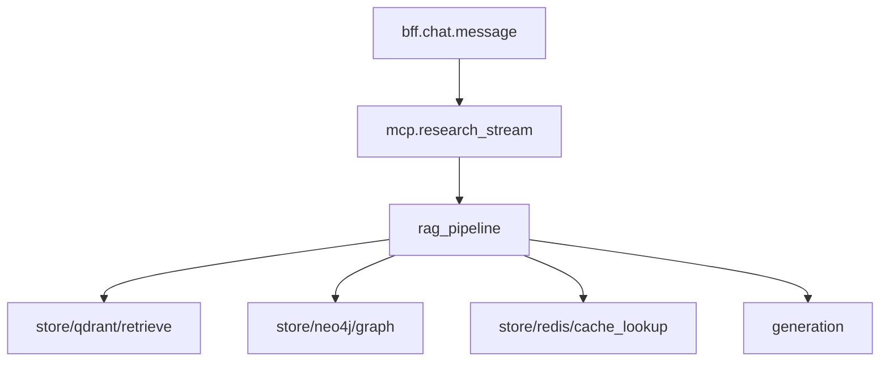

# Langfuse (Observability Sub-Project)

**Deployed by:** `hybrid-rag-observability` only — `langfuse` + `langfuse-postgres` in [../compose/docker-compose.yml](../compose/docker-compose.yml)  
**SDK consumers:** `hybrid-rag-query`, `mod-chat` (not `hybrid-rag-ingest`)

Parent stack: [STACK.md](./STACK.md) · [SPEC.md](../SPEC.md)

Langfuse is the **LLM-native trace store** — generations, token costs, sessions, and RAG stage breakdowns. It is a **first-class component** of the observability sub-project, not a separate deployment.

---

## 1. Deployment

| Mode | `LANGFUSE_HOST` |
|------|-----------------|
| Self-hosted (compose) | `http://langfuse:3000` or `http://localhost:3000` |
| Langfuse Cloud | `https://cloud.langfuse.com` — disable local `langfuse` service in compose |
| Disabled | apps set `[langfuse].enabled = false` |

Compose service: [../compose/docker-compose.yml](../compose/docker-compose.yml) → `langfuse` service.

**Headless bootstrap (dev/staging):** `observability/.env` sets `LANGFUSE_INIT_*` variables; Langfuse provisions org, project, and API keys on startup. Sync to query:

```bash
make -C observability langfuse-init
make bootstrap-langfuse-keys   # repo root
```

See [../scripts/ensure_langfuse_init.sh](../scripts/ensure_langfuse_init.sh) and [../../scripts/bootstrap_langfuse_keys.sh](../../scripts/bootstrap_langfuse_keys.sh).

---

## 2. Application SDK config

### hybrid-rag-query (`query/config/query.toml`)

SDK config only — **server URL comes from observability stack**:

```toml
[langfuse]
enabled = true
# LANGFUSE_HOST=http://langfuse:3000  # set in query/.env — hostname from observability compose
```

### Secrets (application env — not in this repo)

```bash
export LANGFUSE_PUBLIC_KEY=pk-lf-...
export LANGFUSE_SECRET_KEY=sk-lf-...
```

SDK active when `enabled=true` **and** both keys set. **Automated:** `make bootstrap-langfuse-keys` copies headless-init keys from `observability/.env` into `query/.env`.

---

## 3. Trace hierarchy



| Observation | Consumer | Skip when |
|-------------|----------|-----------|
| `mcp.tool.research_documents` | hybrid-rag-query | — |
| `rag_pipeline` | hybrid-rag-query | — |
| `generation` | hybrid-rag-query | cache hit |
| `ingest.batch_write` | hybrid-rag-ingest | — (OTLP only, optional) |

---

## 4. Context propagation

| Field | MCP arg / header | Purpose |
|-------|------------------|---------|
| `langfuse_session_id` | chat thread id | Session UI |
| `langfuse_user_id` | Keycloak `sub` | Cost per user |
| `langfuse_trace_id` | 32-hex | BFF ↔ MCP correlation |

---

## 5. Generation metadata

| Key | Example |
|-----|---------|
| `usage.prompt_tokens` | 9100 |
| `usage.completion_tokens` | 340 |
| `metadata.timings_ms` | per-stage JSON |
| `metadata.context_tokens` | 8420 |
| `metadata.abstained` | false |

---

## 6. Dashboards

Export: [../dashboards/langfuse-hybrid-rag.json](../dashboards/langfuse-hybrid-rag.json)

Widgets: TTFT p95, cost per session, abstention rate, stage breakdown.

---

## 7. Failure behavior

Langfuse unreachable → SDK no-op; **query path continues** (NFR: observability must not block research).
