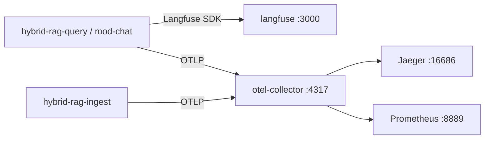

# OpenTelemetry (OTel) — hybrid-rag-observability

**Sub-project:** `hybrid-rag-observability`  
**Interface:** IF-5 in [ENTERPRISE_HYBRID_RAG_SPEC.md](../../ENTERPRISE_HYBRID_RAG_SPEC.md)

---

## 1. Architecture

Langfuse runs **inside** `hybrid-rag-observability` alongside the OTel collector and Jaeger. See [STACK.md](./STACK.md).



Applications **never** embed Langfuse server, collector, or Jaeger — only official SDKs.

---

## 2. Collector endpoints

| Endpoint | Port | Purpose |
|----------|------|---------|
| OTLP gRPC | 4317 | Primary ingress (Python gRPC exporter) |
| OTLP HTTP | 4318 | curl, browser, polyglot clients |
| Health | 13133 | `curl http://localhost:13133/` |
| Prometheus scrape | 8889 | `/metrics` from exported OTel metrics |
| zPages | 55679 | Collector self-debug |

Config: [../collector/otel-collector-config.yaml](../collector/otel-collector-config.yaml)

---

## 3. Application SDK (query + ingest)

Both sub-projects ship `app/telemetry.py`:

```python
from app.telemetry import setup_otel, get_tracer

setup_otel(app)  # FastAPI + OTLP exporter

with get_tracer().start_as_current_span("rag_pipeline"):
    ...
```

**Dependencies:** `opentelemetry-sdk`, `opentelemetry-exporter-otlp-proto-grpc`, `opentelemetry-instrumentation-fastapi`  
**Ingest workers:** `opentelemetry-instrumentation-celery` (optional auto-instrument)

### Required env vars

```bash
OTEL_EXPORTER_OTLP_ENDPOINT=http://otel-collector:4317
OTEL_EXPORTER_OTLP_INSECURE=true
OTEL_SERVICE_NAME=hybrid-rag-query    # or hybrid-rag-ingest
OTEL_TRACES_EXPORTER=otlp
DEPLOY_ENV=dev
```

### Disable OTel (local offline)

```bash
OTEL_SDK_DISABLED=true
# or unset OTEL_EXPORTER_OTLP_ENDPOINT
```

---

## 4. Canonical span names

| Span | Service |
|------|---------|
| `mcp.research_stream` | hybrid-rag-query |
| `mcp.sse.connect` | hybrid-rag-query |
| `rag_pipeline` | hybrid-rag-query |
| `store/qdrant/retrieve` | hybrid-rag-query |
| `ingest.batch_write` | hybrid-rag-ingest |
| `ingest.job.enqueue_collection` | hybrid-rag-ingest |

Required resource attributes:

| Key | Value |
|-----|-------|
| `service.name` | `OTEL_SERVICE_NAME` |
| `module_id` | `hybrid-rag-query` \| `hybrid-rag-ingest` |
| `service.namespace` | `hybrid-rag` (added by collector) |
| `deployment.environment` | `DEPLOY_ENV` |

---

## 5. W3C trace context

Propagate `traceparent` / `tracestate` from mod-chat BFF → hybrid-rag-query → downstream HTTP (inference, stores when instrumented).

Python SDK enables W3C Trace Context by default.

---

## 6. Privacy

- Do **not** export raw chunk text or full user queries in span attributes
- Truncate `rag.query` to ≤ 120 chars before `set_attribute`
- Collector does not log request bodies

---

## 7. Validation

```bash
cd observability
make up
make synthetic-trace
make health
```

Open Jaeger: http://localhost:16686 — search service `hybrid-rag-synthetic` or `hybrid-rag-query`.

Optional Prometheus profile:

```bash
make up PROFILE=metrics
open http://localhost:9090/alerts   # OBS-P5 SLO rules (rag_ttft_ms p95, retrieve, ingest)
```

Persistent Jaeger traces (Badger, 7d default):

```bash
make up PROFILE=jaeger-persist
```

---

## 8. Production

| Concern | Recommendation |
|---------|----------------|
| TLS | Set `OTEL_EXPORTER_OTLP_INSECURE=false`; terminate TLS at collector or use sidecar |
| Sampling | Add `probabilistic_sampler` processor in collector for high QPS |
| Trace retention | `make up PROFILE=jaeger-persist` — Badger volume + `JAEGER_TRACE_RETENTION` (OBS-P4) |
| SigNoz | `PROFILE=signoz` + `otel-collector-config.signoz.yaml` + `SIGNOZ_OTLP_ENDPOINT` — see [SIGNOZ.md](./SIGNOZ.md) and platform §10.5 |
| Langfuse | Keep SDK for LLM cost; OTLP for infra/HTTP spans |
| HA | Run collector as DaemonSet; multiple replicas behind load balancer for OTLP HTTP |

---

## 9. CI

```bash
packer validate observability/packer/
docker compose -f observability/compose/docker-compose.yml config
cd observability && make synthetic-trace
```

Contract tests in `query/` assert span names and `module_id` on golden fixtures.
