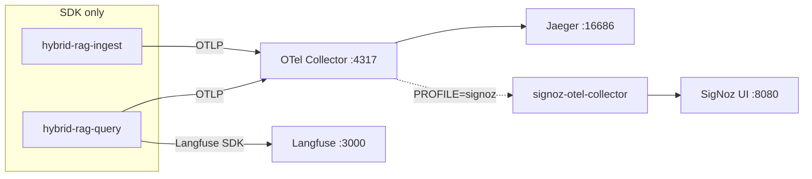

# SigNoz & OTLP Collector

**Sub-project:** `hybrid-rag-observability`  
**Platform normative:** [ENTERPRISE_HYBRID_RAG_SPEC.md §10.5](../../ENTERPRISE_HYBRID_RAG_SPEC.md#105-signoz-optional-apm-profile)

---

## 1. Role

SigNoz receives **traces and metrics** from the **primary OTel collector** via fan-out export — HTTP latency, store spans, pipeline histograms, and host metrics. It **complements** Langfuse (LLM-focused cost and generations).

| Backend | Primary signals |
|---------|-----------------|
| **Langfuse** | LLM generations, token cost, RAG stage spans, sessions |
| **Jaeger** | Distributed trace debug (default dev UI) |
| **SigNoz** (optional) | APM dashboards, SLO alerts, histogram metrics §10.5.3 |

Applications **never** export directly to SigNoz — single SDK endpoint to the primary collector (`IF-5`, `TL-05`).

---

## 2. Architecture



---

## 3. Ports

| Service | Port | Exposure |
|---------|------|----------|
| Primary OTLP gRPC | 4317 | Apps → collector |
| Primary OTLP HTTP | 4318 | Apps (HTTP exporter) |
| Collector health | 13133 | Ops |
| Collector Prometheus | 8889 | `PROFILE=metrics` |
| Jaeger UI | 16686 | Always (dev default) |
| SigNoz UI | 8080 | When full SigNoz stack deployed |
| `signoz-otel-collector` | 4317 internal | Compose `PROFILE=signoz` only |

---

## 4. Deployment profiles

### Default (no SigNoz)

```bash
cd observability
make up
```

Collector config: [`collector/otel-collector-config.yaml`](../collector/otel-collector-config.yaml) → Jaeger only.

### SigNoz sidecar profile

```bash
cd observability
export SIGNOZ_OTLP_ENDPOINT=signoz-otel-collector:4317
make up PROFILE=signoz
```

Mount SigNoz overlay in compose (or set `COLLECTOR_CONFIG`):

- [`collector/otel-collector-config.signoz.yaml`](../collector/otel-collector-config.signoz.yaml) — adds `otlp/signoz` exporter to trace and metrics pipelines.

Services started: Langfuse, Jaeger, primary collector, `signoz-otel-collector`.

### Managed SigNoz (SaaS)

Set collector env:

```bash
SIGNOZ_OTLP_ENDPOINT=ingest.{region}.signoz.cloud:443
# TLS: set otlp/signoz.tls.insecure=false and configure CA in prod overlay
```

Jaeger remains available for engineering trace drill-down; SigNoz receives duplicate export for APM.

### Prometheus (orthogonal)

```bash
make up PROFILE=metrics
```

Scrapes collector `:8889` — can run alongside `PROFILE=signoz`.

---

## 5. Configuration

**TOML:** [`config/observability.toml.example`](../config/observability.toml.example)

```toml
[signoz]
enabled = true
ui_port = 8080

[retention]
signoz_days = 30
```

**Application env (unchanged):**

```bash
OTEL_EXPORTER_OTLP_ENDPOINT=http://otel-collector:4317
OTEL_SERVICE_NAME=hybrid-rag-query   # or hybrid-rag-ingest
```

W3C `traceparent` propagation: BFF → MCP → pipeline.

---

## 6. Normative metrics (FR-40)

When `[signoz].enabled = true`, emit OTLP histograms per platform §10.5.3:

| Metric | Labels |
|--------|--------|
| `rag_ttft_ms` | `module_id` |
| `rag_stage_ms` | `stage`, `module_id` |
| `mcp_request_duration_ms` | `tool`, `status` |
| `ingest_chunks_per_second` | — |
| `celery_queue_depth` | `queue` |

Implement in `query/app/telemetry.py` and `ingest/app/telemetry.py` (pending — see §22 LG implementation bundle).

---

## 7. Dashboards

| File | Focus |
|------|-------|
| [`dashboards/signoz-query-latency.json`](../dashboards/signoz-query-latency.json) | TTFT, stage p95, MCP, cache |
| [`dashboards/signoz-ingest-throughput.json`](../dashboards/signoz-ingest-throughput.json) | chunks/s, queue depth |
| [`dashboards/langfuse-hybrid-rag.json`](../dashboards/langfuse-hybrid-rag.json) | LLM cost (Langfuse) |

Import via SigNoz UI. API automation tracked as E-23.

---

## 8. Alerts

Rules: [`alerts/signoz-rules.yaml`](../alerts/signoz-rules.yaml)

| Alert | Condition |
|-------|-----------|
| `QueryP95High` | TTFT p95 > 2s |
| `TraceExportFailure` | export errors > 1% |
| `IngestStalled` | queue depth > 500 |
| `McpErrorRateHigh` | MCP 5xx > 1% |

---

## 9. Health check

Default `make health` validates collector, Jaeger, Langfuse. When full SigNoz UI is deployed, extend health script to curl `:8080`.

Synthetic trace: `make synthetic-trace` — verify span in Jaeger; with SigNoz overlay, search same `trace_id` in SigNoz.

---

## 10. Production notes

| Concern | Recommendation |
|---------|----------------|
| Cardinality | No per-chunk labels; optional `tenant_id` sampling |
| Sampling | Add `probabilistic_sampler` in prod collector (OBS-P1) |
| PII | `attributes/truncate` processor on `query` attribute (signoz overlay) |
| HA | Collector DaemonSet; multiple OTLP HTTP replicas behind LB |
| Full stack | Deploy [SigNoz Helm chart](https://github.com/SigNoz/charts); point `SIGNOZ_OTLP_ENDPOINT` at cluster ingress |

See also [PERFORMANCE.md](./PERFORMANCE.md) §7, [OTEL.md](./OTEL.md) §8.
