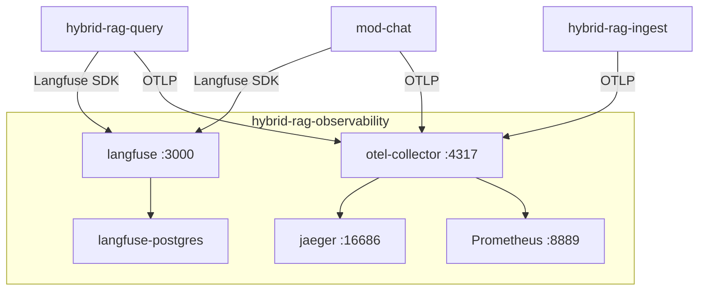

# Observability stack — unified sub-project

**Project ID:** `hybrid-rag-observability`  
**Deploy:** `cd observability && make up`

All telemetry **servers** live in this sub-project. Application modules (`hybrid-rag-query`, `hybrid-rag-ingest`, `mod-chat`) ship **SDKs only** — they never run Langfuse, Jaeger, or collector containers.

---

## 1. Components (single compose)

| Service | Image | Port | Role |
|---------|-------|------|------|
| `langfuse-postgres` | postgres:16-alpine | internal | Langfuse metadata DB |
| `langfuse` | langfuse/langfuse:2 | 3000 | LLM traces, token cost, sessions |
| `jaeger` | jaegertracing/all-in-one | 16686 | Distributed trace UI (OTel) |
| `otel-collector` | otel-collector-contrib | 4317, 4318 | OTLP ingress → Jaeger + metrics |
| `prometheus` | prom/prometheus | 9090 | Optional (`PROFILE=metrics`) |
| `signoz-otel-collector` | signoz/signoz-otel-collector | — | Optional (`PROFILE=signoz`) |

Config: [../compose/docker-compose.yml](../compose/docker-compose.yml)

---

## 2. Data flow



| Path | Protocol | Consumers |
|------|----------|-----------|
| Langfuse SDK → `langfuse:3000` | HTTP | `hybrid-rag-query`, `mod-chat` |
| LangSmith SDK → LangSmith API | HTTP | `hybrid-rag-query` (LangGraph runs), optional `hybrid-rag-ingest` |
| OTLP → `otel-collector:4317` | gRPC | all application modules |
| Jaeger UI | HTTP | operators |

**Ingest** uses OTLP by default; optional LangSmith when `LANGCHAIN_TRACING_V2=true` (no Langfuse keys).

### LangSmith vs Langfuse

| Tool | Scope | Deploy |
|------|-------|--------|
| **LangSmith** | LangGraph run traces, node timings, eval datasets | Cloud or self-hosted API; SDK in query/ingest |
| **Langfuse** | LLM token cost, sessions, production drill-down | Self-hosted in this stack (`langfuse:3000`) |

Use both in dev: LangSmith for graph debugging; Langfuse + OTel for production SLO dashboards.

---

## 3. Bootstrap

```bash
cd observability
cp .env.example .env
make up
make health
```

1. Open Langfuse: http://localhost:3000 — create org/project and API keys.
2. Copy keys into consumer `.env` files:

```bash
# query/.env or mod-chat/.env
LANGFUSE_PUBLIC_KEY=pk-lf-...
LANGFUSE_SECRET_KEY=sk-lf-...
LANGFUSE_HOST=http://langfuse:3000   # Docker network hostname
```

3. OTLP is pre-wired — consumers only need:

```bash
OTEL_EXPORTER_OTLP_ENDPOINT=http://otel-collector:4317
```

---

## 4. Optional backends

| Mode | Change |
|------|--------|
| **Langfuse Cloud** | Omit `langfuse` services; set `LANGFUSE_HOST=https://cloud.langfuse.com` in apps |
| **SigNoz** | `make up PROFILE=signoz` — see [SIGNOZ.md](./SIGNOZ.md) |
| **Prometheus** | `make up PROFILE=metrics` |

No application image rebuild required — env URLs only.

---

## 5. Related docs

| Doc | Focus |
|-----|-------|
| [LANGFUSE.md](./LANGFUSE.md) | Langfuse deployment, trace hierarchy, SDK |
| [OTEL.md](./OTEL.md) | Collector, Jaeger, OTLP contract |
| [INTEGRATION.md](./INTEGRATION.md) | Consumer env vars and trace names |
| [SIGNOZ.md](./SIGNOZ.md) | Optional APM profile |
