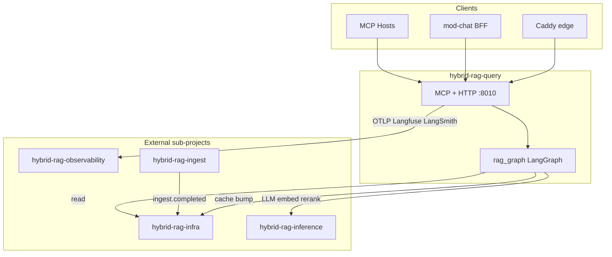

# Query & MCP Sub-Project Specification

**Project ID:** `hybrid-rag-query`  
**Replaces:** `modules/MOD_QUERY.md` as deploy spec  
**Platform parent:** [ENTERPRISE_HYBRID_RAG_SPEC.md](../ENTERPRISE_HYBRID_RAG_SPEC.md) §6–7, IF-1–IF-5

---

## 1. Purpose

Deploy and operate the **query plane** and **MCP-first API** for Enterprise Hybrid RAG:

- MCP server (stdio + SSE): `research_documents`, **RBAC-gated** tools (§7.13), session tools, catalog tools, graph viz
- HTTP: `GET /healthz`, `POST /research/stream`, **`/sessions` CRUD** (SSE)
- RAG pipeline: **LangGraph** state graph → scope → embed → retrieve → rerank → graph → answer
- Query result cache (Redis `qcache:`)
- `warmup_clients()` at startup
- LangSmith (LangGraph traces) + Langfuse + OTLP export (SDK only)

**Not in scope:** Ingest parsing, index writes, Celery workers, Langfuse/SigNoz servers, chat UI/BFF.

---

## 2. Boundary

| Owns | Does NOT own |
|------|--------------|
| `mcp_server.py`, `rag_graph.py`, `research_streaming.py` | `ingest.*`, Celery, connector sync |
| `auth.py`, `rbac.py` (planned) | JWT validation + permission checks §7.13 |
| `session_store.py` (planned) | Session persistence §7.11 |
| SSE streaming, MCP tool handlers | Qdrant/Neo4j **writes** |
| Read-only store clients | Admin ingest API |
| Prompt templates per collection | Store server processes |

### Forbidden imports

`ingest.*`, `celery_app`, `pipeline` (ingest), `tasks` (ingest workers).

### Dependencies (read-only + HTTP clients)

| Dependency | Interface |
|------------|-----------|
| Qdrant | IF-1 search + scroll |
| Neo4j | IF-1 graph read |
| Postgres | IF-2 `CATALOG_DSN_RO` + `CATALOG_DSN_SESSION` (sessions) |
| Redis | `qcache:` + subscribe `rag:events` |
| hybrid-rag-inference | embed, LLM, reranker URLs |
| hybrid-rag-observability | OTLP + Langfuse SDK + LangSmith (optional) |

---

## 3. Architecture



---

## 4. Ports

| Surface | Port | Protocol |
|---------|------|----------|
| MCP SSE + HTTP | 8010 | HTTP/SSE |
| MCP stdio | — | stdin/stdout |

**Public edge:** Caddy in `infra/` proxies `{mcp_path}/sse` → `:8010` (not exposed directly in prod).

---

## 5. Deploy unit

| Image | Role |
|-------|------|
| `hybrid-rag-query` | Single container: MCP + HTTP + pipeline (stateless, HPA-friendly) |

Optional: separate `hybrid-rag-query-worker` for background cache warm — not in v1.

---

## 6. Configuration

**Env:** `QUERY_CONFIG` → `config/query.toml`  
**Secrets:** `query/.env` (gitignored)

See [config/query.toml.example](./config/query.toml.example).

---

## 7. MCP server identity

```
name: enterprise-hybrid-rag
version: 1.0.0
description: Hybrid RAG over ingested enterprise documents
```

---

## 8. Scaling

- Stateless replicas; **session data in Postgres** (§7.11) — no sticky sessions required
- Horizontal pod autoscale on CPU / `rag_ttft_ms` p95 (§12.4)
- Shared Qdrant, Neo4j, inference
- Reranker sidecars shared across N query replicas
- Min 2 replicas production; see [docs/PERFORMANCE.md](./docs/PERFORMANCE.md) §8

---

## 11. Performance

Normative: [docs/PERFORMANCE.md](./docs/PERFORMANCE.md) · Platform §6.3.2, §7.12, §18.14–18.16

| Concern | Mechanism |
|---------|-----------|
| Latency | LangGraph stage budgets; two-stage rerank; adaptive `search_ef` |
| Admission | Redis rate limits per tenant/user (FR-27) |
| Resilience | Circuit breakers on inference + stores (FR-28) |
| Degradation | L0–L5 ladder before 503 (§6.3.2) |
| Pools | Pooled clients — Qdrant gRPC, Neo4j, Redis, httpx (FR-25) |
| Cache | `qcache:` + optional `embedcache:` |
| HPA | `rag_ttft_ms` p95, CPU > 60% |

Config: `[performance]`, `[rate_limit]`, `[degradation]` in `query.toml`.

---

## 12. Evaluation

Normative: [benchmarks/README.md](./benchmarks/README.md) · Platform §13

| Harness | Tool | CI |
|---------|------|-----|
| Quality | **Ragas** (TL-08) | Nightly `--ragas` |
| Load / soak | **k6** primary, **Locust** alt (TL-09) | Pre-release |
| Latency | `benchmark_rag.py` + `baselines.json` | Nightly |
| Graph traces | LangSmith (TL-07) | Eval optional |

---

## 9. CI (this sub-project)

**TDD (TL-11):** failing test → implement → refactor. See [docs/TESTING.md](../docs/TESTING.md).

| Job | Validates |
|-----|-----------|
| `pytest tests/unit tests/contract` | **Every PR** — LangGraph nodes, MCP/SSE contracts |
| `compose config` | Valid docker-compose |
| `make health` | `/healthz` `research_ready` |
| `pytest tests/integration` | Live Qdrant + inference (`LIVE_STACK=1`, nightly) |
| `benchmarks/benchmark_rag.py` | Golden set + optional `--ragas` (nightly) |

---

## 10. Release independence

| Artifact | Tag example |
|----------|-------------|
| Query stack | `query-v1.0.0` |
| Ingestion | `ingest-v1.0.0` |
| Platform kernel | `kernel-v1.0.0` |

Compatibility: [docs/INTEGRATION.md](./docs/INTEGRATION.md).
