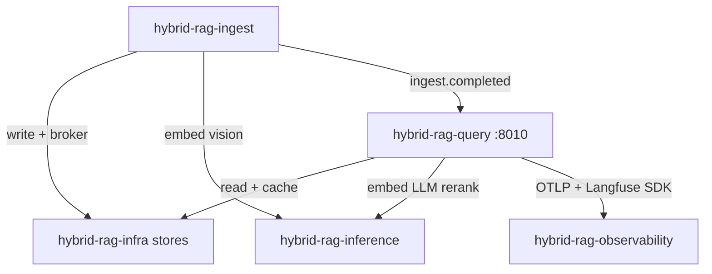

# Integration Guide — Query ↔ Platform Sub-Projects

How **`hybrid-rag-query`** connects to infra, inference, ingest, and observability.

---

## 1. Network topology



---

## 2. Bootstrap order

```bash
cd infra && make up && make init-db
cd ../inference && make up PROFILE=gpu_24gb
cd ../observability && make up
cd ../ingest && make up    # optional for empty corpus
cd ../query && make up
cd ../infra && make up PROFILE=edge   # optional public MCP
```

---

## 3. Environment variables

See [`.env.example`](../.env.example).

| Group | Examples |
|-------|----------|
| Stores (read) | `QDRANT_URL`, `NEO4J_URI`, `CATALOG_DSN_RO`, `REDIS_URL` |
| Object store | `MINIO_ENDPOINT`, `MINIO_ACCESS_KEY`, `MINIO_BUCKET`, `MINIO_PRESIGN_TTL_SECONDS` |
| Inference | `VLLM_URL`, `VLLM_EMBED_URL`, `RERANKER_URL` |
| Observability | `LANGFUSE_*` (SDK → `observability/` Langfuse), `OTEL_EXPORTER_OTLP_ENDPOINT` |
| Events | `redis_stream`, `consumer_group` in `query.toml` |

Detail: [infra/docs/INTEGRATION.md](../../infra/docs/INTEGRATION.md), [inference/docs/INTEGRATION.md](../../inference/docs/INTEGRATION.md)

---

## 4. Reader contract (IF-1, IF-2)

| Store | Access |
|-------|--------|
| Qdrant | search, scroll (read-only client) |
| Neo4j | read sessions |
| Postgres | `query_ro` DSN only |
| MinIO | presigned GET for `image_url` keys (see [infra/docs/MINIO.md](../../infra/docs/MINIO.md)) |
| Redis | `qcache:` + event consumer |

**Never writes** index or catalog — enforced by image packaging.

---

## 5. Cache invalidation (IF-3)

On `ingest.completed` from `hybrid-rag-ingest`:

```python
def on_ingest_completed(event):
    if event.cache_bump:
        bump_cache_version(event.tenant_id, event.collection_id)
```

---

## 6. Caddy edge

`infra` Caddy proxies `/mcp/*` → `query:8010`. Set `mcp_upstream` to orchestrator hostname on Docker network.

Public SSE: `https://rag.example.com/mcp/sse`

---

## 7. Compatibility matrix

| query tag | index_schema_version | Requires |
|-----------|---------------------|----------|
| query-v1.0.0 | 1 | infra-v1.0.0, inf-v1.0.0 |
| query-v1.1.0 | 2 | kernel bump + ingest-v1.1.0 |

---

## 8. mod-chat BFF

Optional client — proxies to this sub-project only. Never connects to Qdrant/Neo4j directly.

Forward per message: `langfuse_session_id`, `langfuse_user_id`, `langfuse_trace_id`.
