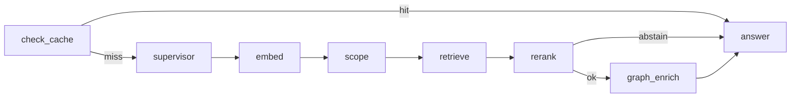

# LangGraph + LangSmith — hybrid-rag-query

**Parent:** [PIPELINE.md](./PIPELINE.md) · Platform §6  
**Libraries:** [LangGraph](https://langchain-ai.github.io/langgraph/) · [LangSmith](https://docs.smith.langchain.com/)

---

## 1. Role

| Library | Purpose in this project |
|---------|-------------------------|
| **LangGraph** | Orchestrates RAG pipeline stages as a **state graph** with conditional edges |
| **LangSmith** | Traces each graph run and node for **debugging, eval datasets, and regression** |
| **Langfuse** (optional) | Production LLM cost, sessions, user-facing drill-down (observability stack) |
| **OpenTelemetry** | Infra/HTTP distributed traces → Jaeger (IF-5) |

LangGraph replaces ad-hoc `rag_pipeline.py` control flow. LangSmith complements — does not replace — Langfuse + OTel.

---

## 2. Package layout

```text
query/app/
├── rag_state.py          # RAGState TypedDict
├── rag_graph.py          # StateGraph compile + node functions
├── research_streaming.py # SSE adapter over graph.ainvoke
├── langsmith_config.py   # LANGCHAIN_* env bootstrap
├── mcp_server.py         # FastAPI entry
└── telemetry.py          # OTLP (parallel to LangSmith)
```

---

## 3. Graph topology



Each node records `timings_ms[stage]` per platform spec §6.1.

**Conditional edges:**

| After | Condition | Next |
|-------|-----------|------|
| `check_cache` | `from_cache` | `answer` |
| `check_cache` | miss | `supervisor` |
| `rerank` | `abstained` | `answer` (skip graph) |
| `rerank` | ok | `graph_enrich` |

---

## 4. LangSmith configuration

```bash
LANGCHAIN_TRACING_V2=true
LANGCHAIN_API_KEY=lsv2_...
LANGCHAIN_PROJECT=hybrid-rag-query
# Optional self-hosted:
# LANGCHAIN_ENDPOINT=https://api.smith.langchain.com
```

Disable in offline dev:

```bash
LANGCHAIN_TRACING_V2=false
# or unset LANGCHAIN_API_KEY
```

`setup_langsmith()` runs at graph compile time (`app/langsmith_config.py`).

**Project naming:** `{LANGCHAIN_PROJECT}-{DEPLOY_ENV}` recommended in prod.

---

## 5. LangGraph config (`query.toml`)

```toml
[langgraph]
enabled = true
checkpointer = "none"       # future: redis for multi-turn agent
stream_mode = "updates"     # for debugging via astream

[langsmith]
tracing_enabled = true
project = "hybrid-rag-query"
```

Env vars override TOML for secrets (`LANGCHAIN_API_KEY`).

---

## 6. Integration with observability stack

| Signal | Export path |
|--------|-------------|
| Graph run (nodes, edges) | LangSmith (when tracing on) |
| LLM generation tokens/cost | Langfuse SDK (query path) |
| HTTP / MCP spans | OTel → collector → Jaeger |
| `timings_ms` per stage | SSE telemetry footer + structured log |

**Rule:** Do not duplicate full chunk text in LangSmith inputs — truncate query to 120 chars in metadata.

---

## 7. Testing

```bash
cd query
pip install -r requirements.txt
LANGCHAIN_TRACING_V2=false uvicorn app.mcp_server:app --port 8010

curl -N -X POST http://127.0.0.1:8010/research/stream \
  -H 'Content-Type: application/json' \
  -d '{"query":"test","tenant_id":"t1","collection_id":"c1"}'
```

With LangSmith:

```bash
export LANGCHAIN_TRACING_V2=true LANGCHAIN_API_KEY=lsv2_...
```

View runs at https://smith.langchain.com (or self-hosted endpoint).

---

## 8. Implementation roadmap

| ID | Task | Status |
|----|------|--------|
| LG-1 | Stub nodes → real Qdrant/Neo4j clients | planned |
| LG-2 | vLLM streaming in `answer` node | planned |
| LG-3 | `query_cache` node integration | planned |
| LG-4 | LangSmith + **Ragas** eval datasets from golden set | planned |
| LG-5 | Redis checkpointer for supervisor loops | future |
