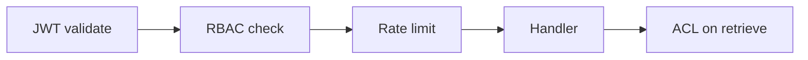

# Role-Based Access Control (hybrid-rag-query)

**Parent:** [SPEC.md](../SPEC.md) · Platform [§7.13](../../ENTERPRISE_HYBRID_RAG_SPEC.md#713-role-based-access-control-rbac) · ACL [§9.4](../../ENTERPRISE_HYBRID_RAG_SPEC.md#94-authorization-model-rbac--acl)

---

## 1. Purpose

RBAC controls **which MCP tools and HTTP routes** a caller may invoke. It complements **ACL** (which documents they can see) and **authentication** (who they are).

| Layer | Module | Deny code |
|-------|--------|-----------|
| Auth | `auth.py` | 401 `auth` |
| RBAC | `rbac.py` | 403 `forbidden` |
| ACL | `acl.py` (planned) | Empty results |
| Rate limit | Redis | 429 |

---

## 2. Evaluation order



Never skip RBAC when `auth.required=true` and `rbac.enabled=true`.

---

## 3. Permissions

| Permission | Tools / routes |
|------------|----------------|
| `mcp.research` | `research_documents`, `POST /research/stream` |
| `mcp.catalog.read` | `list_indexed_documents`, `get_document_metadata` |
| `mcp.graph.read` | `visualize_document_graph` |
| `mcp.session.read` | `list_conversation_sessions`, `get_conversation_history`, `GET /sessions*` |
| `mcp.session.write` | Session create/update/delete, research with `session_id` |
| `mcp.admin.collections` | `list_collections` |
| `mcp.admin.diagnostics` | `search_snippets`, `explain_scope` |

Wildcards: `mcp.admin` → both admin permissions; `mcp.session` → read + write; `mcp.*` → all.

---

## 4. Keycloak roles (default mapping)

| Realm role | Permissions |
|------------|-------------|
| `viewer` | catalog.read, graph.read, session.read |
| `user` | viewer + research + session |
| `collection-admin` | user + admin.collections + admin.diagnostics |
| `admin` | `mcp.*` |

Configured in `query.toml` `[rbac.role_permissions]` — override per deployment.

Realm file: [infra/keycloak/hybrid-rag-realm.json](../../infra/keycloak/hybrid-rag-realm.json)

---

## 5. Implementation (planned)

```python
# query/app/rbac.py
def resolve_permissions(roles: frozenset[str], config: RbacConfig) -> frozenset[str]: ...

def require_permission(ctx: AuthContext, permission: str) -> None:
    """Raise ForbiddenError (403) if permission not in ctx.permissions."""
```

Register in `mcp_server.py`:

```python
@tool("research_documents", permission="mcp.research")
async def research_documents(args, ctx: AuthContext): ...
```

---

## 6. Configuration

```toml
[rbac]
enabled = true

[rbac.role_permissions]
viewer = ["mcp.catalog.read", "mcp.graph.read", "mcp.session.read"]
user = ["mcp.catalog.read", "mcp.graph.read", "mcp.session", "mcp.research"]
collection-admin = ["mcp.catalog.read", "mcp.graph.read", "mcp.session", "mcp.research", "mcp.admin"]
admin = ["mcp.*"]
```

Pair with `[auth].required = true` in production.

---

## 7. RBAC vs ACL example

| User | Role | ACL grant | `research_documents` on `payments-api` |
|------|------|-----------|----------------------------------------|
| Alice | `user` | `group:payments-team` on collection | Works — RBAC + ACL pass |
| Bob | `viewer` | same grant | **403** — no `mcp.research` |
| Carol | `user` | no grant | **200 empty** — RBAC pass, ACL filters all chunks |

---

## 8. Testing

| Test file | Asserts |
|-----------|---------|
| `test_rbac_research_denied_for_viewer.py` | viewer → 403 on research |
| `test_rbac_admin_tools_require_admin.py` | user → 403 on `list_collections` |
| `test_rbac_wildcard_admin.py` | admin → all tools allowed |
| `test_acl_empty_results_not_403.py` | user without grant → empty, not 403 |

Fixtures: `query/tests/fixtures/jwt_viewer.json`, `jwt_admin.json` with frozen claims.

---

## 9. Observability

- Structured log: `mcp.authz.denied tool=... permission=... sub=...`
- OTel span: `mcp.authz.check` with `authz.permission`, `authz.allowed`
- Audit event: `mcp.authz.denied` (optional SIEM export)

See [SESSIONS.md](./SESSIONS.md) for session ownership (separate from RBAC — uses principal match).
